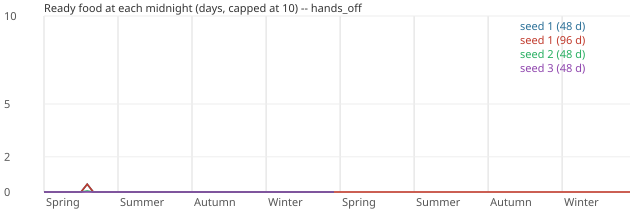
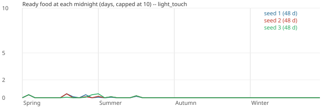

# First-year balance baseline (2026-10-01)

Generated by `tools/balance_report.py` from the balance harness (`godot/tools/balance/`, decision 0911).
Every figure is measured on the real demo village; nothing here is a projection.

## Findings (written by hand; the generated report follows)

**The verdict: a game year is too hard on food, and the residents have almost nothing to do.** It is not "busy".
Even a diligent player cannot feed the nine residents. In the light-touch runs the village stored 166-175 U of food
in the year. 102-111 U of that was fish, and three-quarters of the fish could not be cooked and spoiled. The nine
residents need 864 meals a year. They ate 45-59 portions and 9-11 raw meals; 92-94% of meals were missed. Meanwhile the
residents worked about 0.7 hours a day each, and were idle 95% of their waking, non-meal time. Hunger costs nothing in
the demo (it only decides raw meals and the readouts), so this starvation is visible only on the HUD.

The runs: 3 seeds × 2 policies × 1 year (48 days), and seed 1 hands-off for 2 years. All are at 4x on 30 fixed frames
a second, with staged assets, from the demo's own opening (Spring 1, 06:00, with an empty pantry).

Reproduce (the runs are deterministic: same seed and policy, same numbers; the raw run JSON is not committed):

```
python3 tools/run_balance_matrix.py --out-dir <dir> --seeds 1 2 3 --days 48 --jobs 3
python3 tools/run_balance_matrix.py --out-dir <dir> --seeds 1 --policies hands_off --days 96 --jobs 1
python3 tools/balance_report.py --out docs/balance/2026-10-01-first-year-baseline.md \
    --svg-dir docs/balance/2026-10-01-first-year-baseline --summary-dir docs/balance/2026-10-01-first-year-baseline \
    --notes <this hand-written section, as a file> --title "First-year balance baseline (2026-10-01)" <dir>/*.json
```

### Headline numbers

| | Hands-off s1 / s2 / s3 | Light-touch s1 / s2 / s3 |
|---|---|---|
| Food stored in the year (U) | 18.7 / 18.7 / 18.7 (the three opening crops; nothing sown) | 165.9 / 174.9 / 165.9 |
| of which fish (U) | 0 | 101.7 / 110.8 / 101.7 |
| of which crops (U) | wheat 8.5, carrot 5.1, radish 5.1 | wheat 25.2, carrot 33.9, radish 5.1 (every seed) |
| First Ready food at a midnight | Spring 8 / Spring 8 / never | Spring 2 (every seed) |
| Food runs out | Spring 9, and stays out (40 days) | Spring 3; 45 / 46 / 46 days with none |
| Portions eaten + raw meals | 10+3 (every seed) | 59+10 / 56+11 / 45+9 |
| Meals missed (of 864) | 851 (98%) | 795 / 797 / 810 (92-94%) |
| Hungry share of resident-hours | 97% | 97% |
| Spoiled in store (U) | 0.5 (the last wheat, in winter) | 79.7 / 84.8 / 75.7 (all fish: 74-78% of the catch) |
| Spoilage by season (Sp / Su / Au / Wi) | 0 / 0 / 0 / 0.5 U | 20-25% / 30-43% / 72-77% / 70-74% |
| Idle labour | 99% | 95% |
| Work hours per resident-day | 0.1 | 0.7 |
| Board wait, mean / max (game minutes) | 1 / 1 | 47 / 47 / 53, max 601-660 (overnight) |
| Wood start → end (U) | 40 → 39.5 | 40 → 33.5 (planks held at 4 U) |
| Crops lost | none | none withered; blight cost one bed 1000 health points |
| Threats in the year | 20 floods + 25 fires, every seed; each one a critical incident and an autopause | the same |

Hands-off for two years (seed 1) repeats year 1: nothing is ever sown again. Year 2 stores no food at all, and 1715 of
1728 meals are missed.

### What looks out of balance

1. **Only grain, roots and fish feed anyone, and none can be sown after Summer 4.** The kitchen's three dishes
   (porridge, soup, fish stew; decisions 0381 and 0436) take only grain, roots and fresh fish. The GDD's sowing windows
   (`farming.gd`, BAL-CROP-001) close for grain on Spring 4 and for roots on Summer 4. Cabbage and beans can be sown
   into the autumn, but no dish uses them. So in every light-touch run the beds are empty from about Summer 7 to the
   end of the year: 0 sowings in autumn and winter, and no crop food for 30 days.
2. **Six beds cannot feed nine residents.** Per bed and crop, a bed gives 6-10 U at full health (§5.6). A portion
   costs 1 U of grain or 1.5 U of roots. The windows allow about two crops a bed a year, so the farm's ceiling is
   roughly 100-130 U, which is 70-100 portions against the 864 needed. The light-touch player harvested 64.2 U of crops
   (wheat 25.2, carrot 33.9, radish 5.1, the same for every seed): the opening crops, plus every sowing the windows allowed.
3. **Fish is caught but cannot be eaten.** Fish stew takes 2 U of fish and 2 U of roots for 3 portions. Fresh fish is
   never eaten raw, and it keeps only 48 hours. With roots scarce, 74-78% of the fish caught spoiled in store. That
   is all of the light-touch spoilage, and in autumn and winter it is 70-77% of the food available. The rack's dried
   fish and the mill's flour are not kitchen inputs yet (decision 0434).
4. **The opening is a famine.** The demo opens with an empty pantry. Nobody can eat until the first crop is harvested
   (Spring 2 for radish, Spring 8 for wheat): every day-0 meal and most of day 1's are missed whatever the player does.
5. **Hands-off never sows.** The farm's routine raises harvests and clearings only (REQ-SET-073/085). A village left
   alone stores 18.7 U in its whole life.
6. **Labour is not the constraint.** The residents work about 1% of their waking hours (hands-off) or 5% (light-touch).
   The work board's queue averages under 0.2 tasks. Waits are minutes, except overnight orders, which wait for dawn
   (600 game minutes).
7. **Weather costs almost nothing.** Across the seeds, summer drew ideal_spell or calm_days, autumn blight,
   ideal_spell or early_frost, and winter ideal_spell, hard_freeze or calm_days. The demo's fixed frost nights and
   blight outbreaks are the same for every seed. No crop withered in any run: the player's covers held the frost off,
   and the blight cost one bed 1000 of 10000 health points before its harvest. With empty beds from summer on,
   autumn's and winter's weather have nothing to hit.
8. **Threats are about one a game day.** There are 45 a year (20 floods, 25 fires) in every run, which is decision
   0421's open item, now measured. They are on a real-time schedule with a fixed seed, so every seed meets the same
   ones. Each threat is a critical incident that autopauses the village (UI §8.1's default): 45 pauses a game year
   for a player at 4x, about one every 2.5 real minutes. No rescue was needed in any run.
9. **Wood and stone are not used.** Wood went from 40 U to about 33.5 U in a light-touch year: the kitchen's 0.1 U a
   batch and two sawings. Left alone, the woods' routine hauls (windthrow, deadfall) took it to 63.5 U by the end of
   year 2. Stone stayed at 20 U and earth at 0.

### Suggested tuning experiments (for Brendan to rule on; nothing here was changed)

Each one can be measured with the same harness. Re-run with `tools/run_balance_matrix.py` and compare against this
baseline.

| # | Experiment | What it tests | Expected signal |
|---|---|---|---|
| E1 | Open with a stocked pantry: the 40 U wheat + 50 U carrots the 0381/0421 acceptance runs topped up with, about 5 days | the opening famine | day-0 to day-7 meals served; first food on Spring 1 |
| E2 | A fish dish that needs no roots (fish alone, e.g. 2 U → 2 portions), or a stew that takes any vegetable | fish spoilage | fish spoilage falling from about 85% toward the 10% line; autumn/winter meals served |
| E3 | Make dried fish and flour kitchen inputs (rack and mill already exist, decision 0434) | a winter food path | winter meals served; fish spoilage converted to storage |
| E4 | A dish for cabbage and beans (pottage), whose windows run to Autumn 3 | an idle farm after Summer 4 | beds in use through autumn; autumn meals |
| E5 | 12 or 18 beds instead of 6, or the GDD balanced policy's 32 grain + 32 roots tiles | land as the binding constraint | crops stored per season; idle labour falling |
| E6 | A light-touch variant that fishes only while roots are in store, and 2-3 trips a day | whether fishing can pay | fish eaten against fish spoiled |
| E7 | The threat schedule on the calendar (about one every 9 game days) rather than real time | decision 0421's open item | threats a year from 45 toward about 5 |
| E8 | Give hunger a cost in the demo (slower work, or the GDD's §5.2 effects) | whether a starving village reads as one | needs E1-E5 first, or the village stalls |

Recommended order: E1 + E2 first (cheap; they test whether the economy then closes at all), then E4 or E5 for the
summer-to-winter gap, then E7 separately.

## Runs

| Policy | Seed | Days | Staged assets | FPS x speed | Real seconds |
|---|---|---|---|---|---|
| hands_off | 1 | 48 | True | 30 x 4 | 2733.1 |
| hands_off | 1 | 96 | True | 30 x 4 | 4280.4 |
| hands_off | 2 | 48 | True | 30 x 4 | 2729.0 |
| hands_off | 3 | 48 | True | 30 x 4 | 2733.6 |
| light_touch | 1 | 48 | True | 30 x 4 | 1576.9 |
| light_touch | 2 | 48 | True | 30 x 4 | 1570.6 |
| light_touch | 3 | 48 | True | 30 x 4 | 1583.8 |

## Headlines

- **hands_off seed 1**: first Ready food Y1 Spring 8; food runs out Y1 Spring 9 (40 days with none after that); spoilage negligible (0.5 U over the run); 99% idle labour; 851 meals missed of 864 (98%); hungry 97% of resident-hours.
- **hands_off seed 1, 96 days**: first Ready food Y1 Spring 8; food runs out Y1 Spring 9 (88 days with none after that); spoilage negligible (0.5 U over the run); 99% idle labour; 1715 meals missed of 1728 (99%); hungry 99% of resident-hours.
- **hands_off seed 2**: first Ready food Y1 Spring 8; food runs out Y1 Spring 9 (40 days with none after that); spoilage negligible (0.5 U over the run); 99% idle labour; 851 meals missed of 864 (98%); hungry 97% of resident-hours.
- **hands_off seed 3**: never any Ready food; spoilage negligible (0.5 U over the run); 99% idle labour; 851 meals missed of 864 (98%); hungry 97% of resident-hours.
- **light_touch seed 1**: first Ready food Y1 Spring 2; food runs out Y1 Spring 3 (45 days with none after that); spoilage worst 72% in Y1 Autumn (79.7 of 165.9 U stored over the run); 95% idle labour; 795 meals missed of 864 (92%); hungry 97% of resident-hours.
- **light_touch seed 2**: first Ready food Y1 Spring 2; food runs out Y1 Spring 3 (46 days with none after that); spoilage worst 74% in Y1 Autumn (84.8 of 174.9 U stored over the run); 95% idle labour; 797 meals missed of 864 (92%); hungry 97% of resident-hours.
- **light_touch seed 3**: first Ready food Y1 Spring 2; food runs out Y1 Spring 3 (46 days with none after that); spoilage worst 77% in Y1 Autumn (75.7 of 165.9 U stored over the run); 95% idle labour; 810 meals missed of 864 (94%); hungry 97% of resident-hours.

## Flags

- hands_off seed 1, Y1 Spring: food ran out (Y1 Spring 9; 4 day(s) with no Ready food); 8 opening day(s) before the first Ready food; idle labour 97% (> 50%); meals missed: 203 (94% of diners); hungry 88% of resident-hours (> 5%)
- hands_off seed 1, Y1 Summer: food ran out (Y1 Summer 1; 12 day(s) with no Ready food); idle labour 100% (> 50%); meals missed: 216 (100% of diners); hungry 100% of resident-hours (> 5%)
- hands_off seed 1, Y1 Autumn: food ran out (Y1 Autumn 1; 12 day(s) with no Ready food); idle labour 100% (> 50%); meals missed: 216 (100% of diners); hungry 100% of resident-hours (> 5%)
- hands_off seed 1, Y1 Winter: food ran out (Y1 Winter 1; 12 day(s) with no Ready food); idle labour 100% (> 50%); meals missed: 216 (100% of diners); hungry 100% of resident-hours (> 5%)
- hands_off seed 1, 96 days, Y1 Spring: food ran out (Y1 Spring 9; 4 day(s) with no Ready food); 8 opening day(s) before the first Ready food; idle labour 97% (> 50%); meals missed: 203 (94% of diners); hungry 88% of resident-hours (> 5%)
- hands_off seed 1, 96 days, Y1 Summer: food ran out (Y1 Summer 1; 12 day(s) with no Ready food); idle labour 100% (> 50%); meals missed: 216 (100% of diners); hungry 100% of resident-hours (> 5%)
- hands_off seed 1, 96 days, Y1 Autumn: food ran out (Y1 Autumn 1; 12 day(s) with no Ready food); idle labour 100% (> 50%); meals missed: 216 (100% of diners); hungry 100% of resident-hours (> 5%)
- hands_off seed 1, 96 days, Y1 Winter: food ran out (Y1 Winter 1; 12 day(s) with no Ready food); idle labour 100% (> 50%); meals missed: 216 (100% of diners); hungry 100% of resident-hours (> 5%)
- hands_off seed 1, 96 days, Y2 Spring: food ran out (Y2 Spring 1; 12 day(s) with no Ready food); idle labour 98% (> 50%); meals missed: 216 (100% of diners); hungry 100% of resident-hours (> 5%)
- hands_off seed 1, 96 days, Y2 Summer: food ran out (Y2 Summer 1; 12 day(s) with no Ready food); idle labour 100% (> 50%); meals missed: 216 (100% of diners); hungry 100% of resident-hours (> 5%)
- hands_off seed 1, 96 days, Y2 Autumn: food ran out (Y2 Autumn 1; 12 day(s) with no Ready food); idle labour 99% (> 50%); meals missed: 216 (100% of diners); hungry 100% of resident-hours (> 5%)
- hands_off seed 1, 96 days, Y2 Winter: food ran out (Y2 Winter 1; 12 day(s) with no Ready food); idle labour 100% (> 50%); meals missed: 216 (100% of diners); hungry 100% of resident-hours (> 5%)
- hands_off seed 2, Y1 Spring: food ran out (Y1 Spring 9; 4 day(s) with no Ready food); 8 opening day(s) before the first Ready food; idle labour 98% (> 50%); meals missed: 203 (94% of diners); hungry 88% of resident-hours (> 5%)
- hands_off seed 2, Y1 Summer: food ran out (Y1 Summer 1; 12 day(s) with no Ready food); idle labour 100% (> 50%); meals missed: 216 (100% of diners); hungry 100% of resident-hours (> 5%)
- hands_off seed 2, Y1 Autumn: food ran out (Y1 Autumn 1; 12 day(s) with no Ready food); idle labour 100% (> 50%); meals missed: 216 (100% of diners); hungry 100% of resident-hours (> 5%)
- hands_off seed 2, Y1 Winter: food ran out (Y1 Winter 1; 12 day(s) with no Ready food); idle labour 100% (> 50%); meals missed: 216 (100% of diners); hungry 100% of resident-hours (> 5%)
- hands_off seed 3, Y1 Spring: 12 opening day(s) before the first Ready food; idle labour 98% (> 50%); meals missed: 203 (94% of diners); hungry 88% of resident-hours (> 5%)
- hands_off seed 3, Y1 Summer: 12 opening day(s) before the first Ready food; idle labour 100% (> 50%); meals missed: 216 (100% of diners); hungry 100% of resident-hours (> 5%)
- hands_off seed 3, Y1 Autumn: 12 opening day(s) before the first Ready food; idle labour 99% (> 50%); meals missed: 216 (100% of diners); hungry 100% of resident-hours (> 5%)
- hands_off seed 3, Y1 Winter: 12 opening day(s) before the first Ready food; idle labour 99% (> 50%); meals missed: 216 (100% of diners); hungry 100% of resident-hours (> 5%)
- light_touch seed 1, Y1 Spring: food ran out (Y1 Spring 3; 9 day(s) with no Ready food); 2 opening day(s) before the first Ready food; spoilage 25.3% (> 10%); idle labour 91% (> 50%); meals missed: 175 (81% of diners); hungry 87% of resident-hours (> 5%)
- light_touch seed 1, Y1 Summer: food ran out (Y1 Summer 1; 12 day(s) with no Ready food); spoilage 43.1% (> 10%); idle labour 93% (> 50%); meals missed: 188 (87% of diners); hungry 99% of resident-hours (> 5%)
- light_touch seed 1, Y1 Autumn: food ran out (Y1 Autumn 1; 12 day(s) with no Ready food); spoilage 72.2% (> 10%); idle labour 99% (> 50%); meals missed: 216 (100% of diners); hungry 100% of resident-hours (> 5%)
- light_touch seed 1, Y1 Winter: food ran out (Y1 Winter 1; 12 day(s) with no Ready food); spoilage 69.8% (> 10%); idle labour 98% (> 50%); meals missed: 216 (100% of diners); hungry 100% of resident-hours (> 5%)
- light_touch seed 2, Y1 Spring: food ran out (Y1 Spring 3; 10 day(s) with no Ready food); 2 opening day(s) before the first Ready food; spoilage 20.0% (> 10%); idle labour 90% (> 50%); meals missed: 177 (82% of diners); hungry 87% of resident-hours (> 5%)
- light_touch seed 2, Y1 Summer: food ran out (Y1 Summer 1; 12 day(s) with no Ready food); spoilage 37.1% (> 10%); idle labour 93% (> 50%); meals missed: 188 (87% of diners); hungry 99% of resident-hours (> 5%)
- light_touch seed 2, Y1 Autumn: food ran out (Y1 Autumn 1; 12 day(s) with no Ready food); spoilage 73.6% (> 10%); idle labour 98% (> 50%); meals missed: 216 (100% of diners); hungry 100% of resident-hours (> 5%)
- light_touch seed 2, Y1 Winter: food ran out (Y1 Winter 1; 12 day(s) with no Ready food); spoilage 73.5% (> 10%); idle labour 99% (> 50%); meals missed: 216 (100% of diners); hungry 100% of resident-hours (> 5%)
- light_touch seed 3, Y1 Spring: food ran out (Y1 Spring 3; 10 day(s) with no Ready food); 2 opening day(s) before the first Ready food; spoilage 20.0% (> 10%); idle labour 91% (> 50%); meals missed: 184 (85% of diners); hungry 88% of resident-hours (> 5%)
- light_touch seed 3, Y1 Summer: food ran out (Y1 Summer 1; 12 day(s) with no Ready food); spoilage 29.9% (> 10%); idle labour 93% (> 50%); meals missed: 194 (90% of diners); hungry 99% of resident-hours (> 5%)
- light_touch seed 3, Y1 Autumn: food ran out (Y1 Autumn 1; 12 day(s) with no Ready food); spoilage 76.6% (> 10%); idle labour 98% (> 50%); meals missed: 216 (100% of diners); hungry 100% of resident-hours (> 5%)
- light_touch seed 3, Y1 Winter: food ran out (Y1 Winter 1; 12 day(s) with no Ready food); spoilage 71.2% (> 10%); idle labour 99% (> 50%); meals missed: 216 (100% of diners); hungry 100% of resident-hours (> 5%)

## Thresholds

| Threshold | Value | Why |
|---|---|---|
| `reserve_min_days` | 2 | GDD §5.3 puts food jobs in urgency bucket 2 while the projected reserve is under 2 days, and gameplay_balance.md BAL-RUN-008 counts a village stabilised only with ready food of 2 days or more. A season whose lowest Ready food (the HUD's figure, kitchen.gd days_of_meals_milli) falls below 2 days is flagged; at 0 the report says the food RAN OUT (UI §8: food under 1 day is already CRITICAL). |
| `spoilage_max_pct` | 10 | No GDD target exists. Shelf lives are 48 h for fresh fish, 144 h for leaves, 240 h for roots, 480 h for beans and 720 h for grain (GDD §5.7; farm_catalog.gd), so a pantry that is drawn on twice a day should lose little; one unit in ten of the food available in a season (its opening stock plus what was stored in it) spoiling in store is taken as the line past which spoilage is a balance problem rather than noise. Provisional: for Brendan to confirm. |
| `spoilage_min_u` | 1 | Spoilage is flagged only when at least this much (1 U, about two portions' worth of roots) spoiled in the season: a few hundred milli-U left over and spoiled reads 100% of nearly nothing, which is noise, not a balance problem. |
| `idle_max_pct` | 50 | Idle share = idle / (idle + work) resident-time, rest, meals and emergencies excluded. GDD §5.3's default day is 10 WORK hours of about 14 waking ones (BAL-SUPPLY-001), so a village with work to do should spend well under half its available time idle; above 50% the residents are idle more than they work and labour is not what limits the economy. Provisional: for Brendan to confirm. |
| `missed_meals_max_pct` | 0 | REQ-SET-012 and decision 0381: every resident is fed at each meal. Any resident going without at a meal is flagged; the percentage is of the diners counted at the season's meals. |
| `hungry_max_pct` | 5 | HUNGRY is need 1500 or below (meal_rules.gd: §5.2's urgent line). An occasional hungry hour (a late meal, a resident called away) is normal; more than one resident-hour in twenty spent hungry means meals are not keeping up. |

## Policy: hands_off



**Ready food, lowest (days)**

| Season | seed 1 | seed 1, 96 days | seed 2 | seed 3 |
|---|---|---|---|---|
| Y1 Spring | 0.00 | 0.00 | 0.00 | 0.00 |
| Y1 Summer | 0.00 | 0.00 | 0.00 | 0.00 |
| Y1 Autumn | 0.00 | 0.00 | 0.00 | 0.00 |
| Y1 Winter | 0.00 | 0.00 | 0.00 | 0.00 |
| Y2 Spring | - | 0.00 | - | - |
| Y2 Summer | - | 0.00 | - | - |
| Y2 Autumn | - | 0.00 | - | - |
| Y2 Winter | - | 0.00 | - | - |

**Food stored (U)**

| Season | seed 1 | seed 1, 96 days | seed 2 | seed 3 |
|---|---|---|---|---|
| Y1 Spring | 18.7 | 18.7 | 18.7 | 18.7 |
| Y1 Summer | 0.0 | 0.0 | 0.0 | 0.0 |
| Y1 Autumn | 0.0 | 0.0 | 0.0 | 0.0 |
| Y1 Winter | 0.0 | 0.0 | 0.0 | 0.0 |
| Y2 Spring | - | 0.0 | - | - |
| Y2 Summer | - | 0.0 | - | - |
| Y2 Autumn | - | 0.0 | - | - |
| Y2 Winter | - | 0.0 | - | - |

**Spoilage %**

| Season | seed 1 | seed 1, 96 days | seed 2 | seed 3 |
|---|---|---|---|---|
| Y1 Spring | 0 | 0 | 0 | 0 |
| Y1 Summer | 0 | 0 | 0 | 0 |
| Y1 Autumn | 0 | 0 | 0 | 0 |
| Y1 Winter | 100 | 100 | 100 | 100 |
| Y2 Spring | - | 0 | - | - |
| Y2 Summer | - | 0 | - | - |
| Y2 Autumn | - | 0 | - | - |
| Y2 Winter | - | 0 | - | - |

**Meals missed**

| Season | seed 1 | seed 1, 96 days | seed 2 | seed 3 |
|---|---|---|---|---|
| Y1 Spring | 203 | 203 | 203 | 203 |
| Y1 Summer | 216 | 216 | 216 | 216 |
| Y1 Autumn | 216 | 216 | 216 | 216 |
| Y1 Winter | 216 | 216 | 216 | 216 |
| Y2 Spring | - | 216 | - | - |
| Y2 Summer | - | 216 | - | - |
| Y2 Autumn | - | 216 | - | - |
| Y2 Winter | - | 216 | - | - |

**Hungry % of resident-hours**

| Season | seed 1 | seed 1, 96 days | seed 2 | seed 3 |
|---|---|---|---|---|
| Y1 Spring | 88 | 88 | 88 | 88 |
| Y1 Summer | 100 | 100 | 100 | 100 |
| Y1 Autumn | 100 | 100 | 100 | 100 |
| Y1 Winter | 100 | 100 | 100 | 100 |
| Y2 Spring | - | 100 | - | - |
| Y2 Summer | - | 100 | - | - |
| Y2 Autumn | - | 100 | - | - |
| Y2 Winter | - | 100 | - | - |

**Idle labour %**

| Season | seed 1 | seed 1, 96 days | seed 2 | seed 3 |
|---|---|---|---|---|
| Y1 Spring | 97 | 97 | 98 | 98 |
| Y1 Summer | 100 | 100 | 100 | 100 |
| Y1 Autumn | 100 | 100 | 100 | 99 |
| Y1 Winter | 100 | 100 | 100 | 99 |
| Y2 Spring | - | 98 | - | - |
| Y2 Summer | - | 100 | - | - |
| Y2 Autumn | - | 99 | - | - |
| Y2 Winter | - | 100 | - | - |

**Work h / resident-day**

| Season | seed 1 | seed 1, 96 days | seed 2 | seed 3 |
|---|---|---|---|---|
| Y1 Spring | 0.4 | 0.4 | 0.3 | 0.3 |
| Y1 Summer | 0.0 | 0.0 | 0.0 | 0.0 |
| Y1 Autumn | 0.1 | 0.1 | 0.1 | 0.1 |
| Y1 Winter | 0.0 | 0.0 | 0.0 | 0.1 |
| Y2 Spring | - | 0.3 | - | - |
| Y2 Summer | - | 0.0 | - | - |
| Y2 Autumn | - | 0.1 | - | - |
| Y2 Winter | - | 0.0 | - | - |


## Policy: light_touch



**Ready food, lowest (days)**

| Season | seed 1 | seed 2 | seed 3 |
|---|---|---|---|
| Y1 Spring | 0.00 | 0.00 | 0.00 |
| Y1 Summer | 0.00 | 0.00 | 0.00 |
| Y1 Autumn | 0.00 | 0.00 | 0.00 |
| Y1 Winter | 0.00 | 0.00 | 0.00 |

**Food stored (U)**

| Season | seed 1 | seed 2 | seed 3 |
|---|---|---|---|
| Y1 Spring | 69.6 | 68.6 | 68.6 |
| Y1 Summer | 56.4 | 64.2 | 56.7 |
| Y1 Autumn | 31.8 | 33.4 | 31.8 |
| Y1 Winter | 8.0 | 8.8 | 8.8 |

**Spoilage %**

| Season | seed 1 | seed 2 | seed 3 |
|---|---|---|---|
| Y1 Spring | 25 | 20 | 20 |
| Y1 Summer | 43 | 37 | 30 |
| Y1 Autumn | 72 | 74 | 77 |
| Y1 Winter | 70 | 74 | 71 |

**Meals missed**

| Season | seed 1 | seed 2 | seed 3 |
|---|---|---|---|
| Y1 Spring | 175 | 177 | 184 |
| Y1 Summer | 188 | 188 | 194 |
| Y1 Autumn | 216 | 216 | 216 |
| Y1 Winter | 216 | 216 | 216 |

**Hungry % of resident-hours**

| Season | seed 1 | seed 2 | seed 3 |
|---|---|---|---|
| Y1 Spring | 87 | 87 | 88 |
| Y1 Summer | 99 | 99 | 99 |
| Y1 Autumn | 100 | 100 | 100 |
| Y1 Winter | 100 | 100 | 100 |

**Idle labour %**

| Season | seed 1 | seed 2 | seed 3 |
|---|---|---|---|
| Y1 Spring | 91 | 90 | 91 |
| Y1 Summer | 93 | 93 | 93 |
| Y1 Autumn | 99 | 98 | 98 |
| Y1 Winter | 98 | 99 | 99 |

**Work h / resident-day**

| Season | seed 1 | seed 2 | seed 3 |
|---|---|---|---|
| Y1 Spring | 1.2 | 1.3 | 1.3 |
| Y1 Summer | 1.0 | 1.0 | 1.0 |
| Y1 Autumn | 0.2 | 0.2 | 0.3 |
| Y1 Winter | 0.2 | 0.1 | 0.1 |


## Run: hands_off seed 1

| | Y1 Spring | Y1 Summer | Y1 Autumn | Y1 Winter |
|---|---|---|---|---|
| Food stored (U) | 18.7 | 0.0 | 0.0 | 0.0 |
| of which fish (U) | 0.0 | 0.0 | 0.0 | 0.0 |
| Food eaten (U) | 18.2 | 0.0 | 0.0 | 0.0 |
| Portions eaten | 10 | 0 | 0 | 0 |
| Spoiled in store (U) | 0.0 | 0.0 | 0.0 | 0.5 |
| Spoilage % | 0 | 0 | 0 | 100 |
| Stock at end (U) | 0.5 | 0.5 | 0.5 | 0.0 |
| Ready food min (days) | 0.00 | 0.00 | 0.00 | 0.00 |
| Days with no Ready food (opening) | 4 (8) | 12 (0) | 12 (0) | 12 (0) |
| Meals: ate / raw / missed | 10 / 3 / 203 | 0 / 0 / 216 | 0 / 0 / 216 | 0 / 0 / 216 |
| Missed % | 94 | 100 | 100 | 100 |
| Fed / peckish / hungry % of hours | 8 / 3 / 88 | 0 / 0 / 100 | 0 / 0 / 100 | 0 / 0 / 100 |
| Work h / resident-day | 0.4 | 0.0 | 0.1 | 0.0 |
| Idle h / resident-day | 13.5 | 14.0 | 13.9 | 14.0 |
| Idle % | 97 | 100 | 100 | 100 |
| Board queue avg / max | 0.00 / 1 | 0.00 / 0 | 0.00 / 0 | 0.00 / 0 |
| Board wait mean / max (game min) | 1 / 1 | 0 / 0 | 0 / 0 | 0 / 0 |
| Wood in / out / end (U) | 0.0 / 0.5 / 39.5 | 0.0 / 0.0 / 39.5 | 0.0 / 0.0 / 39.5 | 0.0 / 0.0 / 39.5 |
| Planks / stone / earth at end (U) | 0.0 / 20.0 / 0.0 | 0.0 / 20.0 / 0.0 | 0.0 / 20.0 / 0.0 | 0.0 / 20.0 / 0.0 |
| Beds sown / harvested | 0 / 3 | 0 / 0 | 0 / 0 | 0 / 0 |
| Crops withered (blight/frost/overripe/other) | 0/0/0/0 | 0/0/0/0 | 0/0/0/0 | 0/0/0/0 |
| Weather events | ideal_spell | ideal_spell | blight | ideal_spell |
| Frost nights / blight outbreaks | 1 / 1 | 0 / 2 | 2 / 1 | 0 / 0 |
| Incident raises (critical) / rescues | 17 (11) / 0 | 11 (11) / 0 | 14 (12) / 0 | 12 (11) / 0 |

Daily series (each scaled to its own maximum):

```
Ready food (days)        ▁▁▁▁▁▁▁█▁▁▁▁▁▁▁▁▁▁▁▁▁▁▁▁▁▁▁▁▁▁▁▁▁▁▁▁▁▁▁▁▁▁▁▁▁▁▁▁  max 0.4
Pantry stock (U)         ▁▁▁▁▁▁▁█▁▁▁▁▁▁▁▁▁▁▁▁▁▁▁▁▁▁▁▁▁▁▁▁▁▁▁▁▁▁▁▁▁▁▁▁▁▁▁▁  max 8.5
Food stored (U)          ▁▅▁▁▅▁▁█▁▁▁▁▁▁▁▁▁▁▁▁▁▁▁▁▁▁▁▁▁▁▁▁▁▁▁▁▁▁▁▁▁▁▁▁▁▁▁▁  max 8.5
Portions eaten           ▁▃▁▁▁▁▁▁█▁▁▁▁▁▁▁▁▁▁▁▁▁▁▁▁▁▁▁▁▁▁▁▁▁▁▁▁▁▁▁▁▁▁▁▁▁▁▁  max 8.0
Spoiled (U)              ▁▁▁▁▁▁▁▁▁▁▁▁▁▁▁▁▁▁▁▁▁▁▁▁▁▁▁▁▁▁▁▁▁▁▁▁▁▁▁▁▁▁▁▁▁▁▁█  max 0.5
Meals missed             █▇██▇███▅███████████████████████████████████████  max 18.0
Hungry resident-hours    ▁▄██████████████████████████████████████████████  max 216.0
Work h (all residents)   ▂█▁▁▄▁▂▄▃▂▁▁▁▂▁▁▁▁▁▁▁▁▁▂▁▂▁▂▁▁▁▂▂▁▁▁▁▁▁▁▁▁▁▂▁▁▁▁  max 15.1
Idle h (all residents)   █▇██████▇███████████████████████████████████████  max 126.1
Wood (U)                 ████████████████████████████████████████████████  max 40.0
```

Work hours per resident-day, by resident: Wenna Tallowby 0.1, Jory Whitethorn 0.2, Linnet Whinberry 0.3, Tobit Highbough 0.1, Tegwin Slipstone 0.0, Corra Netley 0.0, Tuppen Clayholm 0.3, Hulda Slatebrook 0.0, Elstan Weirholt 0.0

New incidents by source: farm 2, kitchen 1, threat 1, village 1, water 1; threats: fire at the covered store 25, flood at the stream edge 20

## Run: hands_off seed 1, 96 days

| | Y1 Spring | Y1 Summer | Y1 Autumn | Y1 Winter | Y2 Spring | Y2 Summer | Y2 Autumn | Y2 Winter |
|---|---|---|---|---|---|---|---|---|
| Food stored (U) | 18.7 | 0.0 | 0.0 | 0.0 | 0.0 | 0.0 | 0.0 | 0.0 |
| of which fish (U) | 0.0 | 0.0 | 0.0 | 0.0 | 0.0 | 0.0 | 0.0 | 0.0 |
| Food eaten (U) | 18.2 | 0.0 | 0.0 | 0.0 | 0.0 | 0.0 | 0.0 | 0.0 |
| Portions eaten | 10 | 0 | 0 | 0 | 0 | 0 | 0 | 0 |
| Spoiled in store (U) | 0.0 | 0.0 | 0.0 | 0.5 | 0.0 | 0.0 | 0.0 | 0.0 |
| Spoilage % | 0 | 0 | 0 | 100 | 0 | 0 | 0 | 0 |
| Stock at end (U) | 0.5 | 0.5 | 0.5 | 0.0 | 0.0 | 0.0 | 0.0 | 0.0 |
| Ready food min (days) | 0.00 | 0.00 | 0.00 | 0.00 | 0.00 | 0.00 | 0.00 | 0.00 |
| Days with no Ready food (opening) | 4 (8) | 12 (0) | 12 (0) | 12 (0) | 12 (0) | 12 (0) | 12 (0) | 12 (0) |
| Meals: ate / raw / missed | 10 / 3 / 203 | 0 / 0 / 216 | 0 / 0 / 216 | 0 / 0 / 216 | 0 / 0 / 216 | 0 / 0 / 216 | 0 / 0 / 216 | 0 / 0 / 216 |
| Missed % | 94 | 100 | 100 | 100 | 100 | 100 | 100 | 100 |
| Fed / peckish / hungry % of hours | 8 / 3 / 88 | 0 / 0 / 100 | 0 / 0 / 100 | 0 / 0 / 100 | 0 / 0 / 100 | 0 / 0 / 100 | 0 / 0 / 100 | 0 / 0 / 100 |
| Work h / resident-day | 0.4 | 0.0 | 0.1 | 0.0 | 0.3 | 0.0 | 0.1 | 0.0 |
| Idle h / resident-day | 13.5 | 14.0 | 13.9 | 14.0 | 13.7 | 14.0 | 13.9 | 14.0 |
| Idle % | 97 | 100 | 100 | 100 | 98 | 100 | 99 | 100 |
| Board queue avg / max | 0.00 / 1 | 0.00 / 0 | 0.00 / 0 | 0.00 / 0 | 0.08 / 2 | 0.00 / 0 | 0.00 / 0 | 0.00 / 0 |
| Board wait mean / max (game min) | 1 / 1 | 0 / 0 | 0 / 0 | 0 / 0 | 321 / 600 | 0 / 0 | 0 / 0 | 0 / 0 |
| Wood in / out / end (U) | 0.0 / 0.5 / 39.5 | 0.0 / 0.0 / 39.5 | 0.0 / 0.0 / 39.5 | 0.0 / 0.0 / 39.5 | 24.0 / 0.0 / 63.5 | 0.0 / 0.0 / 63.5 | 0.0 / 0.0 / 63.5 | 0.0 / 0.0 / 63.5 |
| Planks / stone / earth at end (U) | 0.0 / 20.0 / 0.0 | 0.0 / 20.0 / 0.0 | 0.0 / 20.0 / 0.0 | 0.0 / 20.0 / 0.0 | 0.0 / 20.0 / 0.0 | 0.0 / 20.0 / 0.0 | 0.0 / 20.0 / 0.0 | 0.0 / 20.0 / 0.0 |
| Beds sown / harvested | 0 / 3 | 0 / 0 | 0 / 0 | 0 / 0 | 0 / 0 | 0 / 0 | 0 / 0 | 0 / 0 |
| Crops withered (blight/frost/overripe/other) | 0/0/0/0 | 0/0/0/0 | 0/0/0/0 | 0/0/0/0 | 0/0/0/0 | 0/0/0/0 | 0/0/0/0 | 0/0/0/0 |
| Weather events | ideal_spell | ideal_spell | blight | ideal_spell | heavy_rain | ideal_spell | calm_days | ideal_spell |
| Frost nights / blight outbreaks | 1 / 1 | 0 / 2 | 2 / 1 | 0 / 0 | 1 / 1 | 0 / 2 | 2 / 1 | 0 / 0 |
| Incident raises (critical) / rescues | 17 (11) / 0 | 11 (11) / 0 | 14 (12) / 0 | 12 (11) / 0 | 16 (12) / 0 | 10 (10) / 0 | 14 (12) / 0 | 12 (11) / 0 |

Daily series (each scaled to its own maximum):

```
Ready food (days)        ▁▁▁▁▁▁▁█▁▁▁▁▁▁▁▁▁▁▁▁▁▁▁▁▁▁▁▁▁▁▁▁▁▁▁▁▁▁▁▁▁▁▁▁▁▁▁▁▁▁▁▁▁▁▁▁▁▁▁▁▁▁▁▁▁▁▁▁▁▁▁▁▁▁▁▁▁▁▁▁▁▁▁▁▁▁▁▁▁▁▁▁▁▁▁▁  max 0.4
Pantry stock (U)         ▁▁▁▁▁▁▁█▁▁▁▁▁▁▁▁▁▁▁▁▁▁▁▁▁▁▁▁▁▁▁▁▁▁▁▁▁▁▁▁▁▁▁▁▁▁▁▁▁▁▁▁▁▁▁▁▁▁▁▁▁▁▁▁▁▁▁▁▁▁▁▁▁▁▁▁▁▁▁▁▁▁▁▁▁▁▁▁▁▁▁▁▁▁▁▁  max 8.5
Food stored (U)          ▁▅▁▁▅▁▁█▁▁▁▁▁▁▁▁▁▁▁▁▁▁▁▁▁▁▁▁▁▁▁▁▁▁▁▁▁▁▁▁▁▁▁▁▁▁▁▁▁▁▁▁▁▁▁▁▁▁▁▁▁▁▁▁▁▁▁▁▁▁▁▁▁▁▁▁▁▁▁▁▁▁▁▁▁▁▁▁▁▁▁▁▁▁▁▁  max 8.5
Portions eaten           ▁▃▁▁▁▁▁▁█▁▁▁▁▁▁▁▁▁▁▁▁▁▁▁▁▁▁▁▁▁▁▁▁▁▁▁▁▁▁▁▁▁▁▁▁▁▁▁▁▁▁▁▁▁▁▁▁▁▁▁▁▁▁▁▁▁▁▁▁▁▁▁▁▁▁▁▁▁▁▁▁▁▁▁▁▁▁▁▁▁▁▁▁▁▁▁  max 8.0
Spoiled (U)              ▁▁▁▁▁▁▁▁▁▁▁▁▁▁▁▁▁▁▁▁▁▁▁▁▁▁▁▁▁▁▁▁▁▁▁▁▁▁▁▁▁▁▁▁▁▁▁█▁▁▁▁▁▁▁▁▁▁▁▁▁▁▁▁▁▁▁▁▁▁▁▁▁▁▁▁▁▁▁▁▁▁▁▁▁▁▁▁▁▁▁▁▁▁▁▁  max 0.5
Meals missed             █▇██▇███▅███████████████████████████████████████████████████████████████████████████████████████  max 18.0
Hungry resident-hours    ▁▄██████████████████████████████████████████████████████████████████████████████████████████████  max 216.0
Work h (all residents)   ▂█▁▁▄▁▂▄▃▂▁▁▁▂▁▁▁▁▁▁▁▁▁▂▁▂▁▂▁▁▁▂▂▁▁▁▁▁▁▁▁▁▁▂▁▁▁▁▁▁▁▂▂▇█▁▁▁▁▁▁▁▁▁▁▁▁▁▁▁▁▁▁▁▁▁▁▅▁▂▁▁▁▁▁▁▁▁▁▁▂▁▂▁▁▁  max 15.1
Idle h (all residents)   █▇██████▇████████████████████████████████████████████▇▇█████████████████████████████████████████  max 126.1
Wood (U)                 ▅▅▅▅▅▅▅▅▅▅▅▅▅▅▅▅▅▅▅▅▅▅▅▅▅▅▅▅▅▅▅▅▅▅▅▅▅▅▅▅▅▅▅▅▅▅▅▅▅▅▅▅▅▆██████████████████████████████████████████  max 63.5
```

Work hours per resident-day, by resident: Wenna Tallowby 0.0, Jory Whitethorn 0.1, Linnet Whinberry 0.2, Tobit Highbough 0.2, Tegwin Slipstone 0.0, Corra Netley 0.0, Tuppen Clayholm 0.3, Hulda Slatebrook 0.0, Elstan Weirholt 0.1

New incidents by source: farm 2, kitchen 1, threat 1, village 1, water 1, woods 2; threats: fire at the covered store 49, flood at the stream edge 41

## Run: hands_off seed 2

| | Y1 Spring | Y1 Summer | Y1 Autumn | Y1 Winter |
|---|---|---|---|---|
| Food stored (U) | 18.7 | 0.0 | 0.0 | 0.0 |
| of which fish (U) | 0.0 | 0.0 | 0.0 | 0.0 |
| Food eaten (U) | 18.2 | 0.0 | 0.0 | 0.0 |
| Portions eaten | 10 | 0 | 0 | 0 |
| Spoiled in store (U) | 0.0 | 0.0 | 0.0 | 0.5 |
| Spoilage % | 0 | 0 | 0 | 100 |
| Stock at end (U) | 0.5 | 0.5 | 0.5 | 0.0 |
| Ready food min (days) | 0.00 | 0.00 | 0.00 | 0.00 |
| Days with no Ready food (opening) | 4 (8) | 12 (0) | 12 (0) | 12 (0) |
| Meals: ate / raw / missed | 10 / 3 / 203 | 0 / 0 / 216 | 0 / 0 / 216 | 0 / 0 / 216 |
| Missed % | 94 | 100 | 100 | 100 |
| Fed / peckish / hungry % of hours | 8 / 4 / 88 | 0 / 0 / 100 | 0 / 0 / 100 | 0 / 0 / 100 |
| Work h / resident-day | 0.3 | 0.0 | 0.1 | 0.0 |
| Idle h / resident-day | 13.4 | 14.0 | 13.9 | 14.0 |
| Idle % | 98 | 100 | 100 | 100 |
| Board queue avg / max | 0.00 / 1 | 0.00 / 0 | 0.00 / 0 | 0.00 / 0 |
| Board wait mean / max (game min) | 1 / 1 | 0 / 0 | 0 / 0 | 0 / 0 |
| Wood in / out / end (U) | 0.0 / 0.5 / 39.5 | 0.0 / 0.0 / 39.5 | 0.0 / 0.0 / 39.5 | 0.0 / 0.0 / 39.5 |
| Planks / stone / earth at end (U) | 0.0 / 20.0 / 0.0 | 0.0 / 20.0 / 0.0 | 0.0 / 20.0 / 0.0 | 0.0 / 20.0 / 0.0 |
| Beds sown / harvested | 0 / 3 | 0 / 0 | 0 / 0 | 0 / 0 |
| Crops withered (blight/frost/overripe/other) | 0/0/0/0 | 0/0/0/0 | 0/0/0/0 | 0/0/0/0 |
| Weather events | ideal_spell | calm_days | ideal_spell | hard_freeze |
| Frost nights / blight outbreaks | 1 / 1 | 0 / 2 | 2 / 1 | 0 / 0 |
| Incident raises (critical) / rescues | 17 (11) / 0 | 11 (11) / 0 | 14 (12) / 0 | 12 (11) / 0 |

Daily series (each scaled to its own maximum):

```
Ready food (days)        ▁▁▁▁▁▁▁█▁▁▁▁▁▁▁▁▁▁▁▁▁▁▁▁▁▁▁▁▁▁▁▁▁▁▁▁▁▁▁▁▁▁▁▁▁▁▁▁  max 0.1
Pantry stock (U)         ▁▁▁▁▁▁▁████████████████████████████████████████▁  max 0.5
Food stored (U)          ▁▅▁▁▅▁▁█▁▁▁▁▁▁▁▁▁▁▁▁▁▁▁▁▁▁▁▁▁▁▁▁▁▁▁▁▁▁▁▁▁▁▁▁▁▁▁▁  max 8.5
Portions eaten           ▁▃▁▁▁▁▁█▂▁▁▁▁▁▁▁▁▁▁▁▁▁▁▁▁▁▁▁▁▁▁▁▁▁▁▁▁▁▁▁▁▁▁▁▁▁▁▁  max 7.0
Spoiled (U)              ▁▁▁▁▁▁▁▁▁▁▁▁▁▁▁▁▁▁▁▁▁▁▁▁▁▁▁▁▁▁▁▁▁▁▁▁▁▁▁▁▁▁▁▁▁▁▁█  max 0.5
Meals missed             █▇██▇██▅████████████████████████████████████████  max 18.0
Hungry resident-hours    ▁▄██████████████████████████████████████████████  max 216.0
Work h (all residents)   ▂█▁▁▅▁▂▅▂▂▁▁▂▁▁▁▁▁▁▁▁▁▁▂▁▂▁▁▁▂▁▁▁▂▁▁▁▁▁▁▁▁▁▂▁▁▁▁  max 12.4
Idle h (all residents)   █▇█████▇████████████████████████████████████████  max 126.1
Wood (U)                 ████████████████████████████████████████████████  max 40.0
```

Work hours per resident-day, by resident: Wenna Tallowby 0.1, Jory Whitethorn 0.2, Linnet Whinberry 0.2, Tobit Highbough 0.1, Tegwin Slipstone 0.0, Corra Netley 0.0, Tuppen Clayholm 0.2, Hulda Slatebrook 0.0, Elstan Weirholt 0.1

New incidents by source: farm 2, kitchen 1, threat 1, village 1, water 1; threats: fire at the covered store 25, flood at the stream edge 20

## Run: hands_off seed 3

| | Y1 Spring | Y1 Summer | Y1 Autumn | Y1 Winter |
|---|---|---|---|---|
| Food stored (U) | 18.7 | 0.0 | 0.0 | 0.0 |
| of which fish (U) | 0.0 | 0.0 | 0.0 | 0.0 |
| Food eaten (U) | 18.2 | 0.0 | 0.0 | 0.0 |
| Portions eaten | 10 | 0 | 0 | 0 |
| Spoiled in store (U) | 0.0 | 0.0 | 0.0 | 0.5 |
| Spoilage % | 0 | 0 | 0 | 100 |
| Stock at end (U) | 0.5 | 0.5 | 0.5 | 0.0 |
| Ready food min (days) | 0.00 | 0.00 | 0.00 | 0.00 |
| Days with no Ready food (opening) | 0 (12) | 0 (12) | 0 (12) | 0 (12) |
| Meals: ate / raw / missed | 10 / 3 / 203 | 0 / 0 / 216 | 0 / 0 / 216 | 0 / 0 / 216 |
| Missed % | 94 | 100 | 100 | 100 |
| Fed / peckish / hungry % of hours | 8 / 3 / 88 | 0 / 0 / 100 | 0 / 0 / 100 | 0 / 0 / 100 |
| Work h / resident-day | 0.3 | 0.0 | 0.1 | 0.1 |
| Idle h / resident-day | 13.5 | 13.9 | 13.9 | 13.9 |
| Idle % | 98 | 100 | 99 | 99 |
| Board queue avg / max | 0.00 / 1 | 0.00 / 0 | 0.00 / 0 | 0.00 / 0 |
| Board wait mean / max (game min) | 1 / 1 | 0 / 0 | 0 / 0 | 0 / 0 |
| Wood in / out / end (U) | 0.0 / 0.5 / 39.5 | 0.0 / 0.0 / 39.5 | 0.0 / 0.0 / 39.5 | 0.0 / 0.0 / 39.5 |
| Planks / stone / earth at end (U) | 0.0 / 20.0 / 0.0 | 0.0 / 20.0 / 0.0 | 0.0 / 20.0 / 0.0 | 0.0 / 20.0 / 0.0 |
| Beds sown / harvested | 0 / 3 | 0 / 0 | 0 / 0 | 0 / 0 |
| Crops withered (blight/frost/overripe/other) | 0/0/0/0 | 0/0/0/0 | 0/0/0/0 | 0/0/0/0 |
| Weather events | ideal_spell | calm_days | early_frost | calm_days |
| Frost nights / blight outbreaks | 1 / 1 | 0 / 2 | 2 / 1 | 0 / 0 |
| Incident raises (critical) / rescues | 17 (11) / 0 | 11 (11) / 0 | 15 (12) / 0 | 12 (11) / 0 |

Daily series (each scaled to its own maximum):

```
Ready food (days)        ▁▁▁▁▁▁▁▁▁▁▁▁▁▁▁▁▁▁▁▁▁▁▁▁▁▁▁▁▁▁▁▁▁▁▁▁▁▁▁▁▁▁▁▁▁▁▁▁  max 0.0
Pantry stock (U)         ▁▁▁▁▁▁▁████████████████████████████████████████▁  max 0.5
Food stored (U)          ▁▅▁▁▅▁▁█▁▁▁▁▁▁▁▁▁▁▁▁▁▁▁▁▁▁▁▁▁▁▁▁▁▁▁▁▁▁▁▁▁▁▁▁▁▁▁▁  max 8.5
Portions eaten           ▁▃▁▁▁▁▁█▁▁▁▁▁▁▁▁▁▁▁▁▁▁▁▁▁▁▁▁▁▁▁▁▁▁▁▁▁▁▁▁▁▁▁▁▁▁▁▁  max 8.0
Spoiled (U)              ▁▁▁▁▁▁▁▁▁▁▁▁▁▁▁▁▁▁▁▁▁▁▁▁▁▁▁▁▁▁▁▁▁▁▁▁▁▁▁▁▁▁▁▁▁▁▁█  max 0.5
Meals missed             █▇██▇██▅████████████████████████████████████████  max 18.0
Hungry resident-hours    ▁▄██████████████████████████████████████████████  max 216.0
Work h (all residents)   ▂█▁▁▄▁▂▄▁▂▁▁▂▂▂▁▁▁▁▁▁▁▁▁▁▂▁▂▁▂▂▂▂▁▁▁▁▁▁▁▁▁▁▂▁▁▆▁  max 14.7
Idle h (all residents)   █▇█████▇██████████████████████████████████████▇█  max 126.1
Wood (U)                 ████████████████████████████████████████████████  max 40.0
```

Work hours per resident-day, by resident: Wenna Tallowby 0.1, Jory Whitethorn 0.2, Linnet Whinberry 0.2, Tobit Highbough 0.2, Tegwin Slipstone 0.0, Corra Netley 0.0, Tuppen Clayholm 0.2, Hulda Slatebrook 0.0, Elstan Weirholt 0.2

New incidents by source: farm 2, kitchen 1, threat 1, village 1, water 1; threats: fire at the covered store 25, flood at the stream edge 20

## Run: light_touch seed 1

| | Y1 Spring | Y1 Summer | Y1 Autumn | Y1 Winter |
|---|---|---|---|---|
| Food stored (U) | 69.6 | 56.4 | 31.8 | 8.0 |
| of which fish (U) | 37.5 | 24.4 | 31.8 | 8.0 |
| Food eaten (U) | 47.5 | 33.5 | 0.0 | 0.0 |
| Portions eaten | 34 | 25 | 0 | 0 |
| Spoiled in store (U) | 17.6 | 26.2 | 23.8 | 12.0 |
| Spoilage % | 25 | 43 | 72 | 70 |
| Stock at end (U) | 4.5 | 1.2 | 9.2 | 5.2 |
| Ready food min (days) | 0.00 | 0.00 | 0.00 | 0.00 |
| Days with no Ready food (opening) | 9 (2) | 12 (0) | 12 (0) | 12 (0) |
| Meals: ate / raw / missed | 34 / 7 / 175 | 25 / 3 / 188 | 0 / 0 / 216 | 0 / 0 / 216 |
| Missed % | 81 | 87 | 100 | 100 |
| Fed / peckish / hungry % of hours | 8 / 5 / 87 | 0 / 1 / 99 | 0 / 0 / 100 | 0 / 0 / 100 |
| Work h / resident-day | 1.2 | 1.0 | 0.2 | 0.2 |
| Idle h / resident-day | 12.1 | 12.5 | 13.8 | 13.8 |
| Idle % | 91 | 93 | 99 | 98 |
| Board queue avg / max | 0.06 / 4 | 0.11 / 5 | 0.00 / 1 | 0.00 / 1 |
| Board wait mean / max (game min) | 31 / 600 | 84 / 660 | 1 / 1 | 1 / 1 |
| Wood in / out / end (U) | 0.0 / 5.3 / 34.7 | 0.0 / 1.3 / 33.4 | 0.0 / 0.0 / 33.4 | 0.0 / 0.0 / 33.4 |
| Planks / stone / earth at end (U) | 4.0 / 20.0 / 0.0 | 4.0 / 20.0 / 0.0 | 4.0 / 20.0 / 0.0 | 4.0 / 20.0 / 0.0 |
| Beds sown / harvested | 5 / 6 | 4 / 6 | 0 / 0 | 0 / 0 |
| Crops withered (blight/frost/overripe/other) | 0/0/0/0 | 0/0/0/0 | 0/0/0/0 | 0/0/0/0 |
| Weather events | ideal_spell | ideal_spell | blight | ideal_spell |
| Frost nights / blight outbreaks | 1 / 1 | 0 / 2 | 2 / 1 | 0 / 0 |
| Incident raises (critical) / rescues | 28 (11) / 0 | 24 (11) / 0 | 17 (12) / 0 | 14 (11) / 0 |

Daily series (each scaled to its own maximum):

```
Ready food (days)        ▁▆▁▁▁▁▁█▃▁▆▁▂▁▂▁▁▁▄▁▁▁▁▁▁▁▁▁▁▁▁▁▁▁▁▁▁▁▁▁▁▁▁▁▁▁▁▁  max 0.4
Pantry stock (U)         ▄▆▄▄▃▅▄█▃▇▅▃▄▄▂▄▄▂▅▃▂▄▄▂▅▅▅▅▅▅▅▅▅▅▅▅▂▃▃▃▃▃▂▃▃▃▃▃  max 15.7
Food stored (U)          ▄▃▁▄▃▄▁▄▆▄▃▃▆▁▄▃▁▂█▁▁▃▁▁▄▁▁▄▁▁▄▁▁▄▁▁▁▃▁▁▁▁▁▃▁▁▁▁  max 18.2
Portions eaten           ▁▁▂▁▅▁▁▁█▂▁█▅▁▅▁▁▂▅▃▁▁▁▁▁▁▁▁▁▁▁▁▁▁▁▁▁▁▁▁▁▁▁▁▁▁▁▁  max 12.0
Spoiled (U)              ▁▁▁█▁▁▃▁▇▁▁▁▄▁▆▁▁▆▁▁▅▁▁▆▁▁▁█▁▁█▁▁█▁▁█▁▁▁▁▁▅▁▁▁▁▁  max 8.0
Meals missed             ██▇█▅███▃▇█▃▅█▅██▇▅▇████████████████████████████  max 18.0
Hungry resident-hours    ▁▄█████████▇████████████████████████████████████  max 216.0
Work h (all residents)   ▄▅▂▂▂▃▁▅▆▃▅▂▅▁▇▂▃▂█▁▁▂▁▁▂▁▁▂▁▁▂▁▁▂▁▁▁▃▁▁▁▁▁▃▁▃▁▁  max 31.3
Idle h (all residents)   ▇▇▇█▇██▇▆▇▇▇▆█▆█▇▇▆▇█████████████████████████▇██  max 126.1
Wood (U)                 ████████▇▇▇▇▇▇▇▇▇▇▇▇▇▇▇▇▇▇▇▇▇▇▇▇▇▇▇▇▇▇▇▇▇▇▇▇▇▇▇▇  max 38.0
```

Orders given by the policy: Cover 4, Drain 3, Fish (net) 15, Saw planks 2, Sow 10, Water 6

Work hours per resident-day, by resident: Wenna Tallowby 1.5, Jory Whitethorn 1.1, Linnet Whinberry 1.1, Tobit Highbough 0.7, Tegwin Slipstone 0.0, Corra Netley 0.2, Tuppen Clayholm 0.6, Hulda Slatebrook 0.2, Elstan Weirholt 0.5

New incidents by source: farm 9, kitchen 1, threat 1, village 1, water 15; threats: fire at the covered store 25, flood at the stream edge 20

## Run: light_touch seed 2

| | Y1 Spring | Y1 Summer | Y1 Autumn | Y1 Winter |
|---|---|---|---|---|
| Food stored (U) | 68.6 | 64.2 | 33.4 | 8.8 |
| of which fish (U) | 36.4 | 32.1 | 33.4 | 8.8 |
| Food eaten (U) | 47.5 | 37.5 | 0.0 | 0.0 |
| Portions eaten | 32 | 24 | 0 | 0 |
| Spoiled in store (U) | 13.7 | 26.6 | 30.1 | 14.4 |
| Spoilage % | 20 | 37 | 74 | 74 |
| Stock at end (U) | 7.4 | 7.4 | 10.8 | 5.2 |
| Ready food min (days) | 0.00 | 0.00 | 0.00 | 0.00 |
| Days with no Ready food (opening) | 10 (2) | 12 (0) | 12 (0) | 12 (0) |
| Meals: ate / raw / missed | 32 / 7 / 177 | 24 / 4 / 188 | 0 / 0 / 216 | 0 / 0 / 216 |
| Missed % | 82 | 87 | 100 | 100 |
| Fed / peckish / hungry % of hours | 8 / 5 / 87 | 0 / 1 / 99 | 0 / 0 / 100 | 0 / 0 / 100 |
| Work h / resident-day | 1.3 | 1.0 | 0.2 | 0.1 |
| Idle h / resident-day | 12.1 | 12.6 | 13.8 | 13.9 |
| Idle % | 90 | 93 | 98 | 99 |
| Board queue avg / max | 0.06 / 4 | 0.11 / 5 | 0.00 / 1 | 0.00 / 1 |
| Board wait mean / max (game min) | 33 / 600 | 81 / 601 | 1 / 1 | 0 / 1 |
| Wood in / out / end (U) | 0.0 / 5.2 / 34.8 | 0.0 / 1.3 / 33.5 | 0.0 / 0.0 / 33.5 | 0.0 / 0.0 / 33.5 |
| Planks / stone / earth at end (U) | 4.0 / 20.0 / 0.0 | 4.0 / 20.0 / 0.0 | 4.0 / 20.0 / 0.0 | 4.0 / 20.0 / 0.0 |
| Beds sown / harvested | 5 / 6 | 4 / 6 | 0 / 0 | 0 / 0 |
| Crops withered (blight/frost/overripe/other) | 0/0/0/0 | 0/0/0/0 | 0/0/0/0 | 0/0/0/0 |
| Weather events | ideal_spell | calm_days | ideal_spell | hard_freeze |
| Frost nights / blight outbreaks | 1 / 1 | 0 / 2 | 2 / 1 | 0 / 0 |
| Incident raises (critical) / rescues | 27 (11) / 0 | 23 (11) / 0 | 18 (12) / 0 | 14 (11) / 0 |

Daily series (each scaled to its own maximum):

```
Ready food (days)        ▁▆▁▁▁▁▁█▁▁▃▁▄▁▃▁▁▁▅▁▁▁▁▁▁▁▁▁▁▁▁▁▁▁▁▁▁▁▁▁▁▁▁▁▁▁▁▁  max 0.4
Pantry stock (U)         ▄▄▃▄▄▄▄█▃▄▃▄▄▁▄▄▂▃▅▅▅▄▄▄▄▂▅▅▅▅▅▅▅▅▅▆▆▆▆▆▄▄▄▄▄▂▃▃  max 15.8
Food stored (U)          ▅▃▁▄▃▁▅▅▃▅▃▇▅▁█▁▁▆▇▅▁▄▁▄▁▁▅▁▁▅▁▁▅▁▁▆▁▁▁▁▃▁▁▁▁▁▃▁  max 14.6
Portions eaten           ▁▁▄▁▁▁▁▁█▁▃▅▄▁▄▁▁▃▄▃▁▁▁▁▁▁▁▁▁▁▁▁▁▁▁▁▁▁▁▁▁▁▁▁▁▁▁▁  max 14.0
Spoiled (U)              ▁▁▁▄▁▁▆▁▁▃▁▁▁▆▁▁▅▁▁▁▁▆▁▆▁▆▁▁▁▇▁▁▇▁▁▇▁▁▁▁█▁▁▁▁▅▁▁  max 9.6
Meals missed             ██▆█▇███▂█▆▅▆█▆██▆▅▆████████████████████████████  max 18.0
Hungry resident-hours    ▁▄██████▇███████████████████████████████████████  max 216.0
Work h (all residents)   ▄▆▃▂▂▁▂▅▅▄▄▃▄▁█▁▃▄▆▂▁▂▁▂▁▁▂▁▁▂▁▁▂▁▁▂▁▁▁▁▂▁▁▁▁▁▃▁  max 33.4
Idle h (all residents)   ▇▇▇████▇▆▇▇▇▇█▆█▇▇▆▇████████████████████████████  max 126.1
Wood (U)                 ████████▇▇▇▇▇▇▇▇▇▇▇▇▇▇▇▇▇▇▇▇▇▇▇▇▇▇▇▇▇▇▇▇▇▇▇▇▇▇▇▇  max 38.0
```

Orders given by the policy: Cover 4, Drain 3, Fish (net) 16, Saw planks 2, Sow 10, Water 6

Work hours per resident-day, by resident: Wenna Tallowby 1.5, Jory Whitethorn 0.9, Linnet Whinberry 1.1, Tobit Highbough 1.1, Tegwin Slipstone 0.0, Corra Netley 0.4, Tuppen Clayholm 0.5, Hulda Slatebrook 0.2, Elstan Weirholt 0.3

New incidents by source: farm 9, kitchen 1, threat 1, village 1, water 16; threats: fire at the covered store 25, flood at the stream edge 20

## Run: light_touch seed 3

| | Y1 Spring | Y1 Summer | Y1 Autumn | Y1 Winter |
|---|---|---|---|---|
| Food stored (U) | 68.6 | 56.7 | 31.8 | 8.8 |
| of which fish (U) | 36.4 | 24.7 | 31.8 | 8.8 |
| Food eaten (U) | 47.6 | 37.4 | 0.0 | 0.0 |
| Portions eaten | 26 | 19 | 0 | 0 |
| Spoiled in store (U) | 13.7 | 19.1 | 30.0 | 12.8 |
| Spoilage % | 20 | 30 | 77 | 71 |
| Stock at end (U) | 7.2 | 7.5 | 9.2 | 5.2 |
| Ready food min (days) | 0.00 | 0.00 | 0.00 | 0.00 |
| Days with no Ready food (opening) | 10 (2) | 12 (0) | 12 (0) | 12 (0) |
| Meals: ate / raw / missed | 26 / 6 / 184 | 19 / 3 / 194 | 0 / 0 / 216 | 0 / 0 / 216 |
| Missed % | 85 | 90 | 100 | 100 |
| Fed / peckish / hungry % of hours | 8 / 4 / 88 | 0 / 1 / 99 | 0 / 0 / 100 | 0 / 0 / 100 |
| Work h / resident-day | 1.3 | 1.0 | 0.3 | 0.1 |
| Idle h / resident-day | 12.1 | 12.6 | 13.7 | 13.9 |
| Idle % | 91 | 93 | 98 | 99 |
| Board queue avg / max | 0.06 / 4 | 0.11 / 5 | 0.00 / 1 | 0.00 / 1 |
| Board wait mean / max (game min) | 38 / 600 | 97 / 660 | 1 / 1 | 1 / 1 |
| Wood in / out / end (U) | 0.0 / 5.2 / 34.8 | 0.0 / 1.3 / 33.5 | 0.0 / 0.0 / 33.5 | 0.0 / 0.0 / 33.5 |
| Planks / stone / earth at end (U) | 4.0 / 20.0 / 0.0 | 4.0 / 20.0 / 0.0 | 4.0 / 20.0 / 0.0 | 4.0 / 20.0 / 0.0 |
| Beds sown / harvested | 5 / 6 | 4 / 6 | 0 / 0 | 0 / 0 |
| Crops withered (blight/frost/overripe/other) | 0/0/0/0 | 0/0/0/0 | 0/0/0/0 | 0/0/0/0 |
| Weather events | ideal_spell | calm_days | early_frost | calm_days |
| Frost nights / blight outbreaks | 1 / 1 | 0 / 2 | 2 / 1 | 0 / 0 |
| Incident raises (critical) / rescues | 27 (11) / 0 | 23 (11) / 0 | 18 (12) / 0 | 14 (11) / 0 |

Daily series (each scaled to its own maximum):

```
Ready food (days)        ▁▆▁▁▁▁▁▂▁▁▂▆█▁▃▁▁▁▅▁▁▁▁▁▁▁▁▁▁▁▁▁▁▁▁▁▁▁▁▁▁▁▁▁▁▁▁▁  max 0.4
Pantry stock (U)         ▇▇▄▆▆▆▆▇▄▇▄▆▆▁▆▆▂▅█▆▆▂▇▇████████████▂▅▅▅▅▅▂▅▅▅▅▅  max 9.4
Food stored (U)          ▅▃▁▄▃▁▅▅▃▅▃▇▅▁█▁▁▆▇▄▁▁▄▁▅▁▁▅▁▁▅▁▁▅▁▁▁▃▁▁▁▁▁▃▁▁▁▁  max 14.6
Portions eaten           ▁▁▇▁▁▁▁██▁▆▂▁▁▇▁▁▄▇▅▁▁▁▁▁▁▁▁▁▁▁▁▁▁▁▁▁▁▁▁▁▁▁▁▁▁▁▁  max 7.0
Spoiled (U)              ▁▁▁▄▁▁▇▁▁▄▁▁▁▇▁▁▆▁▁▁▁▆▁▁▆▁▁█▁▁█▁▁█▁▁█▁▁▁▁▁▅▁▁▁▁▁  max 8.0
Meals missed             ██▆█▇██▅▅█▆▇██▆██▆▅▆████████████████████████████  max 18.0
Hungry resident-hours    ▁▄██████████████████████████████████████████████  max 216.0
Work h (all residents)   ▄▆▂▂▂▁▂▄▄▃▄▄▄▁█▁▃▃▆▃▁▁▂▁▂▁▁▂▁▁▃▁▁▃▁▁▁▂▁▁▁▁▁▃▁▁▁▁  max 34.3
Idle h (all residents)   ▇▇▇████▆▆▇▇▆▇█▆█▇▇▆▇████████████████████████████  max 126.1
Wood (U)                 ████████▇▇▇▇▇▇▇▇▇▇▇▇▇▇▇▇▇▇▇▇▇▇▇▇▇▇▇▇▇▇▇▇▇▇▇▇▇▇▇▇  max 38.0
```

Orders given by the policy: Cover 4, Drain 3, Fish (net) 15, Saw planks 2, Sow 10, Water 6

Work hours per resident-day, by resident: Wenna Tallowby 1.8, Jory Whitethorn 0.6, Linnet Whinberry 1.3, Tobit Highbough 1.0, Tegwin Slipstone 0.0, Corra Netley 0.3, Tuppen Clayholm 0.4, Hulda Slatebrook 0.3, Elstan Weirholt 0.3

New incidents by source: farm 11, kitchen 1, threat 1, village 1, water 14; threats: fire at the covered store 25, flood at the stream edge 20

## Definitions

- **Food stored**: the pantry's ledger of food credited to a store (harvests, catches, the rack's and mill's outputs).
- **Food eaten**: the kitchen's food cooked into batches plus food eaten raw (milli-U as the kitchen counts it).
- **Spoiled in store**: the pantry's ledger of spoiled food plus a cancelled batch's; **spoilage %** is that over the food
  available in the season (the stock it opened with plus what was stored in it). Portions spoiled on the table are
  counted apart (table_spoiled_portions in the JSON).
- **Ready food**: the HUD's figure (`kitchen.gd days_of_meals_milli`): portions held plus the portions the stores'
  grain, roots and fresh fish would cook, over the village's daily portions; read every farm hour (the minimum) and at
  midnight. "Food ran out" is a day whose lowest reading is 0 after the first midnight with any Ready food; the days
  before that are the OPENING (the demo opens with an empty pantry and its first crops still growing).
- **Meals**: each resident at each meal ate a portion, ate raw, or went without (the kitchen's own tally).
- **Fed / peckish / hungry**: one reading an hour of every resident's need (nourishment.gd).
- **Labour**: every few frames each resident is REST (in bed or going), MEAL (a diner), WORK (holds a board task, cooks
  or draws water, or is on an order), OTHER (an evacuation, a rescue, in the water) or IDLE. **Idle %** is idle over
  idle plus work.
- **Board**: waiting tasks across every work-board source, time-weighted; a wait runs from the first frame a task waits to
  the frame a worker holds it (claimed) or it stops waiting without one (dropped).
- **Materials**: each frame's rise (in) and fall (out) of the stores' stocks; two moves in one frame net out.
- **Withered**: a crop lost, charged to blight (the bed was blighted), frost (a cold hour), overripe (it stood ripe)
  or other.

