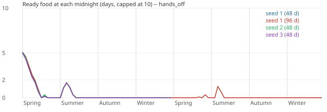
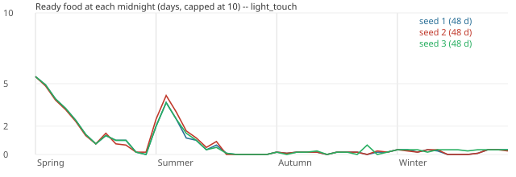
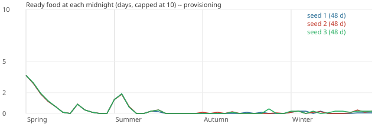

# Year matrix rerun (2026-10-07)

Generated by `tools/balance_report.py` from the balance harness (`godot/tools/balance/`, decision 0911).
Every figure is measured on the real demo village; nothing here is a projection.

## Latest: the ration reserve (2026-10-08; decision 1742)

**Rations are made now: 3–6 U a year (one batch in one seed, two in the others), and all of them were eaten. In two
seeds 3 U were still in store when winter began, and were eaten on days 37–38. Meals did not fall sharply: 211–239
missed of 864 (winter 65–91 of 216), against 216–235 (winter 79–91) without the reserve.**

Brendan's ruling of 2026-10-08:
- **F7 (b), "Add a ration reserve":** one batch's inputs (dried fish, nuts, and flour or a mill batch's grain) are held
  back from the kitchen's planning and from raw eating while the rations owned are below the reserve's target.
- **The target is the GDD's WorldPolicy `ration_reserve_milli`,** default 0. The demo village sets a PROVISIONAL 6 U.
- **F9 (c), accept.**
- **F8:** the conditional keep stays as 1740's PROPOSAL; the reserve replaces it where a target is set.

Staged provisioning, 9 residents, 3 seeds, on the final `ae0e1143`. The summaries and CSVs are in
[rack-fish/f7-reserve/](2026-10-07-year-matrix-rerun/rack-fish/f7-reserve/).

| Provisioning run | Meals missed (of 864) | Winter missed (of 216) | Breakfasts eaten / without (the porridge's meal) | Grain withdrawn (U) | Flour ground (U) | Dried fish (U) | Rations made / eaten (U) |
|---|---|---|---|---|---|---|---|
| 1739 | 190–226 | 62–88 | 111–158 / 152–178 | 94–98 | 0 | 3 | 0 / 0 |
| F5 + F6, no reserve (`b21acaf8`) | 216–235 | 79–91 | 108–132 / 162–185 | 94–98 | 0 | 6–12 | 0 / 0 |
| **The ration reserve (final, `ae0e1143`)** | **211–239** | **65–91** | **108–120 / 165–182** | **98–99** | **3–6** | **9–12** | **3–6 / 3–6** |

- **How the rations came.** In every seed the reserve held the harvest's grain on day 13. The mill ground it, and the
  rations were packed on day 14, and on day 17 in two seeds. The reserve held the flour as it was stored and the dried
  fish as the rack hung it, so the kitchen never planned them first.
- **Then nothing more.** After the harvest the stores held 1.1–1.7 U of grain for the rest of the year. The reserve
  never had a mill batch's 3 U again, so no further batch was packed.
- **The rations went to hungry residents.** They are directly edible (§5.7), and the reserve does not hold rations from
  a hungry resident: REQ-SET-117's emergency meal access may take a reserve, and the ruling held only the inputs.
  - In two seeds the second batch lasted into winter and was eaten on days 37–38.
  - In the third seed the one batch was gone by day 21.
- **The porridge.** It gave up one or two mill batches' grain (3–6 U) to the flour. Breakfasts eaten and missed are
  within the earlier runs' ranges.

**A new question for Brendan:**

| # | Question | Options (recommended first) | Evidence |
|---|---|---|---|
| F10 | The rations made are eaten before or early in winter | **(a) hold the rations themselves up to the target from raw eating too, outside winter or the critical food alert** (the GDD's reserve is of rations; REQ-SET-117 would need its emergency override narrowed, as for the inputs); (b) hold them all year, breakable only by §5.10's release; (c) leave it (rations are an emergency food whenever residents are hungry) | 3–6 U made, all eaten by day 38; at winter's start 3 U were left in two seeds and none in the third |

## Follow-up: after the tuning (2026-10-07; decisions 1732–1738)

Brendan ruled on P1–P14 the same day (decision 1731, "Brendan's rulings"). Branch `feat/demo-balance-tuning` built them:
- **1732, P1 (b):** a portion and a half a diner.
- **1733, P2 (a) + (c):** the cordial is poured at every supper and keeps 240 h.
- **1734, P3 (b):** the brew warning.
- **1735, P5 (a):** the hotpot takes greens or roots.
- **1736, P7 (a):** "raw N days" beside Ready food.
- **1737:** a batch holds its water.

The same staged matrix was rerun on that branch, and provisioning was also run at `--fish-high 12` for P6. The runs'
summaries and CSVs are in [after-tuning/](2026-10-07-year-matrix-rerun/after-tuning/). Before → after, the three seeds'
range:

| | hands_off | light_touch | provisioning |
|---|---|---|---|
| Meals missed | 56% → 57–60% | 29–30% → 29–33% | 25–27% → 24–26% |
| HUNGRY share of resident-hours | 88–89% → 86–87% | 87% → 84% | 86–88% → 83% |
| Winter meals missed (of 216) | 210–214 → 212–215 | 126–149 → 134–160 | 85–88 → 68–93 |
| Portions eaten | 128–129 → 127–130 | 378–388 → 407–417 | 376–387 → 380–414 |
| Peas eaten (U) | 0 → 0 | 0 → 6–10 | 0 → 6 |
| Cordial made / spoiled (U) | – | – | 48–56 / 48–56 → 36–76 / 0–6 |

Hands-off for two years (seed 1): 1043 → 1075 of 1728 meals missed (60% → 62%); HUNGRY 91% → 89%. Year 2's spring
still misses 189 of 216.

**Did they move?**
- **Hunger: hardly.** The portion and a half is served (up to 29–39 more portions a year under the players), but the village
  is supply-limited: the same food runs out sooner, so missed meals are flat or slightly up. Hands-off rarely has food
  for seconds at all.
- **Winter: no.** Nothing the rulings changed brings food into a winter.
- **The cordial: yes.** It is poured at suppers, 32–51 U a year, and almost none spoils (0–6 U).
- **The peas: a little.** 6–10 U a year are eaten as hotpot, but about 35 U still sit in store at year's end. Roots are
  now the hotpot's limit: the village grows about 50 U of roots a year, and the soups take them first.
- **P6, fishing to 12 U:**
  - **The table gains, a little.** 16–53 U more fish a year (3–7 more trips); 203–221 meals missed instead of
    210–225; winter's missed meals 74–85 instead of 68–93.
  - **The rack gets nothing.** Dry fish is still refused NO_FISH on 47 of 48 mornings, so rations are never made. The
    kitchen reserves every fish for its next two days of meals: **the limit is the reservation, not the catch.**

**New questions for Brendan** (nothing changed):

| # | Question | Options (recommended first) | Evidence |
|---|---|---|---|
| F1 | Hunger is now a supply problem (P1 is built) | **(a) more food in the ground first:** a greens bed for every pea bed (P5 (b)), and E5's 18 beds instead of 12; (b) leave it until hunger has a cost (E8) | HUNGRY 83–87% after P1; missed meals flat; light-touch's winter slightly worse (134–160 of 216); hands-off rarely has seconds |
| F2 | The peas' partner | **(a) P5 (b) as well: sow greens beside the peas** (the rotation or the light-touch player); (b) pickles or the hotpot take beans alone | ~33 U of peas left at year's end; 6–10 U eaten |
| F3 | Fish for the rack, so rations (P6 measured) | **(a) Dry fish may take fish planned beyond the next meal** (the kitchen keeps the next meal's); (b) the kitchen plans one day ahead, not two; (c) keep `FISH_STOCK_HIGH` at 12 U in the scripted player (it feeds the table, not the rack) | At 12 U: NO_FISH on 47 of 48 mornings, rations never; 16–53 U more fish, 203–221 missed instead of 210–225 |
| F4 | Mead's and cider's sink | waits on FEAST's Harvest and Orchard feasts (P3 (a)) | mead 36–44 U and cider 8–16 U a year still unpoured |


## Follow-up: fish for the rack (2026-10-08; decision 1739)

Brendan ruled on F1–F4 on 2026-10-08 (decision 1731):
- **F1:** wait for hunger to have a cost (E8);
- **F2:** waits with F1;
- **F3 (a):** Dry fish may take fish the kitchen planned beyond the next meal, never the next meal's;
- **F4:** waits on FEAST.

F3 (a) is built on branch `feat/demo-rack-fish` (decision 1739). Staged provisioning, 3 seeds; the summaries and CSVs
are in [rack-fish/](2026-10-07-year-matrix-rerun/rack-fish/):

| Provisioning run | Meals missed (of 864) | Winter missed (of 216) | Dried fish made (U) | Rations made | Dry fish refused NO_FISH (mornings) |
|---|---|---|---|---|---|
| Before 1739 (default fishing, 4 U) | 210–225 | 68–93 | 3 | 0 | 47 |
| **1739, default fishing** | 190–226 | 62–88 | 3 | **0** | 47 |
| Before 1739, `--fish-high 12` | 203–221 | 74–85 | 3 | 0 | 47 |
| **1739, `--fish-high 12`** | 216–223 | 74–85 | 3 | **0** | 47 |
| Probe: 1739, the scripted player also tries Dry fish every hour (not committed) | 210–242 | 79–93 | 21–24 | **0** | – |

**Did rations get made, and did missed meals move? No, and no.**

- **The kitchen fetches too soon for the 06:00 round.**
  - **The window.** Logged hour by hour, the kitchen reserves a landed catch for meals beyond the next one (6–8 U of
    "spare" fish), and the cook fetches it to the kitchen **within the same game hour**. The ruling's window is about
    an hour after each catch.
  - **What the round sees.** At the scripted player's 06:00 round, the later meals' fish is already at the kitchen,
    which is never the rack's: the rack takes only fish still in its store.
- **Within the window, the dried fish is eaten raw.** An uncommitted probe tried Dry fish every hour; its patch is one
  `elif` in `provisioning_policy.gd`'s `on_hour` that orders `R_DRY_FISH` when no batch is open and its refusal is empty.
  - **The rack runs.** 7–8 batches a year, 21–24 U of dried fish.
  - **But it is all eaten.** Dried fish is directly edible at 1800 NP (GDD §5.7), so hungry residents eat every unit before a batch of
    rations can set it aside.
  - **So no flour is ground either.** The scripted player grinds flour only once dried fish and nuts are both free
    (the chain order of decision 1731), and in the probe the dried fish was gone by the next 06:00 round, so
    `Pack rations` still reads `NO_FLOUR` (the first input checked) on all 48 mornings.
  - **So the outcome is the same.** Rations are still never made, and missed meals do not move: the fish goes from
    the table to the rack and back to the residents.

**A new question for Brendan:**

| # | Question | Options (recommended first) | Evidence |
|---|---|---|---|
| F5 | Rations need dried fish to be kept, not eaten | **(a) keep dried fish for rations:** dried fish is not eaten raw while a ration batch lacks it (close to 1611 P3's option (b), a ration reserve the cook keeps topped up, and the GDD's WorldPolicy `ration_reserve_milli`); (b) let the rack take fish already fetched for meals beyond the next (the rack's fetch from the kitchen's larder); (c) leave it, since rations are a winter reserve the player orders by hand | 21–24 U of dried fish a year, all eaten raw, with an hourly rack; 0 rations in every run |

### F5 and F6 built, re-measured (2026-10-08; decisions 1739, 1740, 1741)

**Are rations made now? No, not in any run. At what cost in meals? The mill took no grain from the porridge. The rack
taking fetched fish (F5 (b)) moved missed meals from 190–226 to 216–235.**

Brendan's rulings of 2026-10-08:
- **F5, "Both":**
  - (a) dried fish is not eaten raw while a batch of rations lacks it (1740);
  - (b) the rack may also take fish already fetched to the kitchen for meals beyond the next (1739).
- **M2:** keep as built.
- **F6, "Push on: mill takes grain too":** the mill may take grain planned beyond the next meal under the rack's rule
  (1741).

**The coordinator's call (a PROPOSAL in 1740, for Brendan to overturn):** dried fish is kept from raw eating only while
a batch of rations could be made but for it. That needs its nuts free; its flour free or on its way (grain for a mill
batch, or a batch grinding); and no batch queued with its own.

Staged provisioning, 9 residents, 3 seeds. The summaries and CSVs are in
[rack-fish/f6/](2026-10-07-year-matrix-rerun/rack-fish/f6/) (final, `b21acaf8`) and
[rack-fish/f5/](2026-10-07-year-matrix-rerun/rack-fish/f5/) (`ae137794`).

| Provisioning run | Meals missed (of 864) | Winter missed (of 216) | Breakfasts eaten / went without (the porridge's meal) | Grain withdrawn (U) | Dried fish made (U) | Flour made (U) | Rations made |
|---|---|---|---|---|---|---|---|
| Before 1739 | 210–225 | 68–93 | 98–127 / 162–183 | 94–98 | 3 | 0 | 0 |
| 1739 (F3 (a): the rack takes in-store fish) | 190–226 | 62–88 | 111–158 / 152–178 | 94–98 | 3 | 0 | 0 |
| F5 (a) + (b), keep unconditional (`ae137794`) | 228–235 | 80–95 | 116–135 / 162–172 | 94–98 | 6–12 | 0 | 0 |
| **F5 + F6, keep conditional (final, `b21acaf8`)** | **216–235** | **79–91** | **108–132 / 162–185** | **94–98** | **6–12** | **0** | **0** |
| Probe: final, plus the scripted player grinding whenever flour is not free (not committed) | 226–245 | 63–100 | 100–127 / 168–182 | 98 | 15 | 12 | 0 |

- **The rack runs more, and its fish is eaten.**
  - Taking fetched fish (F5 (b)) gave the rack 2–4 batches a year against 1 (Dry fish refused NO_FISH on 44–46
    mornings against 47), so 6–12 U of dried fish.
  - Every unit was eaten (made = withdrawn in every seed).
  - Missed meals rose to 216–235: the fish goes from the meals to the rack, and then to residents eating it raw.
- **Why the dried fish was still eaten.** The keep held only while nuts were free and grain was to be had.
  - **Grain** was to be had only on days 12–14, after the year's one harvest (25.6 U), which the porridge used up by
    day 15. For the rest of the year the stores held 1.1–1.7 U, against the mill's 3 U.
  - **Dried fish** came on days 2–3, 6 and 15 (and 20–23 in seed 3), when grain was short or no nuts were free.
- **The porridge did as before.** The scripted player grinds only when dried fish and nuts are free together (1731's
  chain order). That never fell on days 12–14, so the mill never ran: grain withdrawn 94–98 U and breakfasts as in
  every run.
- **Grinding early does not help either** (the uncommitted probe; its patch drops the dried-fish-and-nuts condition
  from the player's grind gate in `provisioning_policy.gd`).
  - **The mill ran.** 4 batches, 12 U of flour.
  - **The kitchen ate it.** It plans flour into its own dishes within the hour (hardtack at breakfast, the biscuit
    soup, the pasty, the scones), so all 12 U was cooked. Pack rations read NO_FLOUR on 47 mornings.
  - **It cost meals.** 226–245 missed.

**New questions for Brendan:**

| # | Question | Options (recommended first) | Evidence |
|---|---|---|---|
| F7 | Rations need their three inputs at once, and the kitchen and hungry residents take each as it comes | **(a) leave rations to the player's own order** (1611 P3 (a), as built): the scripted player shows the chain cannot run by itself, and the meals pay for every attempt; (b) a ration reserve the cook keeps (1611 P3 (b), the GDD's `ration_reserve_milli`): flour, dried fish and nuts held for one batch from both the kitchen and raw eating, at a cost in meals; (c) take F5 (b) back (the rack takes in-store fish only), which recovers the 1739 missed-meal figures | No run made a ration; the rack's extra fish cost about 10 missed meals at the top of the range; grinding early cost about 10 more and still made none |
| F8 | 1740's conditional keep (the coordinator's PROPOSAL) | (a) as built; (b) unconditional (`ae137794`: 1 U kept all year, still no rations) | Under both, all the dried fish beyond the kept unit was eaten |
| F9 | The keep's nuts clause (the review of `b21acaf8`) | (a) also keep the rations' nuts while they wait; (b) drop the nuts clause; (c) accept it as the intent | Nuts are eaten raw too (1600 NP, same 720 h shelf), so under hunger the nuts go below 1 U and the keep switches off |

## Findings (written by hand; the generated report follows)

The first full rerun of the year matrix since the [2026-10-01 baseline](2026-10-01-first-year-baseline.md).
- **Code.** Master after PR #234 (`2e704b6a`), so every tuning ruling since the baseline is in:
  - E1 and E7 (0912);
  - E2–E4 (0603);
  - E5 (0886);
  - batch 8 and the review fixes (0997);
  - the cook serving as he cooks (1005);
  - hives (1601), preserving (1611), brewing (1621), the hall's fuel (1652) and livelier weather (1632);
  - **the new recipes (1625): jam, nut cheese, ale, cider, vinegar and pickles.**
- **Art staged**, so this is the real village of **nine named residents**, as in the baseline. The figures compare
  directly.
- **Harness: decision 1731.** It adds a hearth and apiary watch, and a third scripted player, **provisioning**. That
  player is light-touch plus the preserving and brewing no routine orders, plus the foraging those recipes need.
- **The appendix.** An earlier run on the unstaged, six-placeholder village before #234 is kept as
  [the appendix](2026-10-07-year-matrix-rerun/appendix-six-placeholders/report.md). Its findings agree in direction;
  its numbers are not this village's.
- **The runs.**
  - 3 seeds × 3 policies × 1 year (48 days), and hands-off seed 1 for 2 years.
  - All at 4x on 30 fixed frames a second, from the demo's opening (Spring 1, 06:00, with E1's stocked pantry).
  - A year took about 10–12 real minutes, ten runs at once.
  - Every run printed `BALANCE-RUN ok`.

```
python3 tools/stage_demo_assets.py              # the art must be staged (docs/ENVIRONMENT.md): unstaged, the cast is 6 placeholders
python3 tools/run_balance_matrix.py --out-dir <dir> --seeds 1 2 3 --policies hands_off light_touch provisioning --days 48 --jobs 9
python3 tools/run_balance_matrix.py --out-dir <dir> --seeds 1 --policies hands_off --days 96 --jobs 1
python3 tools/balance_report.py --out docs/balance/2026-10-07-year-matrix-rerun.md \
    --svg-dir docs/balance/2026-10-07-year-matrix-rerun --summary-dir docs/balance/2026-10-07-year-matrix-rerun \
    --notes <this section> --title "Year matrix rerun (2026-10-07)" <dir>/*.json
```

### Headline numbers

| Run | Meals: portion / raw / missed (missed %) | Hungry % of hours | Idle % | Crops stored (U) | Fish (U) | Berries + fruit picked (U) | Honey (U) | Spoiled (U) | Threats |
|---|---|---|---|---|---|---|---|---|---|
| hands_off s1 | 129 / 250 / 485 (56%) | 88% | 59% | 105.8 | 0.0 | 548.2 | 60.5 | 42.7 | 5 |
| hands_off s2 | 128 / 252 / 484 (56%) | 88% | 61% | 114.4 | 0.0 | 563.2 | 60.5 | 30.5 | 5 |
| hands_off s3 | 129 / 254 / 481 (56%) | 89% | 59% | 114.9 | 0.0 | 543.2 | 60.5 | 32.7 | 5 |
| light_touch s1 | 378 / 232 / 254 (29%) | 87% | 52% | 151.5 | 250.4 | 518.2 | 60.5 | 111.1 | 5 |
| light_touch s2 | 379 / 232 / 253 (29%) | 87% | 51% | 151.6 | 247.7 | 528.2 | 60.5 | 128.0 | 5 |
| light_touch s3 | 388 / 215 / 261 (30%) | 87% | 48% | 151.6 | 247.3 | 513.2 | 60.5 | 138.4 | 5 |
| provisioning s1 | 387 / 246 / 231 (27%) | 86% | 47% | 151.6 | 253.3 | 538.2 | 60.5 | 268.4 | 5 |
| provisioning s2 | 386 / 264 / 214 (25%) | 86% | 44% | 151.5 | 252.0 | 518.2 | 60.5 | 189.2 | 5 |
| provisioning s3 | 376 / 266 / 222 (26%) | 88% | 43% | 151.6 | 242.2 | 488.2 | 60.5 | 177.4 | 5 |

There are 864 meals a year (9 residents × 2 meals × 48 days). "Crops stored" leaves out E1's opening 90 U.

**Meals missed by season** (each season has 216; the three seeds are given as s1 / s2 / s3):

| Season | hands_off | light_touch | provisioning |
|---|---|---|---|
| Spring | 120 / 120 / 120 | 52 / 52 / 52 | 52 / 52 / 52 |
| Summer | 79 / 75 / 74 | 47 / 38 / 29 | 40 / 33 / 36 |
| Autumn | 73 / 75 / 77 | 29 / 32 / 31 | 52 / 41 / 49 |
| Winter | 213 / 214 / 210 | 126 / 131 / 149 | **87 / 88 / 85** |

### What moved since the baseline, and why (both runs staged, nine residents)

| | Baseline (2026-10-01) | Now | Why |
|---|---|---|---|
| Meals missed, hands-off | 851 of 864 (98%) | **481–485 (56%)** | E5 (0886): 12 beds and the default sowing policy, so hands-off sows (17–19 sowings, 106–115 U of crops). Also E1's opening stock, and the orchard, hedge and hive, whose food is raw-edible. |
| Meals missed, light-touch | 795–810 (92–94%) | **253–261 (29–30%)** | The same, plus the fish dish that needs no roots (E2, 0603): 236–242 U of the 247–250 U of fish caught is cooked, where the baseline lost three-quarters of its catch. |
| Meals missed, provisioning | – | **214–231 (25–27%)** | Jam, nut cheese, dried fruit and foraged nuts: winter's missed meals fall from 126–149 to 85–88. |
| Portions / raw meals, light-touch | 45–59 / 9–11 | 378–388 / 215–232 | The kitchen has food all year; the hedge (≈420 U a year), the orchard and the hive are eaten raw. |
| Hungry share of resident-hours | 97% | **86–89%, every policy** | Barely moved: two portions are 3600 NP against a 6000 NP day (finding 2). |
| Idle labour, hands-off / light-touch | 99% / 95% | 59–61% / 48–52% (provisioning 43–47%) | Sowing, harvests, the orchard and apiary routines, the woods, fishing and the stations now have work to give. |
| Threats a year | 45 (20 floods, 25 fires) | **5** (3 floods, 2 fires), every seed | E7 (0912): threats come on the calendar. |
| Spoiled in store, light-touch | 76–85 U, mostly fish | 111–138 U: berries 70–84 U, pears 14–40 U, apples 0–27 U, fish 5–13 U | Fish now gets eaten. Berries keep 48 h (`GOODS_SHELF_HOURS`). |
| Spring meals missed, hands-off | 203 of 216 | 120 | E1's 90 U lasts about four days for nine. |
| Wood in a light-touch year | 40 → 33.5 U | 40 → 18.6–30.1 U; hands-off 40 → 16.8–22.1 U; never out of fuel | The hearths now burn 52–58 U a year, 47.8 U of it in winter (the hall alone). |
| Two years hands-off (s1) | 1715 of 1728 missed | **1043 of 1728 (60%)** | Year 2's spring misses 186 of 216, with no opening stock to carry it. Its summer to winter repeat year 1's pattern. |

### Findings

1. **The new food and fuel, as measured** (provisioning unless stated; s1 / s2 / s3).

   | Product (record) | Made a year (U) | Where it went | Why it stops there |
   |---|---|---|---|
   | Honey (1601) | 70.5 made; 60.5 released | All used: mead 27–33 U, the cordial 6–7 U, jam 7–10 U, the rest eaten raw (in light-touch, all 60.5 U raw) | 6 U put by as winter feed, 2 U lost to wildlife. The hive stands at 10 000 strength from spring to the year's end. |
   | Nuts (foraged; 1731) | 84 / 72 / 68 (21 / 18 / 17 trips of one forager) | All used: the cheese, nut dishes, eaten raw | – |
   | Dried fruit (1611) | 24 / 24 / 24 | All eaten | The rack is free for fruit only when the fruit is free (NO_FRUIT on 39–40 mornings). |
   | **Jam (1625)** | 30 / 24 / 21 | **All eaten** (720 h shelf; 850 NP raw) | Berries or honey short on 34–42 mornings. |
   | **Nut cheese (1625)** | 30 / 36 / 38 | **All eaten** (1440 h; 1600 NP raw) | Nuts short on 29–33 mornings; the two crocks are shared with pickles. |
   | Mead (1621) | 36 / 40 / 44 | **Never poured**; all still in store | The harness holds no regatta feast, the only place that pours it. |
   | **Cider (1625)** | 16 / 4 / 8 | **Never poured** | Apples go first to dried fruit (row 1, before cider's row 8); vats were full on 2–4 mornings. |
   | The cordial (1621, DEC-045) | 56 / 48 / 48 | **100% spoiled** | It keeps 72 h and is poured only at a feast. |
   | **Vinegar (1625)** | 4 / 4 / 4 | Held for pickles that never came | Apples are short (NO_APPLES 40–44 mornings). |
   | **Pickles (1625)** | **never made** | – | No free roots on 38–39 mornings, because the kitchen reserves every root. The crocks were full on 5–6 mornings. |
   | **Ale (1625)** | **never made** | – | No barley (NO_BARLEY 44–46 mornings). Neither the light-touch player (wheat first) nor E5's rotation sows barley in year 1. Hands-off's year 2 grows 10 U. |
   | Rations (1611) | **never made** | – | Dried fish is never free (`Not ordered: Dry fish (NO_FISH)` on all 48 mornings): the kitchen reserves every fresh fish for its next two days of meals. The rations line reads `NO_FLOUR` only because flour is the first input checked. |
   | Hearths (1652) | 52–58 U of wood a year; 47.8 U a winter | **Never out of fuel.** Lowest winter fuel-days: hands-off 4.7–6.0, light-touch 4.7–8.1, provisioning 5.5–8.0 | Only the hall's hearth burns (287 heated source-hours of a winter's 288 hours). Tier 2 is never reached: its package needs stone 40, and the village opens with 20 and earns none without digging. The ×0.75 would save 12 U a winter. |
   | Weather (1632) | – | No crop withered; no fuel ran out | Summers drew ideal_spell or calm_days; autumns blight, early_frost or ideal_spell; winters ideal_spell, hard_freeze or calm_days; year 2's spring heavy_rain. |

2. **Hunger cannot fall below about 85% of hours with two meals a day.**
   - Two portions are 1800 NP each, 3600 NP a day, against `family_rules.gd`'s 6000 NP day for a small adult (×1.2
     medium, ×1.6 large, ×1.2 in winter).
   - Decision 0381 knew this: "Two meals are 3600 NP, 60% of a small resident's 6000. The rest is left to later food
     work."
   - Measured: **86–89% of resident-hours HUNGRY under every policy.** The 5% `hungry_max_pct` line cannot be met.
   - Hunger costs nothing in the demo yet (the baseline's E8), so this shows only on the HUD.
3. **Winter is still the famine season, but preserves now work.**
   - **Winter meals missed:** hands-off 210–214 of 216 (97–99%), light-touch 126–149 (58–69%), provisioning 85–88
     (39–41%).
   - **The preserves are the difference:** jam and nut cheese keep 720–1440 h and are eaten raw in winter (provisioning
     ate 90–95 raw meals in winter, against 27–45 in light-touch).
   - **What never reaches the winter table:** peas, rations and pickles.
4. **Peas are harvested and never eaten.**
   - E5's rotation (0886: grain → beans → roots, the demo's wheat → pea → carrot) sows 38–47 U of peas a year.
   - The only bean dish, the bean hotpot, needs beans 2 + greens 2, and nothing ever sows greens.
   - Peas are not raw-edible: 36 U sit in store at every year's end, under every policy, while winter goes hungry.
   - With greens they would make about 21 hotpots of 3 portions: roughly 64 portions, a third of the provisioning
     player's winter shortfall.
5. **Drinks have no sink.**
   - Mead (36–44 U) and cider (4–16 U) pile up all year.
   - The cordial spoils whole (48–56 U).
   - Mead takes 27–33 U of honey, 32 000–40 000 NP that the residents would otherwise eat raw.
   - Provisioning still comes out ahead of light-touch, because jam and cheese more than make up for it. But brewing
     buys nothing until a feast pours.
6. **The preserving player holds berries from raw eating.**
   - Berries spoiled 97–190 U under provisioning, against 70–84 U under light-touch.
   - The cordial's and the jam's batches reserve berries when ordered. Reserved berries are not eaten raw, and at 48 h
     some spoil before the batch is worked.
   - The cordial makes it worse: its berries become a product that spoils too.
7. **"Ready food" reads 0.00 in every season of every run**, so every season is flagged "food ran out".
   - That happens even in seasons ending with 90–161 U in store (provisioning's autumns). The HUD's figure (`kitchen.gd days_of_meals_milli`) counts only what the
     kitchen's dishes would cook.
   - Most of the village's food is now raw-edible stock it ignores: berries, fruit, honey, nuts, jam, cheese, dried
     fruit.
   - **Read the meals-missed and raw columns, not the reserve flags.**

### Tuning proposals (for Brendan; nothing here was changed)

Each one names its number's record, and each can be measured with this harness. Rows P10–P14 are #234's PROVISIONAL
numbers.

| # | Number (record) | Current | Options (recommended first) | Evidence (staged) |
|---|---|---|---|---|
| P1 | Meals a day vs the day's demand (0381; GDD §5.2/§5.7) | 2 × 1800 NP = 3600 of 6000 NP | **(a) a third, midday portion** (5400 NP) with the day-plan work; (b) 1.5 portions per diner at each meal; (c) leave it until hunger has a cost (E8) | 86–89% hungry hours under every policy |
| P2 | The cordial (DEC-045; 1621 P2, P4) | 72 h shelf; poured only at the regatta feast; not eaten | **(a) poured at ordinary suppers** (1621 P2 (c); keeps DEC-007's "table drink"); (b) raw-edible at its 500 NP (1621 P4 (b)); (c) shelf 72 → 240 h | 48–56 U a year, 100% spoiled; its berries held from raw eating (finding 6) |
| P3 | Mead's and cider's sink (1621 P2; 1625) | Poured only at the regatta's Hearth feast, ceil(E/4) U each | **(a) FEAST's Harvest and Orchard feasts pour them** (1621's own plan), **plus (b) the Brew order warns above a stock of two feasts' worth**, ceil(9/4) × 2 = 6 U a drink | Mead 36–44 U and cider 4–16 U a year unused; 27–33 U of honey diverted |
| P4 | Hive winter feed (1601 P3, P5) | 6 U put by first; the pantry tops it up | **No change** | Every winter ends at 10 000 strength with exactly 0 U of feed left; the pantry is never drawn on |
| P5 | The rotation's peas vs the hotpot (0886; dish book `bean_hotpot`) | wheat → pea → carrot; hotpot = beans 2 + greens 2 | **(a) the hotpot takes beans 2 + greens or roots 2** (as E2 opened the fish dish); (b) a greens bed sown for every pea bed; (c) peas raw-edible | 38–47 U of peas a year never withdrawn; about 36 U in store at every year's end |
| P6 | Fish for the rack, and so rations (harness `FISH_STOCK_HIGH` 4 U; the kitchen plans two days ahead, 0421) | No trip while fresh fish ≥ 4 U; the kitchen reserves the next two days' fish | **Measure first:** rerun provisioning with `FISH_STOCK_HIGH` 12 U. Then (a) Dry fish may take fish planned beyond the next meal; or (b) the kitchen plans one day ahead | Dry fish refused NO_FISH on 48 of 48 mornings; rations never made |
| P7 | Ready food (the HUD figure; the harness's `reserve_min_days` 2) | Counts grain, roots and fresh fish only | **(a) show raw-edible stock beside it** ("eaten raw: N days"; no rule changes); (b) count it in Ready food at its NP | 0.00 in all 36 one-year seasons, with up to 161 U in store |
| P8 | Opening stone (`tunnel_stores.gd START_STONE_MILLI_U` 20 U, a demo value) vs the tier-2 package's stone 40 (REQ-SET-136) | 20 U; no stone income without digging | **(a) no change**: fuel never ran out; (b) open with 40 U if tier 2 should be reachable in year 1 | Lowest fuel-days 4.7; tier 2 would save 12 U (2.5 fuel-days) a winter |
| P9 | `hungry_max_pct` (`tools/balance_thresholds.json`, provisional) | 5% | **(a) keep 5% as the target and mark it unattainable until P1**; (b) 40% until P1 is ruled | Breached in every season |
| P10 | Jam (1625, PROVISIONAL): berries 2 + honey 1 + water 1 → 3, 16 WU, 720 h, 850 NP | as built | **(a) no change**; (b) honey 1 → 0.5, if honey is wanted for mead | 21–30 U a year, all eaten; the best winter preserve per unit of honey |
| P11 | Nut cheese (1625, PROVISIONAL): nuts 2 → 2, 16 WU + 24 h, 1440 h, 1600 NP; 2 crocks | as built | **(a) no change**; (b) a third crock, if pickles are to run beside it | 30–38 U a year, all eaten; crocks full on 5–6 mornings |
| P12 | Ale (1625, PROVISIONAL): barley 3 + water 3 → 4 | as built | **(a) no change; measure** once barley is grown (a light-touch barley bed, or year 2); (b) ale takes any grain | Never made: no barley on 44–46 mornings |
| P13 | Cider and vinegar (1625, PROVISIONAL): apples 4 + water 1 → 4 (72 h / 96 h in a vat) | as built | **(a) no change to the rows**; cider's sink is P3; (b) cider and vinegar before dried fruit in the recipe order (a player choice, not a number) | Cider 4–16 U unpoured; vinegar 4 U; apples short on 40–44 mornings |
| P14 | Pickles (1625, PROVISIONAL): roots 3 + vinegar 1 → 3, 12 WU + 24 h, 720 h, 800 NP | as built | **(a) no change**: with nine mouths there is never a root to spare; (b) pickles take roots or greens, so they could use a greens bed (with P5 (b)) | Never made: no free roots on 38–39 mornings |

Also noted, game-side (not a number): `order_batch` checks the butt's water but does not reserve it, so two batches in
one morning can be ordered against the same water. Not seen in these runs: the butt held 37–40 U all year.

### Threshold breaches (questions for Brendan, never "fixed" by changing a rule)

- **Ready food < 2 days:** every season of every run (finding 7, P7).
- **Hungry > 5%:** every season (finding 2, P1, P9).
- **Missed meals > 0:** every season.
- **Spoilage > 10%:** most summer and autumn seasons: berries, pears, and the cordial (findings 5 and 6).
- **Idle > 50%:** most hands-off seasons, and every policy's spring before the first harvests.

The full per-season flags follow.

## Runs

| Policy | Seed | Days | Staged assets | FPS x speed | Real seconds |
|---|---|---|---|---|---|
| hands_off | 1 | 48 | True | 30 x 4 | 729.1 |
| hands_off | 1 | 96 | True | 30 x 4 | 1286.8 |
| hands_off | 2 | 48 | True | 30 x 4 | 720.3 |
| hands_off | 3 | 48 | True | 30 x 4 | 719.5 |
| light_touch | 1 | 48 | True | 30 x 4 | 728.9 |
| light_touch | 2 | 48 | True | 30 x 4 | 729.8 |
| light_touch | 3 | 48 | True | 30 x 4 | 726.3 |
| provisioning | 1 | 48 | True | 30 x 4 | 612.2 |
| provisioning | 2 | 48 | True | 30 x 4 | 607.2 |
| provisioning | 3 | 48 | True | 30 x 4 | 610.9 |

## Headlines

- **hands_off seed 1**: first Ready food Y1 Spring 1; food runs out Y1 Spring 6 (42 days with none after that); spoilage worst 12% in Y1 Summer (42.7 of 714.5 U stored over the run); 59% idle labour; 485 meals missed of 864 (56%); hungry 88% of resident-hours.
- **hands_off seed 1, 96 days**: first Ready food Y1 Spring 1; food runs out Y1 Spring 6 (90 days with none after that); spoilage worst 42% in Y2 Spring (87.1 of 1416.5 U stored over the run); 63% idle labour; 1043 meals missed of 1728 (60%); hungry 91% of resident-hours.
- **hands_off seed 2**: first Ready food Y1 Spring 1; food runs out Y1 Spring 5 (43 days with none after that); spoilage worst 8% in Y1 Summer (30.5 of 738.1 U stored over the run); 61% idle labour; 484 meals missed of 864 (56%); hungry 88% of resident-hours.
- **hands_off seed 3**: first Ready food Y1 Spring 1; food runs out Y1 Spring 6 (42 days with none after that); spoilage worst 8% in Y1 Summer (32.7 of 718.6 U stored over the run); 59% idle labour; 481 meals missed of 864 (56%); hungry 89% of resident-hours.
- **light_touch seed 1**: first Ready food Y1 Spring 1; food runs out Y1 Spring 7 (38 days with none after that); spoilage worst 13% in Y1 Autumn (111.1 of 980.6 U stored over the run); 52% idle labour; 254 meals missed of 864 (29%); hungry 87% of resident-hours.
- **light_touch seed 2**: first Ready food Y1 Spring 1; food runs out Y1 Spring 7 (38 days with none after that); spoilage worst 16% in Y1 Autumn (128.0 of 988.0 U stored over the run); 51% idle labour; 253 meals missed of 864 (29%); hungry 87% of resident-hours.
- **light_touch seed 3**: first Ready food Y1 Spring 1; food runs out Y1 Spring 7 (37 days with none after that); spoilage worst 19% in Y1 Autumn (138.4 of 972.5 U stored over the run); 48% idle labour; 261 meals missed of 864 (30%); hungry 87% of resident-hours.
- **provisioning seed 1**: first Ready food Y1 Spring 1; food runs out Y1 Spring 7 (39 days with none after that); spoilage worst 25% in Y1 Autumn (268.4 of 1283.6 U stored over the run); 47% idle labour; 231 meals missed of 864 (27%); hungry 86% of resident-hours.
- **provisioning seed 2**: first Ready food Y1 Spring 1; food runs out Y1 Spring 7 (39 days with none after that); spoilage worst 18% in Y1 Autumn (189.2 of 1234.1 U stored over the run); 44% idle labour; 214 meals missed of 864 (25%); hungry 86% of resident-hours.
- **provisioning seed 3**: first Ready food Y1 Spring 1; food runs out Y1 Spring 7 (38 days with none after that); spoilage worst 22% in Y1 Autumn (177.4 of 1197.4 U stored over the run); 43% idle labour; 222 meals missed of 864 (26%); hungry 88% of resident-hours.

## Flags

- hands_off seed 1, Y1 Spring: food ran out (Y1 Spring 6; 7 day(s) with no Ready food); idle labour 83% (> 50%); meals missed: 120 (56% of diners); hungry 77% of resident-hours (> 5%)
- hands_off seed 1, Y1 Summer: food ran out (Y1 Summer 1; 11 day(s) with no Ready food); spoilage 11.8% (> 10%); idle labour 54% (> 50%); meals missed: 79 (37% of diners); hungry 91% of resident-hours (> 5%)
- hands_off seed 1, Y1 Autumn: food ran out (Y1 Autumn 1; 12 day(s) with no Ready food); idle labour 58% (> 50%); meals missed: 73 (34% of diners); hungry 86% of resident-hours (> 5%)
- hands_off seed 1, Y1 Winter: food ran out (Y1 Winter 1; 12 day(s) with no Ready food); meals missed: 213 (99% of diners); hungry 99% of resident-hours (> 5%)
- hands_off seed 1, 96 days, Y1 Spring: food ran out (Y1 Spring 6; 7 day(s) with no Ready food); idle labour 83% (> 50%); meals missed: 120 (56% of diners); hungry 77% of resident-hours (> 5%)
- hands_off seed 1, 96 days, Y1 Summer: food ran out (Y1 Summer 1; 11 day(s) with no Ready food); spoilage 11.8% (> 10%); idle labour 54% (> 50%); meals missed: 79 (37% of diners); hungry 91% of resident-hours (> 5%)
- hands_off seed 1, 96 days, Y1 Autumn: food ran out (Y1 Autumn 1; 12 day(s) with no Ready food); idle labour 58% (> 50%); meals missed: 73 (34% of diners); hungry 86% of resident-hours (> 5%)
- hands_off seed 1, 96 days, Y1 Winter: food ran out (Y1 Winter 1; 12 day(s) with no Ready food); meals missed: 213 (99% of diners); hungry 99% of resident-hours (> 5%)
- hands_off seed 1, 96 days, Y2 Spring: food ran out (Y2 Spring 1; 12 day(s) with no Ready food); spoilage 41.8% (> 10%); idle labour 83% (> 50%); meals missed: 186 (86% of diners); hungry 99% of resident-hours (> 5%)
- hands_off seed 1, 96 days, Y2 Summer: food ran out (Y2 Summer 1; 12 day(s) with no Ready food); idle labour 58% (> 50%); meals missed: 81 (38% of diners); hungry 89% of resident-hours (> 5%)
- hands_off seed 1, 96 days, Y2 Autumn: food ran out (Y2 Autumn 1; 12 day(s) with no Ready food); idle labour 66% (> 50%); meals missed: 75 (35% of diners); hungry 85% of resident-hours (> 5%)
- hands_off seed 1, 96 days, Y2 Winter: food ran out (Y2 Winter 1; 12 day(s) with no Ready food); idle labour 60% (> 50%); meals missed: 216 (100% of diners); hungry 100% of resident-hours (> 5%)
- hands_off seed 2, Y1 Spring: food ran out (Y1 Spring 5; 8 day(s) with no Ready food); idle labour 83% (> 50%); meals missed: 120 (56% of diners); hungry 76% of resident-hours (> 5%)
- hands_off seed 2, Y1 Summer: food ran out (Y1 Summer 1; 11 day(s) with no Ready food); idle labour 54% (> 50%); meals missed: 75 (35% of diners); hungry 90% of resident-hours (> 5%)
- hands_off seed 2, Y1 Autumn: food ran out (Y1 Autumn 1; 12 day(s) with no Ready food); idle labour 59% (> 50%); meals missed: 75 (35% of diners); hungry 86% of resident-hours (> 5%)
- hands_off seed 2, Y1 Winter: food ran out (Y1 Winter 1; 12 day(s) with no Ready food); meals missed: 214 (99% of diners); hungry 100% of resident-hours (> 5%)
- hands_off seed 3, Y1 Spring: food ran out (Y1 Spring 6; 7 day(s) with no Ready food); idle labour 83% (> 50%); meals missed: 120 (56% of diners); hungry 77% of resident-hours (> 5%)
- hands_off seed 3, Y1 Summer: food ran out (Y1 Summer 1; 11 day(s) with no Ready food); idle labour 53% (> 50%); meals missed: 74 (34% of diners); hungry 91% of resident-hours (> 5%)
- hands_off seed 3, Y1 Autumn: food ran out (Y1 Autumn 1; 12 day(s) with no Ready food); meals missed: 77 (36% of diners); hungry 86% of resident-hours (> 5%)
- hands_off seed 3, Y1 Winter: food ran out (Y1 Winter 1; 12 day(s) with no Ready food); meals missed: 210 (97% of diners); hungry 99% of resident-hours (> 5%)
- light_touch seed 1, Y1 Spring: food ran out (Y1 Spring 7; 5 day(s) with no Ready food); idle labour 71% (> 50%); meals missed: 52 (24% of diners); hungry 74% of resident-hours (> 5%)
- light_touch seed 1, Y1 Summer: food ran out (Y1 Summer 1; 9 day(s) with no Ready food); meals missed: 47 (22% of diners); hungry 89% of resident-hours (> 5%)
- light_touch seed 1, Y1 Autumn: food ran out (Y1 Autumn 1; 12 day(s) with no Ready food); spoilage 12.5% (> 10%); meals missed: 29 (13% of diners); hungry 86% of resident-hours (> 5%)
- light_touch seed 1, Y1 Winter: food ran out (Y1 Winter 1; 12 day(s) with no Ready food); idle labour 50% (> 50%); meals missed: 126 (58% of diners); hungry 97% of resident-hours (> 5%)
- light_touch seed 2, Y1 Spring: food ran out (Y1 Spring 7; 5 day(s) with no Ready food); idle labour 71% (> 50%); meals missed: 52 (24% of diners); hungry 74% of resident-hours (> 5%)
- light_touch seed 2, Y1 Summer: food ran out (Y1 Summer 1; 9 day(s) with no Ready food); spoilage 10.5% (> 10%); meals missed: 38 (18% of diners); hungry 89% of resident-hours (> 5%)
- light_touch seed 2, Y1 Autumn: food ran out (Y1 Autumn 1; 12 day(s) with no Ready food); spoilage 15.8% (> 10%); meals missed: 32 (15% of diners); hungry 87% of resident-hours (> 5%)
- light_touch seed 2, Y1 Winter: food ran out (Y1 Winter 1; 12 day(s) with no Ready food); meals missed: 131 (61% of diners); hungry 97% of resident-hours (> 5%)
- light_touch seed 3, Y1 Spring: food ran out (Y1 Spring 7; 5 day(s) with no Ready food); idle labour 71% (> 50%); meals missed: 52 (24% of diners); hungry 74% of resident-hours (> 5%)
- light_touch seed 3, Y1 Summer: food ran out (Y1 Summer 1; 8 day(s) with no Ready food); meals missed: 29 (13% of diners); hungry 88% of resident-hours (> 5%)
- light_touch seed 3, Y1 Autumn: food ran out (Y1 Autumn 1; 12 day(s) with no Ready food); spoilage 19.5% (> 10%); meals missed: 31 (14% of diners); hungry 88% of resident-hours (> 5%)
- light_touch seed 3, Y1 Winter: food ran out (Y1 Winter 1; 12 day(s) with no Ready food); meals missed: 149 (69% of diners); hungry 97% of resident-hours (> 5%)
- provisioning seed 1, Y1 Spring: food ran out (Y1 Spring 7; 5 day(s) with no Ready food); idle labour 71% (> 50%); meals missed: 52 (24% of diners); hungry 74% of resident-hours (> 5%)
- provisioning seed 1, Y1 Summer: food ran out (Y1 Summer 1; 10 day(s) with no Ready food); spoilage 11.7% (> 10%); meals missed: 40 (19% of diners); hungry 89% of resident-hours (> 5%)
- provisioning seed 1, Y1 Autumn: food ran out (Y1 Autumn 1; 12 day(s) with no Ready food); spoilage 25.3% (> 10%); meals missed: 52 (24% of diners); hungry 89% of resident-hours (> 5%)
- provisioning seed 1, Y1 Winter: food ran out (Y1 Winter 1; 12 day(s) with no Ready food); spoilage 13.8% (> 10%); meals missed: 87 (40% of diners); hungry 93% of resident-hours (> 5%)
- provisioning seed 2, Y1 Spring: food ran out (Y1 Spring 7; 5 day(s) with no Ready food); idle labour 71% (> 50%); meals missed: 52 (24% of diners); hungry 74% of resident-hours (> 5%)
- provisioning seed 2, Y1 Summer: food ran out (Y1 Summer 1; 10 day(s) with no Ready food); spoilage 11.9% (> 10%); meals missed: 33 (15% of diners); hungry 89% of resident-hours (> 5%)
- provisioning seed 2, Y1 Autumn: food ran out (Y1 Autumn 1; 12 day(s) with no Ready food); spoilage 17.6% (> 10%); meals missed: 41 (19% of diners); hungry 88% of resident-hours (> 5%)
- provisioning seed 2, Y1 Winter: food ran out (Y1 Winter 1; 12 day(s) with no Ready food); meals missed: 88 (41% of diners); hungry 94% of resident-hours (> 5%)
- provisioning seed 3, Y1 Spring: food ran out (Y1 Spring 7; 5 day(s) with no Ready food); idle labour 71% (> 50%); meals missed: 52 (24% of diners); hungry 74% of resident-hours (> 5%)
- provisioning seed 3, Y1 Summer: food ran out (Y1 Summer 1; 9 day(s) with no Ready food); meals missed: 36 (17% of diners); hungry 89% of resident-hours (> 5%)
- provisioning seed 3, Y1 Autumn: food ran out (Y1 Autumn 1; 12 day(s) with no Ready food); spoilage 22.4% (> 10%); meals missed: 49 (23% of diners); hungry 92% of resident-hours (> 5%)
- provisioning seed 3, Y1 Winter: food ran out (Y1 Winter 1; 12 day(s) with no Ready food); meals missed: 85 (39% of diners); hungry 94% of resident-hours (> 5%)

## Thresholds

| Threshold | Value | Why |
|---|---|---|
| `reserve_min_days` | 2 | GDD §5.3 puts food jobs in urgency bucket 2 while the projected reserve is under 2 days, and gameplay_balance.md BAL-RUN-008 counts a village stabilised only with ready food of 2 days or more. A season whose lowest Ready food (the HUD's figure, kitchen.gd days_of_meals_milli) falls below 2 days is flagged; at 0 the report says the food RAN OUT (UI §8: food under 1 day is already CRITICAL). |
| `spoilage_max_pct` | 10 | No GDD target exists. Shelf lives are 48 h for fresh fish, 144 h for leaves, 240 h for roots, 480 h for beans and 720 h for grain (GDD §5.7; farm_catalog.gd), so a pantry that is drawn on twice a day should lose little; one unit in ten of the food available in a season (its opening stock plus what was stored in it) spoiling in store is taken as the line past which spoilage is a balance problem rather than noise. Provisional: for Brendan to confirm. |
| `spoilage_min_u` | 1 | Spoilage is flagged only when at least this much (1 U, about two portions' worth of roots) spoiled in the season: a few hundred milli-U left over and spoiled reads 100% of nearly nothing, which is noise, not a balance problem. |
| `idle_max_pct` | 50 | Idle share = idle / (idle + work) resident-time, rest, meals and emergencies excluded. GDD §5.3's default day is 10 WORK hours of about 14 waking ones (BAL-SUPPLY-001), so a village with work to do should spend well under half its available time idle; above 50% the residents are idle more than they work and labour is not what limits the economy. Provisional: for Brendan to confirm. |
| `missed_meals_max_pct` | 0 | REQ-SET-012 and decision 0381: every resident is fed at each meal. Any resident going without at a meal is flagged; the percentage is of the diners counted at the season's meals. |
| `hungry_max_pct` | 5 | HUNGRY is need 1500 or below (meal_rules.gd: §5.2's urgent line). An occasional hungry hour (a late meal, a resident called away) is normal; more than one resident-hour in twenty spent hungry means meals are not keeping up. |

## Policy: hands_off



**Ready food, lowest (days)**

| Season | seed 1 | seed 1, 96 days | seed 2 | seed 3 |
|---|---|---|---|---|
| Y1 Spring | 0.00 | 0.00 | 0.00 | 0.00 |
| Y1 Summer | 0.00 | 0.00 | 0.00 | 0.00 |
| Y1 Autumn | 0.00 | 0.00 | 0.00 | 0.00 |
| Y1 Winter | 0.00 | 0.00 | 0.00 | 0.00 |
| Y2 Spring | - | 0.00 | - | - |
| Y2 Summer | - | 0.00 | - | - |
| Y2 Autumn | - | 0.00 | - | - |
| Y2 Winter | - | 0.00 | - | - |

**Food stored (U)**

| Season | seed 1 | seed 1, 96 days | seed 2 | seed 3 |
|---|---|---|---|---|
| Y1 Spring | 33.2 | 33.2 | 33.2 | 33.2 |
| Y1 Summer | 339.1 | 339.1 | 362.7 | 353.2 |
| Y1 Autumn | 342.2 | 342.2 | 342.2 | 327.2 |
| Y1 Winter | 0.0 | 0.0 | 0.0 | 5.0 |
| Y2 Spring | - | 49.0 | - | - |
| Y2 Summer | - | 312.7 | - | - |
| Y2 Autumn | - | 340.3 | - | - |
| Y2 Winter | - | 0.0 | - | - |

**Spoilage %**

| Season | seed 1 | seed 1, 96 days | seed 2 | seed 3 |
|---|---|---|---|---|
| Y1 Spring | 0 | 0 | 0 | 0 |
| Y1 Summer | 12 | 12 | 8 | 8 |
| Y1 Autumn | 0 | 0 | 0 | 0 |
| Y1 Winter | 6 | 6 | 6 | 5 |
| Y2 Spring | - | 42 | - | - |
| Y2 Summer | - | 0 | - | - |
| Y2 Autumn | - | 2 | - | - |
| Y2 Winter | - | 0 | - | - |

**Meals missed**

| Season | seed 1 | seed 1, 96 days | seed 2 | seed 3 |
|---|---|---|---|---|
| Y1 Spring | 120 | 120 | 120 | 120 |
| Y1 Summer | 79 | 79 | 75 | 74 |
| Y1 Autumn | 73 | 73 | 75 | 77 |
| Y1 Winter | 213 | 213 | 214 | 210 |
| Y2 Spring | - | 186 | - | - |
| Y2 Summer | - | 81 | - | - |
| Y2 Autumn | - | 75 | - | - |
| Y2 Winter | - | 216 | - | - |

**Hungry % of resident-hours**

| Season | seed 1 | seed 1, 96 days | seed 2 | seed 3 |
|---|---|---|---|---|
| Y1 Spring | 77 | 77 | 76 | 77 |
| Y1 Summer | 91 | 91 | 90 | 91 |
| Y1 Autumn | 86 | 86 | 86 | 86 |
| Y1 Winter | 99 | 99 | 100 | 99 |
| Y2 Spring | - | 99 | - | - |
| Y2 Summer | - | 89 | - | - |
| Y2 Autumn | - | 85 | - | - |
| Y2 Winter | - | 100 | - | - |

**Idle labour %**

| Season | seed 1 | seed 1, 96 days | seed 2 | seed 3 |
|---|---|---|---|---|
| Y1 Spring | 83 | 83 | 83 | 83 |
| Y1 Summer | 54 | 54 | 54 | 53 |
| Y1 Autumn | 58 | 58 | 59 | 50 |
| Y1 Winter | 40 | 40 | 48 | 50 |
| Y2 Spring | - | 83 | - | - |
| Y2 Summer | - | 58 | - | - |
| Y2 Autumn | - | 66 | - | - |
| Y2 Winter | - | 60 | - | - |

**Work h / resident-day**

| Season | seed 1 | seed 1, 96 days | seed 2 | seed 3 |
|---|---|---|---|---|
| Y1 Spring | 2.2 | 2.2 | 2.2 | 2.3 |
| Y1 Summer | 5.8 | 5.8 | 5.9 | 6.0 |
| Y1 Autumn | 5.3 | 5.3 | 5.3 | 6.5 |
| Y1 Winter | 8.3 | 8.3 | 7.3 | 7.0 |
| Y2 Spring | - | 2.3 | - | - |
| Y2 Summer | - | 5.3 | - | - |
| Y2 Autumn | - | 4.4 | - | - |
| Y2 Winter | - | 5.6 | - | - |


## Policy: light_touch



**Ready food, lowest (days)**

| Season | seed 1 | seed 2 | seed 3 |
|---|---|---|---|
| Y1 Spring | 0.00 | 0.00 | 0.00 |
| Y1 Summer | 0.00 | 0.00 | 0.00 |
| Y1 Autumn | 0.00 | 0.00 | 0.00 |
| Y1 Winter | 0.00 | 0.00 | 0.00 |

**Food stored (U)**

| Season | seed 1 | seed 2 | seed 3 |
|---|---|---|---|
| Y1 Spring | 114.9 | 114.3 | 114.3 |
| Y1 Summer | 374.4 | 390.2 | 406.4 |
| Y1 Autumn | 442.7 | 438.6 | 410.6 |
| Y1 Winter | 48.6 | 44.9 | 41.4 |

**Spoilage %**

| Season | seed 1 | seed 2 | seed 3 |
|---|---|---|---|
| Y1 Spring | 2 | 2 | 2 |
| Y1 Summer | 8 | 10 | 9 |
| Y1 Autumn | 13 | 16 | 19 |
| Y1 Winter | 8 | 5 | 6 |

**Meals missed**

| Season | seed 1 | seed 2 | seed 3 |
|---|---|---|---|
| Y1 Spring | 52 | 52 | 52 |
| Y1 Summer | 47 | 38 | 29 |
| Y1 Autumn | 29 | 32 | 31 |
| Y1 Winter | 126 | 131 | 149 |

**Hungry % of resident-hours**

| Season | seed 1 | seed 2 | seed 3 |
|---|---|---|---|
| Y1 Spring | 74 | 74 | 74 |
| Y1 Summer | 89 | 89 | 88 |
| Y1 Autumn | 86 | 87 | 88 |
| Y1 Winter | 97 | 97 | 97 |

**Idle labour %**

| Season | seed 1 | seed 2 | seed 3 |
|---|---|---|---|
| Y1 Spring | 71 | 71 | 71 |
| Y1 Summer | 45 | 46 | 42 |
| Y1 Autumn | 41 | 50 | 39 |
| Y1 Winter | 50 | 37 | 39 |

**Work h / resident-day**

| Season | seed 1 | seed 2 | seed 3 |
|---|---|---|---|
| Y1 Spring | 3.6 | 3.6 | 3.6 |
| Y1 Summer | 6.7 | 6.6 | 7.0 |
| Y1 Autumn | 7.1 | 6.3 | 7.6 |
| Y1 Winter | 6.5 | 8.2 | 8.0 |


## Policy: provisioning



**Ready food, lowest (days)**

| Season | seed 1 | seed 2 | seed 3 |
|---|---|---|---|
| Y1 Spring | 0.00 | 0.00 | 0.00 |
| Y1 Summer | 0.00 | 0.00 | 0.00 |
| Y1 Autumn | 0.00 | 0.00 | 0.00 |
| Y1 Winter | 0.00 | 0.00 | 0.00 |

**Food stored (U)**

| Season | seed 1 | seed 2 | seed 3 |
|---|---|---|---|
| Y1 Spring | 114.9 | 114.3 | 114.3 |
| Y1 Summer | 483.4 | 489.4 | 467.3 |
| Y1 Autumn | 585.0 | 523.6 | 522.1 |
| Y1 Winter | 100.2 | 106.9 | 93.7 |

**Spoilage %**

| Season | seed 1 | seed 2 | seed 3 |
|---|---|---|---|
| Y1 Spring | 2 | 2 | 2 |
| Y1 Summer | 12 | 12 | 7 |
| Y1 Autumn | 25 | 18 | 22 |
| Y1 Winter | 14 | 8 | 3 |

**Meals missed**

| Season | seed 1 | seed 2 | seed 3 |
|---|---|---|---|
| Y1 Spring | 52 | 52 | 52 |
| Y1 Summer | 40 | 33 | 36 |
| Y1 Autumn | 52 | 41 | 49 |
| Y1 Winter | 87 | 88 | 85 |

**Hungry % of resident-hours**

| Season | seed 1 | seed 2 | seed 3 |
|---|---|---|---|
| Y1 Spring | 74 | 74 | 74 |
| Y1 Summer | 89 | 89 | 89 |
| Y1 Autumn | 89 | 88 | 92 |
| Y1 Winter | 93 | 94 | 94 |

**Idle labour %**

| Season | seed 1 | seed 2 | seed 3 |
|---|---|---|---|
| Y1 Spring | 71 | 71 | 71 |
| Y1 Summer | 39 | 38 | 39 |
| Y1 Autumn | 36 | 37 | 30 |
| Y1 Winter | 43 | 30 | 32 |

**Work h / resident-day**

| Season | seed 1 | seed 2 | seed 3 |
|---|---|---|---|
| Y1 Spring | 3.6 | 3.6 | 3.6 |
| Y1 Summer | 7.5 | 7.6 | 7.4 |
| Y1 Autumn | 8.0 | 7.7 | 8.8 |
| Y1 Winter | 7.3 | 8.8 | 8.6 |


## Run: hands_off seed 1

| | Y1 Spring | Y1 Summer | Y1 Autumn | Y1 Winter |
|---|---|---|---|---|
| Food stored (U) | 33.2 | 339.1 | 342.2 | 0.0 |
| of which fish (U) | 0.0 | 0.0 | 0.0 | 0.0 |
| Food eaten (U) | 122.7 | 251.0 | 343.7 | 9.3 |
| Portions eaten | 86 | 43 | 0 | 0 |
| Spoiled in store (U) | 0.0 | 40.0 | 0.0 | 2.7 |
| Spoilage % | 0 | 12 | 0 | 6 |
| Stock at end (U) | 0.5 | 48.7 | 47.2 | 35.3 |
| Ready food min (days) | 0.00 | 0.00 | 0.00 | 0.00 |
| Days with no Ready food (opening) | 7 (0) | 11 (0) | 12 (0) | 12 (0) |
| Meals: ate / raw / missed | 86 / 10 / 120 | 43 / 94 / 79 | 0 / 143 / 73 | 0 / 3 / 213 |
| Missed % | 56 | 37 | 34 | 99 |
| Fed / peckish / hungry % of hours | 16 / 7 / 77 | 0 / 9 / 91 | 0 / 14 / 86 | 0 / 1 / 99 |
| Work h / resident-day | 2.2 | 5.8 | 5.3 | 8.3 |
| Idle h / resident-day | 10.9 | 6.9 | 7.5 | 5.6 |
| Idle % | 83 | 54 | 58 | 40 |
| Board queue avg / max | 0.99 / 8 | 2.50 / 11 | 1.81 / 8 | 0.76 / 9 |
| Board wait mean / max (game min) | 168 / 601 | 144 / 752 | 124 / 661 | 461 / 1340 |
| Wood in / out / end (U) | 4.5 / 6.3 / 38.2 | 0.0 / 2.4 / 35.8 | 17.0 / 4.2 / 48.6 | 16.5 / 47.8 / 17.3 |
| Planks / stone / earth at end (U) | 0.0 / 20.0 / 0.0 | 0.0 / 20.0 / 0.0 | 0.0 / 20.0 / 0.0 | 0.0 / 20.0 / 0.0 |
| Beds sown / harvested | 11 / 3 | 6 / 17 | 0 / 0 | 0 / 0 |
| Crops withered (blight/frost/overripe/other) | 0/0/0/0 | 0/0/0/0 | 0/0/0/0 | 0/0/0/0 |
| Weather events | ideal_spell | ideal_spell | blight | ideal_spell |
| Frost nights / blight outbreaks | 1 / 1 | 0 / 2 | 2 / 1 | 0 / 0 |
| Incident raises (critical) / rescues | 9 (1) / 0 | 7 (1) / 0 | 3 (1) / 0 | 4 (2) / 0 |

Daily series (each scaled to its own maximum):

```
Ready food (days)        █▆▄▂▁▁▁▁▁▁▁▁▁▁▂▁▁▁▁▁▁▁▁▁▁▁▁▁▁▁▁▁▁▁▁▁▁▁▁▁▁▁▁▁▁▁▁▁  max 3.4
Pantry stock (U)         ▆▅▄▂▁▁▁▁▁▁▁▁▂▃▄▄▂▂▂▃▅▄▄▄▇▅█▇▆▄▄▄▄▄▄▄▄▄▄▄▄▄▃▃▃▃▃▃  max 105.9
Food stored (U)          ▁▁▁▁▂▁▁▂▁▁▁▁▄▃▅▃▃▃▃▄▅▃▃▃▇▃█▃▃▃▃▃▃▃▃▃▁▁▁▁▁▁▁▁▁▁▁▁  max 78.9
Portions eaten           ▅███▅▂▁▃▃▁▁▁▁▆▅█▃▁▁▁▁▁▁▁▁▁▁▁▁▁▁▁▁▁▁▁▁▁▁▁▁▁▁▁▁▁▁▁  max 18.0
Spoiled (U)              ▁▁▁▁▁▁▁▁▁▁▁▁▁▁▃▅█▁▁▁▁▁▂▁▁▁▁▁▁▁▁▁▁▁▁▁▁▁▁▁▁▁▂▁▁▁▁▁  max 20.0
Meals missed             ▄▁▁▁▃▆█▆▆███▆▁▃▁▂▄▄▅▅▃▅▄▄▃▃▃▁▂▄▄▅▄▅▄▇███████████  max 18.0
Hungry resident-hours    ▁▁▃▇█████████▇▇█▇▇▇▇█▇▇▇▇▇▇▇▆▇▇▇▇▇▇▇████████████  max 216.0
Work h (all residents)   ▂▃▂▂▃▂▂▂▂▂▃▂▄▅▅▅▅▄▄▄▄▄▄▄▆▄▅▄▃▄▃▄▄▄▄▄█████▄▃▂▅▅▅▇  max 109.9
Idle h (all residents)   ▇▆▆▇▆▇█▇▇█▇█▆▄▄▄▄▆▆▅▅▅▅▆▄▅▄▅▅▅▆▅▅▆▅▅▂▂▂▂▂▆▇▇▅▅▅▃  max 114.4
Wood (U)                 ▇▇▆▆▆▆▆▆▆▆▆▆▆▆▆▆▆▆▆▆▆▆▆▆▇▇██████████▇▇▆▆▅▅▅▅▄▄▄▃  max 48.8
```

Work hours per resident-day, by resident: Wenna Tallowby 5.6, Jory Whitethorn 4.5, Linnet Whinberry 5.8, Tobit Highbough 5.8, Tegwin Slipstone 6.6, Corra Netley 5.2, Tuppen Clayholm 6.8, Hulda Slatebrook 4.5, Elstan Weirholt 4.0

New incidents by source: farm 7, kitchen 1, threat 1, village 1, water 1, winter 1; threats: fire at the covered store 2, flood at the stream edge 3

## Run: hands_off seed 1, 96 days

| | Y1 Spring | Y1 Summer | Y1 Autumn | Y1 Winter | Y2 Spring | Y2 Summer | Y2 Autumn | Y2 Winter |
|---|---|---|---|---|---|---|---|---|
| Food stored (U) | 33.2 | 339.1 | 342.2 | 0.0 | 49.0 | 312.7 | 340.3 | 0.0 |
| of which fish (U) | 0.0 | 0.0 | 0.0 | 0.0 | 0.0 | 0.0 | 0.0 | 0.0 |
| Food eaten (U) | 122.7 | 251.0 | 343.7 | 9.3 | 49.0 | 290.6 | 346.0 | 0.0 |
| Portions eaten | 86 | 43 | 0 | 0 | 18 | 18 | 0 | 0 |
| Spoiled in store (U) | 0.0 | 40.0 | 0.0 | 2.7 | 35.3 | 0.7 | 8.5 | 0.0 |
| Spoilage % | 0 | 12 | 0 | 6 | 42 | 0 | 2 | 0 |
| Stock at end (U) | 0.5 | 48.7 | 47.2 | 35.3 | 0.0 | 21.3 | 7.1 | 7.1 |
| Ready food min (days) | 0.00 | 0.00 | 0.00 | 0.00 | 0.00 | 0.00 | 0.00 | 0.00 |
| Days with no Ready food (opening) | 7 (0) | 11 (0) | 12 (0) | 12 (0) | 12 (0) | 12 (0) | 12 (0) | 12 (0) |
| Meals: ate / raw / missed | 86 / 10 / 120 | 43 / 94 / 79 | 0 / 143 / 73 | 0 / 3 / 213 | 18 / 12 / 186 | 18 / 117 / 81 | 0 / 141 / 75 | 0 / 0 / 216 |
| Missed % | 56 | 37 | 34 | 99 | 86 | 38 | 35 | 100 |
| Fed / peckish / hungry % of hours | 16 / 7 / 77 | 0 / 9 / 91 | 0 / 14 / 86 | 0 / 1 / 99 | 0 / 1 / 99 | 0 / 11 / 89 | 0 / 15 / 85 | 0 / 0 / 100 |
| Work h / resident-day | 2.2 | 5.8 | 5.3 | 8.3 | 2.3 | 5.3 | 4.4 | 5.6 |
| Idle h / resident-day | 10.9 | 6.9 | 7.5 | 5.6 | 11.3 | 7.4 | 8.4 | 8.4 |
| Idle % | 83 | 54 | 58 | 40 | 83 | 58 | 66 | 60 |
| Board queue avg / max | 0.99 / 8 | 2.50 / 11 | 1.81 / 8 | 0.76 / 9 | 1.26 / 9 | 1.98 / 7 | 1.25 / 7 | 0.58 / 9 |
| Board wait mean / max (game min) | 168 / 601 | 144 / 752 | 124 / 661 | 461 / 1340 | 239 / 1063 | 130 / 601 | 104 / 601 | 281 / 802 |
| Wood in / out / end (U) | 4.5 / 6.3 / 38.2 | 0.0 / 2.4 / 35.8 | 17.0 / 4.2 / 48.6 | 16.5 / 47.8 / 17.3 | 36.5 / 6.9 / 46.9 | 0.0 / 0.9 / 46.0 | 6.8 / 4.2 / 48.6 | 36.0 / 47.8 / 36.8 |
| Planks / stone / earth at end (U) | 0.0 / 20.0 / 0.0 | 0.0 / 20.0 / 0.0 | 0.0 / 20.0 / 0.0 | 0.0 / 20.0 / 0.0 | 0.0 / 20.0 / 0.0 | 0.0 / 20.0 / 0.0 | 0.0 / 20.0 / 0.0 | 0.0 / 20.0 / 0.0 |
| Beds sown / harvested | 11 / 3 | 6 / 17 | 0 / 0 | 0 / 0 | 12 / 6 | 3 / 9 | 0 / 0 | 0 / 0 |
| Crops withered (blight/frost/overripe/other) | 0/0/0/0 | 0/0/0/0 | 0/0/0/0 | 0/0/0/0 | 0/0/0/0 | 0/0/0/0 | 0/0/0/0 | 0/0/0/0 |
| Weather events | ideal_spell | ideal_spell | blight | ideal_spell | heavy_rain | ideal_spell | calm_days | ideal_spell |
| Frost nights / blight outbreaks | 1 / 1 | 0 / 2 | 2 / 1 | 0 / 0 | 1 / 1 | 0 / 2 | 2 / 1 | 0 / 0 |
| Incident raises (critical) / rescues | 9 (1) / 0 | 7 (1) / 0 | 3 (1) / 0 | 4 (2) / 0 | 10 (1) / 0 | 8 (1) / 0 | 3 (1) / 0 | 2 (1) / 0 |

Daily series (each scaled to its own maximum):

```
Ready food (days)        █▆▄▂▁▁▁▁▁▁▁▁▁▁▂▁▁▁▁▁▁▁▁▁▁▁▁▁▁▁▁▁▁▁▁▁▁▁▁▁▁▁▁▁▁▁▁▁▁▁▁▁▁▁▁▁▁▁▁▁▁▁▂▁▁▁▁▁▁▁▁▁▁▁▁▁▁▁▁▁▁▁▁▁▁▁▁▁▁▁▁▁▁▁▁▁  max 3.4
Pantry stock (U)         ▆▅▄▂▁▁▁▁▁▁▁▁▂▃▄▄▂▂▂▃▅▄▄▄▇▅█▇▆▄▄▄▄▄▄▄▄▄▄▄▄▄▃▃▃▃▃▃▃▃▂▁▁▁▁▁▁▁▁▁▁▂▄▃▃▃▂▃▃▂▃▂▆▄█▇▇▆▅▄▂▂▂▁▁▁▁▁▁▁▁▁▁▁▁▁  max 106.0
Food stored (U)          ▁▁▁▁▁▁▁▂▁▁▁▁▃▃▄▃▃▃▃▃▄▃▃▃▆▂▇▂▂▂▃▂▃▂▃▃▁▁▁▁▁▁▁▁▁▁▁▁▁▁▁▁▁▁▁▁▂▂▂▁▃▃▄▃▃▃▃▃▃▃▃▃▇▂█▃▃▃▂▂▂▂▂▂▁▁▁▁▁▁▁▁▁▁▁▁  max 93.4
Portions eaten           ▅███▅▂▁▃▃▁▁▁▁▆▅█▃▁▁▁▁▁▁▁▁▁▁▁▁▁▁▁▁▁▁▁▁▁▁▁▁▁▁▁▁▁▁▁▁▁▁▁▁▁▁▁▂▆▂▁▁▁▃▅▁▁▂▂▁▁▁▁▁▁▁▁▁▁▁▁▁▁▁▁▁▁▁▁▁▁▁▁▁▁▁▁  max 18.0
Spoiled (U)              ▁▁▁▁▁▁▁▁▁▁▁▁▁▁▃▅█▁▁▁▁▁▂▁▁▁▁▁▁▁▁▁▁▁▁▁▁▁▁▁▁▁▂▁▁▁▁▁▁▃▅▇▁▁▁▁▁▁▁▁▁▁▁▁▁▁▁▁▁▁▁▁▁▁▁▁▁▁▁▁▁▁▄▁▁▁▁▁▁▁▁▁▁▁▁▁  max 20.0
Meals missed             ▄▁▁▁▃▆█▆▆███▆▁▃▁▂▄▄▅▅▃▅▄▄▃▃▃▁▂▄▄▅▄▅▄▇███████████████████▆▃▅█▅▅▄▁▃▃▃▄▃▄▅▄▄▁▂▂▅▃▄▃▂▅▅▆████████████  max 18.0
Hungry resident-hours    ▁▁▃▇█████████▇▇█▇▇▇▇█▇▇▇▇▇▇▇▆▇▇▇▇▇▇▇█████████████████████████▇█▇▇▇▇▇▇▇▇▇▇▇▇▆▇▇▇▇▆▇▇█████████████  max 216.0
Work h (all residents)   ▂▃▂▂▃▂▂▂▂▂▃▂▄▅▅▅▅▄▄▄▄▄▄▄▆▄▅▄▃▄▃▄▄▄▄▄█████▄▃▂▅▅▅▇▂▂▁▂▂▃▃▂▂▃▃▂▄▄▅▄▄▄▅▄▄▄▄▄▅▄▄▄▄▃▄▃▃▃▃▃▅▅▆▅▅▂▂▂▅▅▅▅  max 109.9
Idle h (all residents)   ▆▅▆▇▆▇█▇▇█▇▇▅▃▄▄▄▅▅▅▅▅▅▅▄▅▄▅▅▅▆▅▅▅▅▅▂▂▂▂▂▆▇▇▅▅▅▃████▇▆▆▇▇▆▅█▆▅▄▄▅▅▄▄▅▅▆▅▄▅▄▅▅▆▆▆▆▇▆▆▄▅▄▅▅███▅▄▅▅  max 119.1
Wood (U)                 ▇▇▆▆▆▆▆▆▆▆▆▆▆▆▆▆▆▆▆▆▆▆▆▆▇▇██████████▇▇▆▆▅▅▅▅▄▄▄▃▄▄▄▄▄▅▇██▇███████████████████████████▇▇▇▆▇▇▇▆▆▆▆  max 48.8
```

Work hours per resident-day, by resident: Wenna Tallowby 5.2, Jory Whitethorn 4.3, Linnet Whinberry 4.8, Tobit Highbough 5.5, Tegwin Slipstone 6.2, Corra Netley 4.9, Tuppen Clayholm 6.2, Hulda Slatebrook 3.7, Elstan Weirholt 3.4

New incidents by source: farm 13, kitchen 1, threat 1, village 1, water 1, winter 1, woods 2; threats: fire at the covered store 5, flood at the stream edge 4

## Run: hands_off seed 2

| | Y1 Spring | Y1 Summer | Y1 Autumn | Y1 Winter |
|---|---|---|---|---|
| Food stored (U) | 33.2 | 362.7 | 342.2 | 0.0 |
| of which fish (U) | 0.0 | 0.0 | 0.0 | 0.0 |
| Food eaten (U) | 122.7 | 278.8 | 350.8 | 1.4 |
| Portions eaten | 86 | 42 | 0 | 0 |
| Spoiled in store (U) | 0.0 | 27.9 | 0.0 | 2.7 |
| Spoilage % | 0 | 8 | 0 | 6 |
| Stock at end (U) | 0.5 | 56.5 | 48.0 | 43.9 |
| Ready food min (days) | 0.00 | 0.00 | 0.00 | 0.00 |
| Days with no Ready food (opening) | 8 (0) | 11 (0) | 12 (0) | 12 (0) |
| Meals: ate / raw / missed | 86 / 10 / 120 | 42 / 99 / 75 | 0 / 141 / 75 | 0 / 2 / 214 |
| Missed % | 56 | 35 | 35 | 99 |
| Fed / peckish / hungry % of hours | 17 / 6 / 76 | 0 / 10 / 90 | 0 / 14 / 86 | 0 / 0 / 100 |
| Work h / resident-day | 2.2 | 5.9 | 5.3 | 7.3 |
| Idle h / resident-day | 10.9 | 6.9 | 7.6 | 6.7 |
| Idle % | 83 | 54 | 59 | 48 |
| Board queue avg / max | 1.00 / 8 | 2.54 / 11 | 1.76 / 8 | 0.71 / 9 |
| Board wait mean / max (game min) | 170 / 600 | 151 / 770 | 131 / 601 | 401 / 1154 |
| Wood in / out / end (U) | 4.5 / 6.3 / 38.2 | 0.0 / 2.4 / 35.8 | 14.8 / 2.2 / 48.4 | 16.2 / 47.8 / 16.8 |
| Planks / stone / earth at end (U) | 0.0 / 20.0 / 0.0 | 0.0 / 20.0 / 0.0 | 0.0 / 20.0 / 0.0 | 0.0 / 20.0 / 0.0 |
| Beds sown / harvested | 11 / 3 | 8 / 19 | 0 / 0 | 0 / 0 |
| Crops withered (blight/frost/overripe/other) | 0/0/0/0 | 0/0/0/0 | 0/0/0/0 | 0/0/0/0 |
| Weather events | ideal_spell | calm_days | ideal_spell | hard_freeze |
| Frost nights / blight outbreaks | 1 / 1 | 0 / 2 | 2 / 1 | 0 / 0 |
| Incident raises (critical) / rescues | 7 (1) / 0 | 10 (1) / 0 | 3 (1) / 0 | 4 (2) / 0 |

Daily series (each scaled to its own maximum):

```
Ready food (days)        █▆▄▂▁▁▁▂▁▁▁▁▁▃▃▁▁▁▁▁▁▁▁▁▁▁▁▁▁▁▁▁▁▁▁▁▁▁▁▁▁▁▁▁▁▁▁▁  max 3.1
Pantry stock (U)         ▅▄▃▂▁▁▁▁▁▁▁▁▂▃▄▃▂▂▂▁▃▃▄▄▇▆█▇▆▅▅▄▄▄▄▄▄▄▄▄▄▄▄▃▃▃▃▃  max 127.0
Food stored (U)          ▁▁▁▁▂▁▁▂▁▁▁▁▃▅▅▃▃▃▃▂▆▃▅▃▇▃█▃▃▃▃▃▃▃▃▃▁▁▁▁▁▁▁▁▁▁▁▁  max 78.9
Portions eaten           ███▆▅▁▁▂▃▁▁▁▁▄█▇▂▁▁▁▁▁▁▁▁▁▁▁▁▁▁▁▁▁▁▁▁▁▁▁▁▁▁▁▁▁▁▁  max 18.0
Spoiled (U)              ▁▁▁▁▁▁▁▁▁▁▁▁▁▁▁█▆▁▁▁▁▁▁▁▁▁▁▁▁▁▁▁▁▁▁▁▁▁▁▁▁▁▁▂▁▁▁▁  max 15.7
Meals missed             ▁▁▁▂▃██▇▅███▅▄▁▂▂▂▄▅▅▄▄▄▅▃▂▃▂▂▃▃▅▅▅▅▇███████████  max 18.0
Hungry resident-hours    ▁▁▃▆█████████▇██▇▇▇▇▇▇▇▇▇▇▆▇▇▆▇▇▇▇▇▇████████████  max 216.0
Work h (all residents)   ▃▄▃▂▃▂▂▃▂▂▃▂▄▇▇▅▅▄▄▄▅▅▆▅▇▅▅▅▅▅▅▅▄▄▄▄█▆▆▅▆▇▇▇▅▆▆▅  max 89.1
Idle h (all residents)   ▆▅▇▇▇██▇▇█▇█▆▄▃▄▅▅▅▆▅▅▄▅▄▅▄▅▅▅▅▅▆▆▆▆▃▅▅▅▅▄▄▄▅▅▅▅  max 115.0
Wood (U)                 ▇▇▆▆▆▆▆▆▆▆▆▇▇▆▆▆▆▆▆▆▆▆▆▆▇▇██████████▇▇▇▇▆▆▆▅▄▄▄▃  max 48.5
```

Work hours per resident-day, by resident: Wenna Tallowby 5.5, Jory Whitethorn 4.5, Linnet Whinberry 5.0, Tobit Highbough 5.7, Tegwin Slipstone 6.1, Corra Netley 5.2, Tuppen Clayholm 7.6, Hulda Slatebrook 3.7, Elstan Weirholt 3.2

New incidents by source: farm 10, kitchen 1, threat 1, village 1, water 1, winter 1; threats: fire at the covered store 2, flood at the stream edge 3

## Run: hands_off seed 3

| | Y1 Spring | Y1 Summer | Y1 Autumn | Y1 Winter |
|---|---|---|---|---|
| Food stored (U) | 33.2 | 353.2 | 327.2 | 5.0 |
| of which fish (U) | 0.0 | 0.0 | 0.0 | 0.0 |
| Food eaten (U) | 122.7 | 266.0 | 332.9 | 10.0 |
| Portions eaten | 86 | 43 | 0 | 0 |
| Spoiled in store (U) | 0.0 | 30.0 | 0.0 | 2.7 |
| Spoilage % | 0 | 8 | 0 | 5 |
| Stock at end (U) | 0.5 | 57.7 | 52.0 | 44.3 |
| Ready food min (days) | 0.00 | 0.00 | 0.00 | 0.00 |
| Days with no Ready food (opening) | 7 (0) | 11 (0) | 12 (0) | 12 (0) |
| Meals: ate / raw / missed | 86 / 10 / 120 | 43 / 99 / 74 | 0 / 139 / 77 | 0 / 6 / 210 |
| Missed % | 56 | 34 | 36 | 97 |
| Fed / peckish / hungry % of hours | 16 / 7 / 77 | 0 / 9 / 91 | 0 / 14 / 86 | 0 / 1 / 99 |
| Work h / resident-day | 2.3 | 6.0 | 6.5 | 7.0 |
| Idle h / resident-day | 10.9 | 6.8 | 6.4 | 7.0 |
| Idle % | 83 | 53 | 50 | 50 |
| Board queue avg / max | 0.97 / 8 | 2.66 / 11 | 2.00 / 8 | 0.71 / 9 |
| Board wait mean / max (game min) | 170 / 601 | 150 / 757 | 129 / 661 | 327 / 784 |
| Wood in / out / end (U) | 4.5 / 6.3 / 38.2 | 0.0 / 2.4 / 35.8 | 20.2 / 8.2 / 47.9 | 22.0 / 47.8 / 22.1 |
| Planks / stone / earth at end (U) | 0.0 / 20.0 / 0.0 | 0.0 / 20.0 / 0.0 | 0.0 / 20.0 / 0.0 | 0.0 / 20.0 / 0.0 |
| Beds sown / harvested | 11 / 3 | 8 / 19 | 0 / 0 | 0 / 0 |
| Crops withered (blight/frost/overripe/other) | 0/0/0/0 | 0/0/0/0 | 0/0/0/0 | 0/0/0/0 |
| Weather events | ideal_spell | calm_days | early_frost | calm_days |
| Frost nights / blight outbreaks | 1 / 1 | 0 / 2 | 2 / 1 | 0 / 0 |
| Incident raises (critical) / rescues | 7 (1) / 0 | 9 (1) / 0 | 4 (1) / 0 | 4 (2) / 0 |

Daily series (each scaled to its own maximum):

```
Ready food (days)        █▆▄▃▁▁▁▂▁▁▁▁▁▂▂▁▁▁▁▁▁▁▁▁▁▁▁▁▁▁▁▁▁▁▁▁▁▁▁▁▁▁▁▁▁▁▁▁  max 3.5
Pantry stock (U)         ▆▄▃▂▁▁▁▁▁▁▁▁▂▃▃▃▂▂▂▃▄▃▅▄▇▅██▇▅▅▅▄▄▅▄▄▄▄▄▄▄▄▄▄▄▄▄  max 116.6
Food stored (U)          ▁▁▁▁▂▁▁▂▁▁▁▁▃▄▄▃▃▃▃▄▄▃▅▃▇▃█▃▂▃▃▃▃▂▂▃▁▁▁▁▁▁▁▁▁▁▁▁  max 78.9
Portions eaten           ▅██▇▇▂▁▂▃▁▁▁▁▅█▇▂▁▁▁▁▁▁▁▁▁▁▁▁▁▁▁▁▁▁▁▁▁▁▁▁▁▁▁▁▁▁▁  max 18.0
Spoiled (U)              ▁▁▁▁▁▁▁▁▁▁▁▁▁▁▅█▅▁▄▁▄▂▁▁▁▁▁▁▁▁▁▁▁▁▁▁▁▁▁▁▁▁▁▃▁▁▁▁  max 10.0
Meals missed             ▅▁▁▂▁▇█▇▅███▅▄▁▁▃▄▄▃▅▄▄▃▃▃▃▃▂▂▃▂▄▆▆▄▆▇██████████  max 18.0
Hungry resident-hours    ▁▁▃▇█████████▇██▇▇▇▇█▇▇▇▇▇▇▇▇▆▇▇▇▇█▇████████████  max 216.0
Work h (all residents)   ▃▃▃▂▃▂▂▃▂▂▃▂▄▅▆▅▅▄▄▅▅▄▅▅▆▅▅▅▅▄▄▄▄██▄▆▅▅▅▅▅▅▅█▅▅▅  max 101.1
Idle h (all residents)   ▇▆▆▇▆▇█▇▇█▇█▆▄▃▄▄▅▅▅▅▆▄▅▄▄▅▅▅▆▅▅▆▃▂▅▄▅▅▅▅▅▅▅▃▅▅▅  max 114.5
Wood (U)                 ▇▇▆▆▆▆▆▆▆▆▆▆▆▆▆▆▆▆▆▆▆▆▆▆▇████████████▇▇▇▆▆▆▅▅▅▄▄  max 48.7
```

Work hours per resident-day, by resident: Wenna Tallowby 6.2, Jory Whitethorn 4.9, Linnet Whinberry 5.3, Tobit Highbough 5.6, Tegwin Slipstone 5.8, Corra Netley 5.3, Tuppen Clayholm 7.8, Hulda Slatebrook 4.2, Elstan Weirholt 3.8

New incidents by source: farm 9, kitchen 1, threat 1, village 1, water 1, winter 1; threats: fire at the covered store 2, flood at the stream edge 3

## Run: light_touch seed 1

| | Y1 Spring | Y1 Summer | Y1 Autumn | Y1 Winter |
|---|---|---|---|---|
| Food stored (U) | 114.9 | 374.4 | 442.7 | 48.6 |
| of which fish (U) | 58.1 | 53.3 | 90.4 | 48.6 |
| Food eaten (U) | 200.3 | 287.7 | 313.6 | 119.0 |
| Portions eaten | 149 | 94 | 90 | 45 |
| Spoiled in store (U) | 2.4 | 31.7 | 62.7 | 14.3 |
| Spoilage % | 2 | 8 | 13 | 8 |
| Stock at end (U) | 2.2 | 57.3 | 123.6 | 38.9 |
| Ready food min (days) | 0.00 | 0.00 | 0.00 | 0.00 |
| Days with no Ready food (opening) | 5 (0) | 9 (0) | 12 (0) | 12 (0) |
| Meals: ate / raw / missed | 149 / 15 / 52 | 94 / 75 / 47 | 90 / 97 / 29 | 45 / 45 / 126 |
| Missed % | 24 | 22 | 13 | 58 |
| Fed / peckish / hungry % of hours | 16 / 10 / 74 | 0 / 11 / 89 | 0 / 14 / 86 | 0 / 3 / 97 |
| Work h / resident-day | 3.6 | 6.7 | 7.1 | 6.5 |
| Idle h / resident-day | 8.9 | 5.6 | 5.0 | 6.5 |
| Idle % | 71 | 45 | 41 | 50 |
| Board queue avg / max | 0.96 / 15 | 2.35 / 13 | 2.22 / 8 | 0.87 / 9 |
| Board wait mean / max (game min) | 109 / 601 | 123 / 780 | 104 / 601 | 176 / 797 |
| Wood in / out / end (U) | 38.8 / 13.3 / 65.5 | 0.0 / 4.9 / 60.5 | 1.0 / 8.7 / 52.9 | 27.5 / 50.2 / 30.1 |
| Planks / stone / earth at end (U) | 4.0 / 20.0 / 0.0 | 4.0 / 20.0 / 0.0 | 4.0 / 20.0 / 0.0 | 4.0 / 20.0 / 0.0 |
| Beds sown / harvested | 12 / 8 | 11 / 18 | 0 / 0 | 0 / 0 |
| Crops withered (blight/frost/overripe/other) | 0/0/0/0 | 0/0/0/0 | 0/0/0/0 | 0/0/0/0 |
| Weather events | ideal_spell | ideal_spell | blight | ideal_spell |
| Frost nights / blight outbreaks | 1 / 1 | 0 / 2 | 2 / 1 | 0 / 0 |
| Incident raises (critical) / rescues | 20 (1) / 0 | 17 (1) / 0 | 21 (1) / 0 | 23 (2) / 0 |

Daily series (each scaled to its own maximum):

```
Ready food (days)        █▇▅▃▂▁▁▃▂▁▁▁▄▅▂▁▁▁▂▁▁▁▁▁▁▁▁▁▁▁▁▁▁▁▁▁▁▁▁▁▁▁▁▁▁▁▁▁  max 3.7
Pantry stock (U)         ▄▄▃▂▂▁▁▂▁▁▁▁▃▃▃▂▂▂▂▃▃▃▃▃▅▅███▇▆▆▆▆▅▆▅▄▃▃▃▃▃▃▃▃▃▃  max 174.1
Food stored (U)          ▂▁▁▂▁▁▂▄▂▂▂▂▅▄▂▃▃▄▄▅▃▃▃▃▇▃█▄▃▃▃▃▃▃▃▄▁▁▁▁▁▁▁▁▁▁▁▁  max 86.4
Portions eaten           ▅███▅▅▄▄▇▆▅▃▃██▃▃▃▃▃▃▃▃▃▃▄▄▄▃▄▃▄▄▅▄▄▁▃▂▄▁▄▃▃▃▂▁▃  max 18.0
Spoiled (U)              ▁▁▁▁▁▁▂▁▁▁▁▁▁▁▆▇▁▁▁▂▂▁▁▁▁▁▁▁▃█▇▁▁▁█▃▄▁▁▁▁▁▄▁▁▁▁▁  max 18.7
Meals missed             ▄▁▁▁▃▃▅▅▁▂▃▅▅▁▁▂▃▃▁▄▃▃▂▃▃▂▁▂▁▃▁▁▂▂▃▃▂▁▂▃█▅▇▇▇▇█▆  max 17.0
Hungry resident-hours    ▁▁▃▆█████▇▇████▇▇▇▇▇▇▇▇▇▇▇▇▇▇▇▆▇▇▇▇██▇▇█████████  max 216.0
Work h (all residents)   ▄▄▂▃▃▃▃▅▃▇▅▃█▇▅▅▆▆▆▇▆▅▅▆▅▄▇▆▆▆▇█▇▆▇▇█▇▆▆▇▄▃▃▆▆▇▇  max 84.1
Idle h (all residents)   ▆▆█▇▇▇▇▆▇▄▅█▄▄▅▅▄▅▃▃▅▅▅▅▅▆▃▄▄▅▃▂▄▅▄▄▃▃▄▄▄▇██▅▅▅▄  max 101.0
Wood (U)                 ▅▅▅▅▄▄▄▄▄▇████████████▇▇▇▇▇▇▇▇▇▇▇▇▇▇▆▆▆▆▅▅▅▅▅▅▅▄  max 65.8
```

Orders given by the policy: Auto-fell off 1, Auto-fell on 1, Cover 8, Drain 5, Fish (net) 41, Gather deadfall 1, Saw planks 2, Sow 14, Water 12

Work hours per resident-day, by resident: Wenna Tallowby 7.5, Jory Whitethorn 5.7, Linnet Whinberry 5.6, Tobit Highbough 5.6, Tegwin Slipstone 7.1, Corra Netley 5.8, Tuppen Clayholm 6.8, Hulda Slatebrook 5.1, Elstan Weirholt 4.7

New incidents by source: farm 13, kitchen 1, threat 1, village 1, water 33, winter 1; threats: fire at the covered store 2, flood at the stream edge 3

## Run: light_touch seed 2

| | Y1 Spring | Y1 Summer | Y1 Autumn | Y1 Winter |
|---|---|---|---|---|
| Food stored (U) | 114.3 | 390.2 | 438.6 | 44.9 |
| of which fish (U) | 57.5 | 53.9 | 91.4 | 44.9 |
| Food eaten (U) | 200.3 | 294.1 | 316.7 | 100.7 |
| Portions eaten | 149 | 97 | 90 | 43 |
| Spoiled in store (U) | 1.8 | 41.0 | 78.5 | 6.7 |
| Spoilage % | 2 | 10 | 16 | 5 |
| Stock at end (U) | 2.2 | 57.3 | 100.7 | 38.2 |
| Ready food min (days) | 0.00 | 0.00 | 0.00 | 0.00 |
| Days with no Ready food (opening) | 5 (0) | 9 (0) | 12 (0) | 12 (0) |
| Meals: ate / raw / missed | 149 / 15 / 52 | 97 / 81 / 38 | 90 / 94 / 32 | 43 / 42 / 131 |
| Missed % | 24 | 18 | 15 | 61 |
| Fed / peckish / hungry % of hours | 17 / 10 / 74 | 0 / 11 / 89 | 0 / 13 / 87 | 0 / 3 / 97 |
| Work h / resident-day | 3.6 | 6.6 | 6.3 | 8.2 |
| Idle h / resident-day | 8.9 | 5.7 | 6.2 | 4.9 |
| Idle % | 71 | 46 | 50 | 37 |
| Board queue avg / max | 1.00 / 15 | 2.50 / 12 | 1.66 / 8 | 1.02 / 10 |
| Board wait mean / max (game min) | 107 / 601 | 124 / 839 | 97 / 602 | 227 / 862 |
| Wood in / out / end (U) | 37.8 / 13.3 / 64.5 | 0.0 / 5.1 / 59.4 | 0.0 / 6.7 / 52.7 | 15.8 / 50.0 / 18.6 |
| Planks / stone / earth at end (U) | 4.0 / 20.0 / 0.0 | 4.0 / 20.0 / 0.0 | 4.0 / 20.0 / 0.0 | 4.0 / 20.0 / 0.0 |
| Beds sown / harvested | 12 / 8 | 11 / 18 | 0 / 0 | 0 / 0 |
| Crops withered (blight/frost/overripe/other) | 0/0/0/0 | 0/0/0/0 | 0/0/0/0 | 0/0/0/0 |
| Weather events | ideal_spell | calm_days | ideal_spell | hard_freeze |
| Frost nights / blight outbreaks | 1 / 1 | 0 / 2 | 2 / 1 | 0 / 0 |
| Incident raises (critical) / rescues | 19 (1) / 0 | 17 (1) / 0 | 26 (1) / 0 | 20 (2) / 0 |

Daily series (each scaled to its own maximum):

```
Ready food (days)        █▇▅▃▂▁▁▃▂▁▁▁▄▅▂▁▁▁▂▁▁▁▁▁▁▁▁▁▁▁▁▁▁▁▁▁▁▁▁▁▁▁▁▁▁▁▁▁  max 3.7
Pantry stock (U)         ▅▄▃▂▂▁▁▂▁▁▁▁▃▄▃▂▂▃▃▃▄▄▄▄▅▅▇██████▇▅▅▅▄▃▃▃▃▃▃▃▃▃▃  max 158.1
Food stored (U)          ▂▁▁▂▂▁▂▄▂▂▂▂▆▅▂▂▃▄▄▅▄▃▃▃▇▃█▄▃▄▄▄▄▃▄▄▁▁▁▁▁▁▁▁▁▁▁▁  max 81.3
Portions eaten           ▅███▅▅▄▄▇▆▅▃▃██▃▃▃▄▃▃▃▃▃▃▄▄▄▄▃▄▄▄▄▄▃▃▁▃▃▂▂▃▁▄▁▄▂  max 18.0
Spoiled (U)              ▁▁▁▁▁▁▁▁▁▁▁▁▁▁▃▃▁▁▁▂▁▁▁▁▁▁▁▁▁▁▁▁▃▂█▂▁▁▁▁▁▁▂▁▁▁▁▁  max 48.3
Meals missed             ▄▁▁▁▃▃▅▅▁▂▃▅▅▁▁▂▂▃▂▂▂▃▂▂▂▂▂▃▂▂▂▁▁▁▃▃▂▂▂▄▇▇▆█▅█▅▇  max 18.0
Hungry resident-hours    ▁▁▃▆█████▇▇████▇▇▇▇▇▇▇▇▇▇▇▇▇▇▇▇▇▇▇█▇▇███████████  max 216.0
Work h (all residents)   ▄▃▂▃▃▂▃▅▃▆▄▃▇▆▅▅▅▅▆▅▅▅▄▅▅▄▆▅▄▄▄▅▅▆▇▆▆▆▅▅▆▇▇█▆▆▆▆  max 98.2
Idle h (all residents)   ▆▇██▇▇▇▆▇▄▆█▄▄▄▅▅▅▃▄▅▅▆▅▅▆▄▆▆▆▆▅▄▄▃▅▄▅▄▅▅▃▄▃▄▅▄▅  max 97.5
Wood (U)                 ▅▅▅▅▄▄▄▄▄████████████▇▇▇▇▇▇▇▇▇▇▇▇▇▇▇▆▆▆▅▅▅▄▄▄▄▃▃  max 64.8
```

Orders given by the policy: Auto-fell off 1, Auto-fell on 2, Cover 8, Drain 5, Fish (net) 40, Gather deadfall 4, Saw planks 2, Sow 14, Water 14

Work hours per resident-day, by resident: Wenna Tallowby 7.6, Jory Whitethorn 5.4, Linnet Whinberry 5.0, Tobit Highbough 6.3, Tegwin Slipstone 7.0, Corra Netley 6.4, Tuppen Clayholm 7.8, Hulda Slatebrook 5.3, Elstan Weirholt 4.7

New incidents by source: farm 11, kitchen 1, threat 1, village 1, water 35, winter 1; threats: fire at the covered store 2, flood at the stream edge 3

## Run: light_touch seed 3

| | Y1 Spring | Y1 Summer | Y1 Autumn | Y1 Winter |
|---|---|---|---|---|
| Food stored (U) | 114.3 | 406.4 | 410.6 | 41.4 |
| of which fish (U) | 57.5 | 65.1 | 83.3 | 41.4 |
| Food eaten (U) | 200.3 | 301.7 | 307.5 | 76.7 |
| Portions eaten | 149 | 115 | 84 | 40 |
| Spoiled in store (U) | 1.8 | 36.2 | 93.7 | 6.7 |
| Spoilage % | 2 | 9 | 19 | 6 |
| Stock at end (U) | 2.2 | 70.7 | 80.0 | 37.9 |
| Ready food min (days) | 0.00 | 0.00 | 0.00 | 0.00 |
| Days with no Ready food (opening) | 5 (0) | 8 (0) | 12 (0) | 12 (0) |
| Meals: ate / raw / missed | 149 / 15 / 52 | 115 / 72 / 29 | 84 / 101 / 31 | 40 / 27 / 149 |
| Missed % | 24 | 13 | 14 | 69 |
| Fed / peckish / hungry % of hours | 16 / 10 / 74 | 0 / 12 / 88 | 0 / 12 / 88 | 0 / 3 / 97 |
| Work h / resident-day | 3.6 | 7.0 | 7.6 | 8.0 |
| Idle h / resident-day | 8.8 | 5.1 | 4.9 | 5.2 |
| Idle % | 71 | 42 | 39 | 39 |
| Board queue avg / max | 1.00 / 15 | 2.61 / 12 | 2.29 / 9 | 0.86 / 10 |
| Board wait mean / max (game min) | 111 / 601 | 112 / 690 | 116 / 686 | 216 / 1200 |
| Wood in / out / end (U) | 37.8 / 13.3 / 64.5 | 0.0 / 6.0 / 58.5 | 6.5 / 12.4 / 52.6 | 25.0 / 49.9 / 27.6 |
| Planks / stone / earth at end (U) | 4.0 / 20.0 / 0.0 | 4.0 / 20.0 / 0.0 | 4.0 / 20.0 / 0.0 | 4.0 / 20.0 / 0.0 |
| Beds sown / harvested | 12 / 8 | 11 / 18 | 0 / 0 | 0 / 0 |
| Crops withered (blight/frost/overripe/other) | 0/0/0/0 | 0/0/0/0 | 0/0/0/0 | 0/0/0/0 |
| Weather events | ideal_spell | calm_days | early_frost | calm_days |
| Frost nights / blight outbreaks | 1 / 1 | 0 / 2 | 2 / 1 | 0 / 0 |
| Incident raises (critical) / rescues | 20 (1) / 0 | 17 (1) / 0 | 27 (1) / 0 | 20 (2) / 0 |

Daily series (each scaled to its own maximum):

```
Ready food (days)        █▇▅▃▂▁▁▃▂▁▁▁▄▅▃▁▁▁▂▂▁▁▁▁▁▁▁▁▁▁▁▁▁▂▂▁▁▁▁▁▁▁▁▁▁▁▁▁  max 3.7
Pantry stock (U)         ▄▄▃▂▂▁▁▂▁▁▁▁▃▃▃▃▃▂▃▃▄▃▃▄▅▅▇███▇▇▆▅▄▄▃▃▃▃▃▃▃▂▃▂▂▂  max 190.3
Food stored (U)          ▂▁▁▂▁▁▂▄▂▂▂▂▆▄▃▃▃▄▅▃▄▃▃▃▆▃█▃▃▄▃▃▃▃▂▃▁▁▁▁▁▁▁▁▁▁▁▁  max 86.3
Portions eaten           ▅███▆▅▄▄▇▆▅▃▃█▆▇▆▃▅▃▆▃▃▃▄▄▃▄▄▄▄▄▄▁▃▄▁▃▂▃▃▁▂▃▂▄▃▃  max 18.0
Spoiled (U)              ▁▁▁▁▁▁▁▁▁▁▁▁▁▁▄▁▃▂▁▁▁▁▁▁▁▁▁▁▁▂▄▂█▂▄▁▁▁▁▁▁▁▁▂▁▁▁▁  max 41.1
Meals missed             ▄▁▁▁▃▃▅▅▁▂▃▅▅▁▁▁▂▂▁▁▁▂▃▃▂▂▁▃▁▂▁▂▂▃▃▂▂▂▆▆▆█▇▆▇▅▆▆  max 18.0
Hungry resident-hours    ▁▁▃▆█████▇▇███▇█▇▇▇▇▇▇▇▇▇▇▇▇▇▇▆▇▇▇▇▇█▇██████████  max 216.0
Work h (all residents)   ▃▃▂▃▃▂▃▅▃▆▄▃▆▆▅▅▅▅▆▅▅▄▄▅▆▅▅▆▅▄▄▅▆██▅▆▅▆▅▅█▆▅▅▇▆▆  max 104.7
Idle h (all residents)   ▆▇█▇▇▇▇▆▇▄▆█▄▃▅▄▄▄▃▃▄▆▆▅▄▅▄▄▅▆▆▄▄▂▁▅▄▄▄▅▅▃▅▅▅▃▅▅  max 97.5
Wood (U)                 ▅▅▅▅▄▄▄▄▄██████████▇▇▇▇▇▇▇▇▇▇▇▇▇▇▇▆▇▆▆▆▆▆▅▅▅▄▄▄▄  max 64.8
```

Orders given by the policy: Auto-fell off 1, Auto-fell on 2, Cover 8, Drain 5, Fish (net) 40, Gather deadfall 4, Saw planks 2, Sow 14, Water 14

Work hours per resident-day, by resident: Wenna Tallowby 8.1, Jory Whitethorn 5.9, Linnet Whinberry 5.9, Tobit Highbough 5.9, Tegwin Slipstone 7.6, Corra Netley 6.9, Tuppen Clayholm 7.9, Hulda Slatebrook 5.8, Elstan Weirholt 5.0

New incidents by source: farm 11, kitchen 1, threat 1, village 1, water 38, winter 1; threats: fire at the covered store 2, flood at the stream edge 3

## Run: provisioning seed 1

| | Y1 Spring | Y1 Summer | Y1 Autumn | Y1 Winter |
|---|---|---|---|---|
| Food stored (U) | 114.9 | 483.4 | 585.0 | 100.2 |
| of which fish (U) | 58.1 | 60.2 | 94.8 | 40.2 |
| Food eaten (U) | 200.3 | 275.8 | 234.6 | 122.9 |
| Portions eaten | 149 | 105 | 94 | 39 |
| Spoiled in store (U) | 2.4 | 56.6 | 173.4 | 35.9 |
| Spoilage % | 2 | 12 | 25 | 14 |
| Stock at end (U) | 2.2 | 99.2 | 160.7 | 97.6 |
| Ready food min (days) | 0.00 | 0.00 | 0.00 | 0.00 |
| Days with no Ready food (opening) | 5 (0) | 10 (0) | 12 (0) | 12 (0) |
| Meals: ate / raw / missed | 149 / 15 / 52 | 105 / 71 / 40 | 94 / 70 / 52 | 39 / 90 / 87 |
| Missed % | 24 | 19 | 24 | 40 |
| Fed / peckish / hungry % of hours | 16 / 10 / 74 | 0 / 11 / 89 | 0 / 11 / 89 | 0 / 7 / 93 |
| Work h / resident-day | 3.6 | 7.5 | 8.0 | 7.3 |
| Idle h / resident-day | 8.9 | 4.7 | 4.5 | 5.4 |
| Idle % | 71 | 39 | 36 | 43 |
| Board queue avg / max | 0.96 / 15 | 2.77 / 15 | 2.61 / 14 | 1.56 / 9 |
| Board wait mean / max (game min) | 109 / 601 | 122 / 825 | 88 / 604 | 151 / 808 |
| Wood in / out / end (U) | 38.8 / 13.3 / 65.5 | 0.0 / 5.4 / 60.0 | 2.5 / 8.9 / 53.7 | 25.8 / 49.8 / 29.6 |
| Planks / stone / earth at end (U) | 4.0 / 20.0 / 0.0 | 4.0 / 20.0 / 0.0 | 4.0 / 20.0 / 0.0 | 4.0 / 20.0 / 0.0 |
| Beds sown / harvested | 12 / 8 | 11 / 18 | 0 / 0 | 0 / 0 |
| Crops withered (blight/frost/overripe/other) | 0/0/0/0 | 0/0/0/0 | 0/0/0/0 | 0/0/0/0 |
| Weather events | ideal_spell | ideal_spell | blight | ideal_spell |
| Frost nights / blight outbreaks | 1 / 1 | 0 / 2 | 2 / 1 | 0 / 0 |
| Incident raises (critical) / rescues | 20 (1) / 0 | 18 (1) / 0 | 22 (1) / 0 | 21 (2) / 0 |

Daily series (each scaled to its own maximum):

```
Ready food (days)        █▇▅▃▂▁▁▃▂▁▁▁▄▅▂▁▁▁▁▁▁▁▁▁▁▁▁▁▁▁▁▁▁▁▁▁▁▁▁▁▁▁▁▁▁▁▁▁  max 3.7
Pantry stock (U)         ▃▃▃▂▂▁▁▂▁▁▁▁▂▃▃▂▂▂▃▃▃▄▄▄▅▅▇▇█▇▇▆▇▆▆▆▆▅▅▄▄▄▄▄▄▄▄▄  max 238.8
Food stored (U)          ▁▁▁▂▁▁▂▃▂▂▂▂▅▅▂▃▃▄▅▄▄▄▃▄▆▃█▄▅▄▄▃▄▄▃▃▂▁▂▁▂▁▂▂▂▂▂▂  max 100.3
Portions eaten           ▅███▅▅▄▄▇▆▅▃▃██▃▃▄▆▄▃▃▃▃▄▃▄▄▄▄▄▄▄▅▄▃▂▂▃▃▁▃▃▃▃▂▃▃  max 18.0
Spoiled (U)              ▁▁▁▁▁▁▁▁▁▁▁▁▁▁▂█▁▂▁▂▃▂▁▁▂▂▁▂▃▇▆▆▇▆▆▆▃▃▁▂▁▁▂▃▁▁▂▁  max 29.7
Meals missed             ▅▁▁▁▅▄▇▇▁▃▄▇▇▁▁▂▅▅▂▂▄▅▄▂▄▄▅▄▅▄▄▂▅▂▃▄▄▂▃▁▄▆█████▇  max 11.0
Hungry resident-hours    ▁▁▃▆███████████▇▇▇▇▇▇█▇▇▇████▇▇▇█▇▇▇███▇████████  max 210.0
Work h (all residents)   ▄▃▂▃▃▂▃▄▃▆▄▃▇▆▆▄▅▇▆▇▄▅▅▅▇▆▆▆▇▆▆▆▆▅▅▅▇██▆▆▂▃▃▆▆▆▆  max 100.8
Idle h (all residents)   ▆▇█▇▇█▇▆▇▄▆█▄▃▄▅▅▃▃▂▆▄▅▄▃▃▄▄▃▄▄▃▄▄▅▅▃▂▂▄▄███▅▄▄▄  max 97.3
Wood (U)                 ▅▅▅▅▄▄▄▄▄▇██████████▇▇▇▇▇▇▇▇▇▇▇▇▇▇▇▇▆▆▆▆▆▆▅▅▅▅▅▄  max 65.8
```

Orders given by the policy: Auto-fell off 1, Auto-fell on 1, Brew mead 9, Cover 8, Drain 5, Dry fruit 8, Fish (net) 40, Forage (nuts) 21, Gather deadfall 1, Make cheese 15, Make cider 4, Make cordial 16, Make jam 10, Make vinegar 1, Not ordered: Brew ale (NO_BARLEY) 44, Not ordered: Brew ale (VATS_FULL) 4, Not ordered: Brew mead (NO_HONEY) 36, Not ordered: Brew mead (VATS_FULL) 3, Not ordered: Dry fish (NO_FISH) 48, Not ordered: Dry fruit (NO_FRUIT) 40, Not ordered: Make cheese (NO_NUTS) 33, Not ordered: Make cider (NO_APPLES) 40, Not ordered: Make cider (VATS_FULL) 4, Not ordered: Make cordial (NO_BERRIES) 27, Not ordered: Make cordial (NO_HONEY) 5, Not ordered: Make jam (NO_BERRIES) 30, Not ordered: Make jam (NO_HONEY) 8, Not ordered: Make pickles (CROCKS_FULL) 5, Not ordered: Make pickles (NO_ROOTS) 39, Not ordered: Make pickles (NO_VINEGAR) 4, Not ordered: Make vinegar (NO_APPLES) 40, Not ordered: Make vinegar (VATS_FULL) 7, Not ordered: Pack rations (NO_FLOUR) 48, Saw planks 2, Sow 14, Water 10

Work hours per resident-day, by resident: Wenna Tallowby 8.3, Jory Whitethorn 6.7, Linnet Whinberry 5.8, Tobit Highbough 6.1, Tegwin Slipstone 7.4, Corra Netley 6.7, Tuppen Clayholm 7.3, Hulda Slatebrook 5.4, Elstan Weirholt 5.6

New incidents by source: farm 10, kitchen 1, threat 1, village 1, water 35, winter 1; threats: fire at the covered store 2, flood at the stream edge 3

## Run: provisioning seed 2

| | Y1 Spring | Y1 Summer | Y1 Autumn | Y1 Winter |
|---|---|---|---|---|
| Food stored (U) | 114.3 | 489.4 | 523.6 | 106.9 |
| of which fish (U) | 57.5 | 60.2 | 93.4 | 40.9 |
| Food eaten (U) | 200.3 | 293.4 | 267.2 | 123.3 |
| Portions eaten | 149 | 107 | 94 | 36 |
| Spoiled in store (U) | 1.8 | 58.4 | 108.9 | 20.2 |
| Spoilage % | 2 | 12 | 18 | 8 |
| Stock at end (U) | 2.2 | 96.9 | 143.3 | 90.7 |
| Ready food min (days) | 0.00 | 0.00 | 0.00 | 0.00 |
| Days with no Ready food (opening) | 5 (0) | 10 (0) | 12 (0) | 12 (0) |
| Meals: ate / raw / missed | 149 / 15 / 52 | 107 / 76 / 33 | 94 / 81 / 41 | 36 / 92 / 88 |
| Missed % | 24 | 15 | 19 | 41 |
| Fed / peckish / hungry % of hours | 17 / 10 / 74 | 0 / 11 / 89 | 0 / 12 / 88 | 0 / 6 / 94 |
| Work h / resident-day | 3.6 | 7.6 | 7.7 | 8.8 |
| Idle h / resident-day | 8.9 | 4.6 | 4.5 | 3.8 |
| Idle % | 71 | 38 | 37 | 30 |
| Board queue avg / max | 1.00 / 15 | 2.91 / 16 | 2.56 / 15 | 1.44 / 10 |
| Board wait mean / max (game min) | 107 / 601 | 117 / 731 | 82 / 601 | 151 / 938 |
| Wood in / out / end (U) | 37.8 / 13.3 / 64.5 | 0.0 / 5.6 / 58.9 | 1.0 / 6.9 / 53.0 | 17.5 / 49.6 / 20.9 |
| Planks / stone / earth at end (U) | 4.0 / 20.0 / 0.0 | 4.0 / 20.0 / 0.0 | 4.0 / 20.0 / 0.0 | 4.0 / 20.0 / 0.0 |
| Beds sown / harvested | 12 / 8 | 11 / 18 | 0 / 0 | 0 / 0 |
| Crops withered (blight/frost/overripe/other) | 0/0/0/0 | 0/0/0/0 | 0/0/0/0 | 0/0/0/0 |
| Weather events | ideal_spell | calm_days | ideal_spell | hard_freeze |
| Frost nights / blight outbreaks | 1 / 1 | 0 / 2 | 2 / 1 | 0 / 0 |
| Incident raises (critical) / rescues | 19 (1) / 0 | 20 (1) / 0 | 20 (1) / 0 | 23 (2) / 0 |

Daily series (each scaled to its own maximum):

```
Ready food (days)        █▇▅▃▂▁▁▃▂▁▁▁▄▅▂▁▁▁▂▁▁▁▁▁▁▁▁▁▁▁▁▁▁▁▁▁▁▁▁▁▁▁▁▁▁▂▁▁  max 3.7
Pantry stock (U)         ▄▄▃▂▂▁▁▂▁▁▁▁▃▄▃▂▂▃▃▄▄▄▄▅▆▆████▇██▇▇▆▆▆▅▅▅▅▄▄▄▄▄▄  max 189.9
Food stored (U)          ▂▁▁▁▁▁▂▃▂▂▂▂▅▅▂▃▃▄▅▄▄▄▄▄▆▃█▃▃▄▄▄▄▃▄▂▂▂▁▂▁▁▁▂▂▂▂▂  max 97.8
Portions eaten           ▅███▅▅▄▄▇▆▅▃▃██▃▃▃▆▆▃▃▃▃▃▄▄▄▄▅▃▄▄▃▅▅▁▂▃▂▂▂▃▃▂▁▄▂  max 18.0
Spoiled (U)              ▁▁▁▁▁▁▁▁▁▁▁▁▁▁▆█▁▁▁▁▄▂▂▁▁▂▂▁▁▃▇▄▃▆█▇▁▁▁▂▁▁▃▁▂▂▁▁  max 22.2
Meals missed             ▅▁▁▁▄▃▆▆▁▂▄▆▆▁▁▂▂▄▂▂▂▅▂▂▂▂▃▂▅▂▄▅▂▄▄▁▄▃▂▂▄▅▇▆▇█▄▇  max 13.0
Hungry resident-hours    ▁▁▃▆███████████▇▇▇▇█▇█▇▇▇▇▇██▇▇█▇█▇▇████████████  max 210.0
Work h (all residents)   ▄▃▂▃▃▃▃▅▃▆▄▃▇▇▆▅▆▆▆▆▅▆▅▆▆▆▇▆▆▅▅▆▆▅▅▆█▇▆▆▆█▇▇▆▇▆▆  max 97.2
Idle h (all residents)   ▆▇██▇▇▇▆▇▄▆█▄▃▄▄▄▄▃▄▄▄▅▄▃▃▃▃▄▄▅▄▄▅▅▃▂▃▄▄▄▃▃▃▅▄▄▄  max 97.5
Wood (U)                 ▅▅▅▅▄▄▄▄▄██████████▇▇▇▇▇▇▇▇▇▇▇▇▇▇▇▇▇▆▆▆▆▆▅▅▄▄▄▄▃  max 64.8
```

Orders given by the policy: Auto-fell off 1, Auto-fell on 2, Brew mead 10, Cover 8, Drain 5, Dry fruit 8, Fish (net) 40, Forage (nuts) 18, Gather deadfall 2, Make cheese 18, Make cider 2, Make cordial 15, Make jam 10, Make vinegar 2, Not ordered: Brew ale (NO_BARLEY) 46, Not ordered: Brew ale (VATS_FULL) 2, Not ordered: Brew mead (NO_HONEY) 38, Not ordered: Dry fish (NO_FISH) 48, Not ordered: Dry fruit (NO_FRUIT) 40, Not ordered: Make cheese (NO_NUTS) 30, Not ordered: Make cider (NO_APPLES) 44, Not ordered: Make cider (VATS_FULL) 2, Not ordered: Make cordial (NO_BERRIES) 27, Not ordered: Make cordial (NO_HONEY) 6, Not ordered: Make jam (NO_BERRIES) 28, Not ordered: Make jam (NO_HONEY) 10, Not ordered: Make pickles (CROCKS_FULL) 6, Not ordered: Make pickles (NO_ROOTS) 38, Not ordered: Make pickles (NO_VINEGAR) 4, Not ordered: Make vinegar (NO_APPLES) 44, Not ordered: Make vinegar (VATS_FULL) 2, Not ordered: Pack rations (NO_FLOUR) 48, Saw planks 2, Sow 14, Water 12

Work hours per resident-day, by resident: Wenna Tallowby 8.2, Jory Whitethorn 6.5, Linnet Whinberry 6.1, Tobit Highbough 7.1, Tegwin Slipstone 7.6, Corra Netley 7.2, Tuppen Clayholm 7.4, Hulda Slatebrook 6.1, Elstan Weirholt 6.1

New incidents by source: farm 10, kitchen 1, threat 1, village 1, water 37, winter 1; threats: fire at the covered store 2, flood at the stream edge 3

## Run: provisioning seed 3

| | Y1 Spring | Y1 Summer | Y1 Autumn | Y1 Winter |
|---|---|---|---|---|
| Food stored (U) | 114.3 | 467.3 | 522.1 | 93.7 |
| of which fish (U) | 57.5 | 59.1 | 85.9 | 39.7 |
| Food eaten (U) | 200.3 | 296.0 | 226.3 | 122.5 |
| Portions eaten | 149 | 105 | 86 | 36 |
| Spoiled in store (U) | 1.8 | 30.6 | 137.3 | 7.7 |
| Spoilage % | 2 | 7 | 22 | 3 |
| Stock at end (U) | 2.2 | 89.9 | 146.5 | 99.0 |
| Ready food min (days) | 0.00 | 0.00 | 0.00 | 0.00 |
| Days with no Ready food (opening) | 5 (0) | 9 (0) | 12 (0) | 12 (0) |
| Meals: ate / raw / missed | 149 / 15 / 52 | 105 / 75 / 36 | 86 / 81 / 49 | 36 / 95 / 85 |
| Missed % | 24 | 17 | 23 | 39 |
| Fed / peckish / hungry % of hours | 16 / 10 / 74 | 0 / 11 / 89 | 0 / 8 / 92 | 0 / 6 / 94 |
| Work h / resident-day | 3.6 | 7.4 | 8.8 | 8.6 |
| Idle h / resident-day | 8.8 | 4.8 | 3.7 | 4.0 |
| Idle % | 71 | 39 | 30 | 32 |
| Board queue avg / max | 1.00 / 15 | 2.79 / 15 | 2.79 / 13 | 1.57 / 10 |
| Board wait mean / max (game min) | 111 / 601 | 122 / 746 | 94 / 694 | 140 / 834 |
| Wood in / out / end (U) | 37.8 / 13.3 / 64.5 | 0.0 / 5.5 / 59.0 | 5.4 / 12.4 / 52.0 | 26.8 / 49.6 / 29.1 |
| Planks / stone / earth at end (U) | 4.0 / 20.0 / 0.0 | 4.0 / 20.0 / 0.0 | 4.0 / 20.0 / 0.0 | 4.0 / 20.0 / 0.0 |
| Beds sown / harvested | 12 / 8 | 11 / 18 | 0 / 0 | 0 / 0 |
| Crops withered (blight/frost/overripe/other) | 0/0/0/0 | 0/0/0/0 | 0/0/0/0 | 0/0/0/0 |
| Weather events | ideal_spell | calm_days | early_frost | calm_days |
| Frost nights / blight outbreaks | 1 / 1 | 0 / 2 | 2 / 1 | 0 / 0 |
| Incident raises (critical) / rescues | 20 (1) / 0 | 20 (1) / 0 | 25 (1) / 0 | 23 (2) / 0 |

Daily series (each scaled to its own maximum):

```
Ready food (days)        █▇▅▃▂▁▁▃▂▁▁▁▄▅▂▁▁▁▂▁▁▁▁▁▁▁▁▁▁▁▁▁▁▂▁▁▁▁▁▁▁▁▁▁▁▁▁▁  max 3.7
Pantry stock (U)         ▄▃▃▂▂▁▁▂▁▁▁▁▂▃▃▂▂▂▃▄▄▄▄▄▅▅▇█████▇▆▆▆▅▅▅▅▅▄▄▄▄▄▄▄  max 219.1
Food stored (U)          ▂▁▁▁▁▁▂▃▂▂▂▂▅▄▃▃▃▄▄▅▄▃▃▄▆▃█▄▄▄▄▄▄▃▂▃▂▁▂▂▁▁▂▁▂▂▂▂  max 98.3
Portions eaten           ▅███▆▅▄▄▇▆▅▃▃██▃▃▃▆▆▃▃▃▃▄▄▃▄▄▅▄▃▄▁▄▄▁▃▃▁▃▂▁▃▃▂▃▃  max 18.0
Spoiled (U)              ▁▁▁▁▁▁▁▁▁▁▁▁▁▁▂▃▂▂▁▂▂▁▁▁▁▂▁▂▁▄▃▅▆█▆▄▁▁▁▁▁▁▂▁▁▁▁▁  max 33.0
Meals missed             ▅▂▁▁▄▃▆▆▁▂▄▆▆▁▁▃▅▂▂▂▃▃▄▂▂▄▃▄▄▂▃▃▃▅▂▃▃▂▃▃▂▅▇█▅▇▇▇  max 13.0
Hungry resident-hours    ▁▁▃▆███████████▇▇▇██▇▇▇▇▇▇██▇███▇██▇█▇██████████  max 213.0
Work h (all residents)   ▃▃▂▃▃▂▃▅▃▆▄▃▆▆▅▅▅▅▅▆▅▆▅▅▆▇▆▆▅▆▆▇▅██▆▇▇▇▆▅▆▆▆▆▆▆▆  max 105.3
Idle h (all residents)   ▆▇█▇▇▇▇▆▇▄▆█▄▄▄▅▄▄▄▃▅▄▄▅▃▃▄▄▄▃▄▃▅▂▁▄▃▂▂▄▅▄▄▅▄▄▄▄  max 97.5
Wood (U)                 ▅▅▅▅▄▄▄▄▄███████████▇▇▇▇▇▇▇▇▇▇▇▇▇▇▆▇▆▆▆▆▅▅▅▅▄▄▄▄  max 64.8
```

Orders given by the policy: Auto-fell off 1, Auto-fell on 2, Brew mead 11, Cover 8, Drain 5, Dry fruit 9, Fish (net) 39, Forage (nuts) 17, Gather deadfall 3, Make cheese 19, Make cider 2, Make cordial 15, Make jam 10, Make vinegar 1, Not ordered: Brew ale (NO_BARLEY) 45, Not ordered: Brew ale (VATS_FULL) 3, Not ordered: Brew mead (NO_HONEY) 36, Not ordered: Brew mead (VATS_FULL) 1, Not ordered: Dry fish (NO_FISH) 48, Not ordered: Dry fruit (NO_FRUIT) 39, Not ordered: Make cheese (NO_NUTS) 29, Not ordered: Make cider (NO_APPLES) 43, Not ordered: Make cider (VATS_FULL) 3, Not ordered: Make cordial (NO_BERRIES) 30, Not ordered: Make cordial (NO_HONEY) 3, Not ordered: Make jam (NO_BERRIES) 32, Not ordered: Make jam (NO_HONEY) 6, Not ordered: Make pickles (CROCKS_FULL) 6, Not ordered: Make pickles (NO_ROOTS) 38, Not ordered: Make pickles (NO_VINEGAR) 4, Not ordered: Make vinegar (NO_APPLES) 43, Not ordered: Make vinegar (VATS_FULL) 4, Not ordered: Pack rations (NO_FLOUR) 48, Saw planks 2, Sow 14, Water 12

Work hours per resident-day, by resident: Wenna Tallowby 8.7, Jory Whitethorn 6.4, Linnet Whinberry 6.5, Tobit Highbough 7.3, Tegwin Slipstone 7.4, Corra Netley 7.1, Tuppen Clayholm 7.6, Hulda Slatebrook 6.3, Elstan Weirholt 6.5

New incidents by source: farm 11, kitchen 1, threat 1, village 1, water 39, winter 1; threats: fire at the covered store 2, flood at the stream edge 3

## Definitions

- **Food stored**: the pantry's ledger of food credited to a store (harvests, catches, the rack's and mill's outputs).
- **Food eaten**: the kitchen's food cooked into batches plus food eaten raw (milli-U as the kitchen counts it).
- **Spoiled in store**: the pantry's ledger of spoiled food plus a cancelled batch's; **spoilage %** is that over the food
  available in the season (the stock it opened with plus what was stored in it). Portions spoiled on the table are
  counted apart (table_spoiled_portions in the JSON).
- **Ready food**: the HUD's figure (`kitchen.gd days_of_meals_milli`): portions held plus the portions the stores'
  grain, roots and fresh fish would cook, over the village's daily portions; read every farm hour (the minimum) and at
  midnight. "Food ran out" is a day whose lowest reading is 0 after the first midnight with any Ready food; the days
  before that are the OPENING (the demo opens with an empty pantry and its first crops still growing).
- **Meals**: each resident at each meal ate a portion, ate raw, or went without (the kitchen's own tally).
- **Fed / peckish / hungry**: one reading an hour of every resident's need (nourishment.gd).
- **Labour**: every few frames each resident is REST (in bed or going), MEAL (a diner), WORK (holds a board task, cooks
  or draws water, or is on an order), OTHER (an evacuation, a rescue, in the water) or IDLE. **Idle %** is idle over
  idle plus work.
- **Board**: waiting tasks across every work-board source, time-weighted; a wait runs from the first frame a task waits to
  the frame a worker holds it (claimed) or it stops waiting without one (dropped).
- **Materials**: each frame's rise (in) and fall (out) of the stores' stocks; two moves in one frame net out.
- **Withered**: a crop lost, charged to blight (the bed was blighted), frost (a cold hour), overripe (it stood ripe)
  or other.

