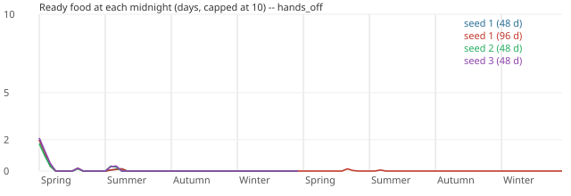
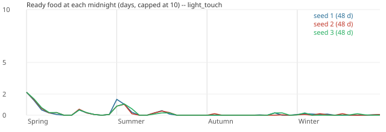
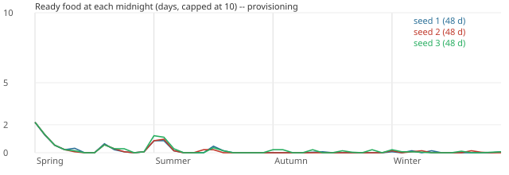

# After the tuning (2026-10-07)

Generated by `tools/balance_report.py` from the balance harness (`godot/tools/balance/`, decision 0911).
Every figure is measured on the real demo village; nothing here is a projection.

## About these runs

The staged year matrix (nine residents; 3 seeds × 3 policies, and hands-off for 2 years) rerun on
`feat/demo-balance-tuning` at `7a8279d3`, with Brendan's rulings of 2026-10-07 built (decisions 1732–1737). Their summary
and what moved are the main report's follow-up section ([the year matrix rerun](../../2026-10-07-year-matrix-rerun.md),
"Follow-up: after the tuning"); this is the generated detail. P6's fishing run (`--fish-high 12`, provisioning, 3
seeds) is in `p6-fish-high-12/` (its summaries and CSVs).

## Runs

| Policy | Seed | Days | Staged assets | FPS x speed | Real seconds |
|---|---|---|---|---|---|
| hands_off | 1 | 48 | True | 30 x 4 | 937.2 |
| hands_off | 1 | 96 | True | 30 x 4 | 1454.8 |
| hands_off | 2 | 48 | True | 30 x 4 | 940.3 |
| hands_off | 3 | 48 | True | 30 x 4 | 955.3 |
| light_touch | 1 | 48 | True | 30 x 4 | 952.4 |
| light_touch | 2 | 48 | True | 30 x 4 | 949.2 |
| light_touch | 3 | 48 | True | 30 x 4 | 948.9 |
| provisioning | 1 | 48 | True | 30 x 4 | 961.1 |
| provisioning | 2 | 48 | True | 30 x 4 | 957.5 |
| provisioning | 3 | 48 | True | 30 x 4 | 969.8 |

## Headlines

- **hands_off seed 1**: first Ready food Y1 Spring 1; food runs out Y1 Spring 4 (45 days with none after that); spoilage worst 8% in Y1 Winter (13.4 of 709.9 U stored over the run); 65% idle labour; 514 meals missed of 864 (59%); hungry 86% of resident-hours.
- **hands_off seed 1, 96 days**: first Ready food Y1 Spring 1; food runs out Y1 Spring 4 (93 days with none after that); spoilage worst 38% in Y2 Spring (49.9 of 1414.7 U stored over the run); 66% idle labour; 1075 meals missed of 1728 (62%); hungry 89% of resident-hours.
- **hands_off seed 2**: first Ready food Y1 Spring 1; food runs out Y1 Spring 4 (45 days with none after that); spoilage worst 6% in Y1 Winter (19.1 of 733.7 U stored over the run); 61% idle labour; 494 meals missed of 864 (57%); hungry 87% of resident-hours.
- **hands_off seed 3**: first Ready food Y1 Spring 1; food runs out Y1 Spring 4 (45 days with none after that); spoilage worst 6% in Y1 Summer (22.7 of 713.3 U stored over the run); 60% idle labour; 516 meals missed of 864 (60%); hungry 86% of resident-hours.
- **light_touch seed 1**: first Ready food Y1 Spring 1; food runs out Y1 Spring 5 (39 days with none after that); spoilage worst 12% in Y1 Autumn (96.1 of 1000.1 U stored over the run); 53% idle labour; 250 meals missed of 864 (29%); hungry 84% of resident-hours.
- **light_touch seed 2**: first Ready food Y1 Spring 1; food runs out Y1 Spring 5 (40 days with none after that); spoilage worst 15% in Y1 Autumn (119.0 of 999.2 U stored over the run); 48% idle labour; 276 meals missed of 864 (32%); hungry 84% of resident-hours.
- **light_touch seed 3**: first Ready food Y1 Spring 1; food runs out Y1 Spring 5 (40 days with none after that); spoilage worst 19% in Y1 Autumn (114.2 of 976.7 U stored over the run); 49% idle labour; 288 meals missed of 864 (33%); hungry 84% of resident-hours.
- **provisioning seed 1**: first Ready food Y1 Spring 1; food runs out Y1 Spring 5 (40 days with none after that); spoilage worst 5% in Y1 Autumn (57.1 of 1273.2 U stored over the run); 46% idle labour; 210 meals missed of 864 (24%); hungry 83% of resident-hours.
- **provisioning seed 2**: first Ready food Y1 Spring 1; food runs out Y1 Spring 5 (40 days with none after that); spoilage worst 17% in Y1 Autumn (169.6 of 1291.9 U stored over the run); 42% idle labour; 225 meals missed of 864 (26%); hungry 83% of resident-hours.
- **provisioning seed 3**: first Ready food Y1 Spring 1; food runs out Y1 Spring 5 (38 days with none after that); spoilage worst 8% in Y1 Autumn (81.4 of 1177.6 U stored over the run); 43% idle labour; 218 meals missed of 864 (25%); hungry 83% of resident-hours.

## Flags

- hands_off seed 1, Y1 Spring: food ran out (Y1 Spring 4; 9 day(s) with no Ready food); idle labour 84% (> 50%); meals missed: 140 (65% of diners); hungry 71% of resident-hours (> 5%)
- hands_off seed 1, Y1 Summer: food ran out (Y1 Summer 1; 12 day(s) with no Ready food); idle labour 55% (> 50%); meals missed: 87 (40% of diners); hungry 87% of resident-hours (> 5%)
- hands_off seed 1, Y1 Autumn: food ran out (Y1 Autumn 1; 12 day(s) with no Ready food); idle labour 62% (> 50%); meals missed: 72 (33% of diners); hungry 86% of resident-hours (> 5%)
- hands_off seed 1, Y1 Winter: food ran out (Y1 Winter 1; 12 day(s) with no Ready food); idle labour 61% (> 50%); meals missed: 215 (100% of diners); hungry 100% of resident-hours (> 5%)
- hands_off seed 1, 96 days, Y1 Spring: food ran out (Y1 Spring 4; 9 day(s) with no Ready food); idle labour 84% (> 50%); meals missed: 140 (65% of diners); hungry 71% of resident-hours (> 5%)
- hands_off seed 1, 96 days, Y1 Summer: food ran out (Y1 Summer 1; 12 day(s) with no Ready food); idle labour 55% (> 50%); meals missed: 87 (40% of diners); hungry 87% of resident-hours (> 5%)
- hands_off seed 1, 96 days, Y1 Autumn: food ran out (Y1 Autumn 1; 12 day(s) with no Ready food); idle labour 62% (> 50%); meals missed: 72 (33% of diners); hungry 86% of resident-hours (> 5%)
- hands_off seed 1, 96 days, Y1 Winter: food ran out (Y1 Winter 1; 12 day(s) with no Ready food); idle labour 61% (> 50%); meals missed: 215 (100% of diners); hungry 100% of resident-hours (> 5%)
- hands_off seed 1, 96 days, Y2 Spring: food ran out (Y2 Spring 1; 12 day(s) with no Ready food); spoilage 38.1% (> 10%); idle labour 83% (> 50%); meals missed: 189 (88% of diners); hungry 98% of resident-hours (> 5%)
- hands_off seed 1, 96 days, Y2 Summer: food ran out (Y2 Summer 1; 12 day(s) with no Ready food); idle labour 58% (> 50%); meals missed: 82 (38% of diners); hungry 89% of resident-hours (> 5%)
- hands_off seed 1, 96 days, Y2 Autumn: food ran out (Y2 Autumn 1; 12 day(s) with no Ready food); idle labour 66% (> 50%); meals missed: 74 (34% of diners); hungry 85% of resident-hours (> 5%)
- hands_off seed 1, 96 days, Y2 Winter: food ran out (Y2 Winter 1; 12 day(s) with no Ready food); spoilage 26.7% (> 10%); idle labour 62% (> 50%); meals missed: 216 (100% of diners); hungry 100% of resident-hours (> 5%)
- hands_off seed 2, Y1 Spring: food ran out (Y1 Spring 4; 9 day(s) with no Ready food); idle labour 84% (> 50%); meals missed: 139 (64% of diners); hungry 73% of resident-hours (> 5%)
- hands_off seed 2, Y1 Summer: food ran out (Y1 Summer 1; 12 day(s) with no Ready food); idle labour 54% (> 50%); meals missed: 75 (35% of diners); hungry 88% of resident-hours (> 5%)
- hands_off seed 2, Y1 Autumn: food ran out (Y1 Autumn 1; 12 day(s) with no Ready food); idle labour 61% (> 50%); meals missed: 66 (31% of diners); hungry 86% of resident-hours (> 5%)
- hands_off seed 2, Y1 Winter: food ran out (Y1 Winter 1; 12 day(s) with no Ready food); meals missed: 214 (99% of diners); hungry 100% of resident-hours (> 5%)
- hands_off seed 3, Y1 Spring: food ran out (Y1 Spring 4; 9 day(s) with no Ready food); idle labour 84% (> 50%); meals missed: 144 (67% of diners); hungry 70% of resident-hours (> 5%)
- hands_off seed 3, Y1 Summer: food ran out (Y1 Summer 1; 12 day(s) with no Ready food); idle labour 55% (> 50%); meals missed: 87 (40% of diners); hungry 89% of resident-hours (> 5%)
- hands_off seed 3, Y1 Autumn: food ran out (Y1 Autumn 1; 12 day(s) with no Ready food); meals missed: 73 (34% of diners); hungry 86% of resident-hours (> 5%)
- hands_off seed 3, Y1 Winter: food ran out (Y1 Winter 1; 12 day(s) with no Ready food); idle labour 53% (> 50%); meals missed: 212 (98% of diners); hungry 99% of resident-hours (> 5%)
- light_touch seed 1, Y1 Spring: food ran out (Y1 Spring 5; 7 day(s) with no Ready food); idle labour 70% (> 50%); meals missed: 64 (30% of diners); hungry 69% of resident-hours (> 5%)
- light_touch seed 1, Y1 Summer: food ran out (Y1 Summer 1; 8 day(s) with no Ready food); meals missed: 27 (12% of diners); hungry 83% of resident-hours (> 5%)
- light_touch seed 1, Y1 Autumn: food ran out (Y1 Autumn 1; 12 day(s) with no Ready food); spoilage 12.2% (> 10%); meals missed: 25 (12% of diners); hungry 85% of resident-hours (> 5%)
- light_touch seed 1, Y1 Winter: food ran out (Y1 Winter 1; 12 day(s) with no Ready food); idle labour 51% (> 50%); meals missed: 134 (62% of diners); hungry 97% of resident-hours (> 5%)
- light_touch seed 2, Y1 Spring: food ran out (Y1 Spring 5; 7 day(s) with no Ready food); idle labour 69% (> 50%); meals missed: 69 (32% of diners); hungry 69% of resident-hours (> 5%)
- light_touch seed 2, Y1 Summer: food ran out (Y1 Summer 1; 9 day(s) with no Ready food); meals missed: 36 (17% of diners); hungry 84% of resident-hours (> 5%)
- light_touch seed 2, Y1 Autumn: food ran out (Y1 Autumn 1; 12 day(s) with no Ready food); spoilage 14.8% (> 10%); meals missed: 27 (12% of diners); hungry 87% of resident-hours (> 5%)
- light_touch seed 2, Y1 Winter: food ran out (Y1 Winter 1; 12 day(s) with no Ready food); meals missed: 144 (67% of diners); hungry 97% of resident-hours (> 5%)
- light_touch seed 3, Y1 Spring: food ran out (Y1 Spring 5; 6 day(s) with no Ready food); idle labour 70% (> 50%); meals missed: 78 (36% of diners); hungry 70% of resident-hours (> 5%)
- light_touch seed 3, Y1 Summer: food ran out (Y1 Summer 1; 10 day(s) with no Ready food); meals missed: 22 (10% of diners); hungry 83% of resident-hours (> 5%)
- light_touch seed 3, Y1 Autumn: food ran out (Y1 Autumn 1; 12 day(s) with no Ready food); spoilage 19.3% (> 10%); meals missed: 28 (13% of diners); hungry 86% of resident-hours (> 5%)
- light_touch seed 3, Y1 Winter: food ran out (Y1 Winter 1; 12 day(s) with no Ready food); meals missed: 160 (74% of diners); hungry 98% of resident-hours (> 5%)
- provisioning seed 1, Y1 Spring: food ran out (Y1 Spring 5; 7 day(s) with no Ready food); idle labour 69% (> 50%); meals missed: 63 (29% of diners); hungry 66% of resident-hours (> 5%)
- provisioning seed 1, Y1 Summer: food ran out (Y1 Summer 1; 9 day(s) with no Ready food); meals missed: 37 (17% of diners); hungry 84% of resident-hours (> 5%)
- provisioning seed 1, Y1 Autumn: food ran out (Y1 Autumn 1; 12 day(s) with no Ready food); meals missed: 42 (19% of diners); hungry 89% of resident-hours (> 5%)
- provisioning seed 1, Y1 Winter: food ran out (Y1 Winter 1; 12 day(s) with no Ready food); meals missed: 68 (31% of diners); hungry 92% of resident-hours (> 5%)
- provisioning seed 2, Y1 Spring: food ran out (Y1 Spring 5; 7 day(s) with no Ready food); idle labour 68% (> 50%); meals missed: 57 (26% of diners); hungry 66% of resident-hours (> 5%)
- provisioning seed 2, Y1 Summer: food ran out (Y1 Summer 1; 9 day(s) with no Ready food); meals missed: 34 (16% of diners); hungry 83% of resident-hours (> 5%)
- provisioning seed 2, Y1 Autumn: food ran out (Y1 Autumn 1; 12 day(s) with no Ready food); spoilage 17.2% (> 10%); meals missed: 54 (25% of diners); hungry 90% of resident-hours (> 5%)
- provisioning seed 2, Y1 Winter: food ran out (Y1 Winter 1; 12 day(s) with no Ready food); spoilage 10.7% (> 10%); meals missed: 80 (37% of diners); hungry 93% of resident-hours (> 5%)
- provisioning seed 3, Y1 Spring: food ran out (Y1 Spring 5; 7 day(s) with no Ready food); idle labour 69% (> 50%); meals missed: 55 (25% of diners); hungry 66% of resident-hours (> 5%)
- provisioning seed 3, Y1 Summer: food ran out (Y1 Summer 1; 9 day(s) with no Ready food); meals missed: 28 (13% of diners); hungry 84% of resident-hours (> 5%)
- provisioning seed 3, Y1 Autumn: food ran out (Y1 Autumn 1; 11 day(s) with no Ready food); meals missed: 42 (19% of diners); hungry 89% of resident-hours (> 5%)
- provisioning seed 3, Y1 Winter: food ran out (Y1 Winter 1; 11 day(s) with no Ready food); meals missed: 93 (43% of diners); hungry 94% of resident-hours (> 5%)

## Thresholds

| Threshold | Value | Why |
|---|---|---|
| `reserve_min_days` | 2 | GDD §5.3 puts food jobs in urgency bucket 2 while the projected reserve is under 2 days, and gameplay_balance.md BAL-RUN-008 counts a village stabilised only with ready food of 2 days or more. A season whose lowest Ready food (the HUD's figure, kitchen.gd days_of_meals_milli) falls below 2 days is flagged; at 0 the report says the food RAN OUT (UI §8: food under 1 day is already CRITICAL). |
| `spoilage_max_pct` | 10 | No GDD target exists. Shelf lives are 48 h for fresh fish, 144 h for leaves, 240 h for roots, 480 h for beans and 720 h for grain (GDD §5.7; farm_catalog.gd), so a pantry that is drawn on twice a day should lose little; one unit in ten of the food available in a season (its opening stock plus what was stored in it) spoiling in store is taken as the line past which spoilage is a balance problem rather than noise. Provisional: for Brendan to confirm. |
| `spoilage_min_u` | 1 | Spoilage is flagged only when at least this much (1 U, about two portions' worth of roots) spoiled in the season: a few hundred milli-U left over and spoiled reads 100% of nearly nothing, which is noise, not a balance problem. |
| `idle_max_pct` | 50 | Idle share = idle / (idle + work) resident-time, rest, meals and emergencies excluded. GDD §5.3's default day is 10 WORK hours of about 14 waking ones (BAL-SUPPLY-001), so a village with work to do should spend well under half its available time idle; above 50% the residents are idle more than they work and labour is not what limits the economy. Provisional: for Brendan to confirm. |
| `missed_meals_max_pct` | 0 | REQ-SET-012 and decision 0381: every resident is fed at each meal. Any resident going without at a meal is flagged; the percentage is of the diners counted at the season's meals. |
| `hungry_max_pct` | 5 | HUNGRY is need 1500 or below (meal_rules.gd: §5.2's urgent line). An occasional hungry hour (a late meal, a resident called away) is normal; more than one resident-hour in twenty spent hungry means meals are not keeping up. Brendan's ruling of 2026-10-07 on the balance rerun's P9 (a) (decision 1731): kept at 5% as the target, and UNATTAINABLE until P1 has been measured -- two 1800 NP portions a day were 3600 NP against a 6000 NP day (86-89% of hours hungry in every policy); P1 (b), a portion and a half a diner (decision 1732), is the change to measure. |

## Policy: hands_off



**Ready food, lowest (days)**

| Season | seed 1 | seed 1, 96 days | seed 2 | seed 3 |
|---|---|---|---|---|
| Y1 Spring | 0.00 | 0.00 | 0.00 | 0.00 |
| Y1 Summer | 0.00 | 0.00 | 0.00 | 0.00 |
| Y1 Autumn | 0.00 | 0.00 | 0.00 | 0.00 |
| Y1 Winter | 0.00 | 0.00 | 0.00 | 0.00 |
| Y2 Spring | - | 0.00 | - | - |
| Y2 Summer | - | 0.00 | - | - |
| Y2 Autumn | - | 0.00 | - | - |
| Y2 Winter | - | 0.00 | - | - |

**Food stored (U)**

| Season | seed 1 | seed 1, 96 days | seed 2 | seed 3 |
|---|---|---|---|---|
| Y1 Spring | 33.2 | 33.2 | 33.2 | 33.2 |
| Y1 Summer | 329.5 | 329.5 | 358.3 | 337.9 |
| Y1 Autumn | 347.2 | 347.2 | 342.2 | 342.2 |
| Y1 Winter | 0.0 | 0.0 | 0.0 | 0.0 |
| Y2 Spring | - | 49.7 | - | - |
| Y2 Summer | - | 314.8 | - | - |
| Y2 Autumn | - | 340.3 | - | - |
| Y2 Winter | - | 0.0 | - | - |

**Spoilage %**

| Season | seed 1 | seed 1, 96 days | seed 2 | seed 3 |
|---|---|---|---|---|
| Y1 Spring | 0 | 0 | 0 | 0 |
| Y1 Summer | 3 | 3 | 5 | 6 |
| Y1 Autumn | 0 | 0 | 0 | 0 |
| Y1 Winter | 8 | 8 | 6 | 5 |
| Y2 Spring | - | 38 | - | - |
| Y2 Summer | - | 0 | - | - |
| Y2 Autumn | - | 1 | - | - |
| Y2 Winter | - | 27 | - | - |

**Meals missed**

| Season | seed 1 | seed 1, 96 days | seed 2 | seed 3 |
|---|---|---|---|---|
| Y1 Spring | 140 | 140 | 139 | 144 |
| Y1 Summer | 87 | 87 | 75 | 87 |
| Y1 Autumn | 72 | 72 | 66 | 73 |
| Y1 Winter | 215 | 215 | 214 | 212 |
| Y2 Spring | - | 189 | - | - |
| Y2 Summer | - | 82 | - | - |
| Y2 Autumn | - | 74 | - | - |
| Y2 Winter | - | 216 | - | - |

**Hungry % of resident-hours**

| Season | seed 1 | seed 1, 96 days | seed 2 | seed 3 |
|---|---|---|---|---|
| Y1 Spring | 71 | 71 | 73 | 70 |
| Y1 Summer | 87 | 87 | 88 | 89 |
| Y1 Autumn | 86 | 86 | 86 | 86 |
| Y1 Winter | 100 | 100 | 100 | 99 |
| Y2 Spring | - | 98 | - | - |
| Y2 Summer | - | 89 | - | - |
| Y2 Autumn | - | 85 | - | - |
| Y2 Winter | - | 100 | - | - |

**Idle labour %**

| Season | seed 1 | seed 1, 96 days | seed 2 | seed 3 |
|---|---|---|---|---|
| Y1 Spring | 84 | 84 | 84 | 84 |
| Y1 Summer | 55 | 55 | 54 | 55 |
| Y1 Autumn | 62 | 62 | 61 | 49 |
| Y1 Winter | 61 | 61 | 45 | 53 |
| Y2 Spring | - | 83 | - | - |
| Y2 Summer | - | 58 | - | - |
| Y2 Autumn | - | 66 | - | - |
| Y2 Winter | - | 62 | - | - |

**Work h / resident-day**

| Season | seed 1 | seed 1, 96 days | seed 2 | seed 3 |
|---|---|---|---|---|
| Y1 Spring | 2.2 | 2.2 | 2.1 | 2.1 |
| Y1 Summer | 5.8 | 5.8 | 5.9 | 5.8 |
| Y1 Autumn | 4.9 | 4.9 | 5.0 | 6.5 |
| Y1 Winter | 5.4 | 5.4 | 7.7 | 6.6 |
| Y2 Spring | - | 2.4 | - | - |
| Y2 Summer | - | 5.3 | - | - |
| Y2 Autumn | - | 4.4 | - | - |
| Y2 Winter | - | 5.3 | - | - |


## Policy: light_touch



**Ready food, lowest (days)**

| Season | seed 1 | seed 2 | seed 3 |
|---|---|---|---|
| Y1 Spring | 0.00 | 0.00 | 0.00 |
| Y1 Summer | 0.00 | 0.00 | 0.00 |
| Y1 Autumn | 0.00 | 0.00 | 0.00 |
| Y1 Winter | 0.00 | 0.00 | 0.00 |

**Food stored (U)**

| Season | seed 1 | seed 2 | seed 3 |
|---|---|---|---|
| Y1 Spring | 129.1 | 121.3 | 113.6 |
| Y1 Summer | 400.6 | 393.7 | 404.5 |
| Y1 Autumn | 419.9 | 439.5 | 411.2 |
| Y1 Winter | 50.5 | 44.8 | 47.4 |

**Spoilage %**

| Season | seed 1 | seed 2 | seed 3 |
|---|---|---|---|
| Y1 Spring | 5 | 6 | 6 |
| Y1 Summer | 8 | 8 | 4 |
| Y1 Autumn | 12 | 15 | 19 |
| Y1 Winter | 0 | 4 | 0 |

**Meals missed**

| Season | seed 1 | seed 2 | seed 3 |
|---|---|---|---|
| Y1 Spring | 64 | 69 | 78 |
| Y1 Summer | 27 | 36 | 22 |
| Y1 Autumn | 25 | 27 | 28 |
| Y1 Winter | 134 | 144 | 160 |

**Hungry % of resident-hours**

| Season | seed 1 | seed 2 | seed 3 |
|---|---|---|---|
| Y1 Spring | 69 | 69 | 70 |
| Y1 Summer | 83 | 84 | 83 |
| Y1 Autumn | 85 | 87 | 86 |
| Y1 Winter | 97 | 97 | 98 |

**Idle labour %**

| Season | seed 1 | seed 2 | seed 3 |
|---|---|---|---|
| Y1 Spring | 70 | 69 | 70 |
| Y1 Summer | 40 | 42 | 42 |
| Y1 Autumn | 50 | 45 | 45 |
| Y1 Winter | 51 | 37 | 40 |

**Work h / resident-day**

| Season | seed 1 | seed 2 | seed 3 |
|---|---|---|---|
| Y1 Spring | 3.7 | 3.9 | 3.7 |
| Y1 Summer | 7.1 | 6.9 | 6.9 |
| Y1 Autumn | 6.0 | 6.6 | 6.7 |
| Y1 Winter | 6.3 | 8.2 | 7.9 |


## Policy: provisioning



**Ready food, lowest (days)**

| Season | seed 1 | seed 2 | seed 3 |
|---|---|---|---|
| Y1 Spring | 0.00 | 0.00 | 0.00 |
| Y1 Summer | 0.00 | 0.00 | 0.00 |
| Y1 Autumn | 0.00 | 0.00 | 0.00 |
| Y1 Winter | 0.00 | 0.00 | 0.00 |

**Food stored (U)**

| Season | seed 1 | seed 2 | seed 3 |
|---|---|---|---|
| Y1 Spring | 131.2 | 138.3 | 137.6 |
| Y1 Summer | 492.4 | 486.0 | 468.3 |
| Y1 Autumn | 548.9 | 573.9 | 475.2 |
| Y1 Winter | 100.7 | 93.8 | 96.5 |

**Spoilage %**

| Season | seed 1 | seed 2 | seed 3 |
|---|---|---|---|
| Y1 Spring | 2 | 2 | 2 |
| Y1 Summer | 3 | 4 | 5 |
| Y1 Autumn | 5 | 17 | 8 |
| Y1 Winter | 3 | 11 | 4 |

**Meals missed**

| Season | seed 1 | seed 2 | seed 3 |
|---|---|---|---|
| Y1 Spring | 63 | 57 | 55 |
| Y1 Summer | 37 | 34 | 28 |
| Y1 Autumn | 42 | 54 | 42 |
| Y1 Winter | 68 | 80 | 93 |

**Hungry % of resident-hours**

| Season | seed 1 | seed 2 | seed 3 |
|---|---|---|---|
| Y1 Spring | 66 | 66 | 66 |
| Y1 Summer | 84 | 83 | 84 |
| Y1 Autumn | 89 | 90 | 89 |
| Y1 Winter | 92 | 93 | 94 |

**Idle labour %**

| Season | seed 1 | seed 2 | seed 3 |
|---|---|---|---|
| Y1 Spring | 69 | 68 | 69 |
| Y1 Summer | 34 | 38 | 39 |
| Y1 Autumn | 37 | 33 | 32 |
| Y1 Winter | 43 | 28 | 31 |

**Work h / resident-day**

| Season | seed 1 | seed 2 | seed 3 |
|---|---|---|---|
| Y1 Spring | 3.8 | 3.9 | 3.9 |
| Y1 Summer | 7.8 | 7.4 | 7.3 |
| Y1 Autumn | 7.6 | 8.2 | 8.4 |
| Y1 Winter | 7.2 | 9.2 | 8.7 |


## Run: hands_off seed 1

| | Y1 Spring | Y1 Summer | Y1 Autumn | Y1 Winter |
|---|---|---|---|---|
| Food stored (U) | 33.2 | 329.5 | 347.2 | 0.0 |
| of which fish (U) | 0.0 | 0.0 | 0.0 | 0.0 |
| Food eaten (U) | 122.7 | 281.0 | 351.5 | 0.7 |
| Portions eaten | 86 | 41 | 0 | 0 |
| Spoiled in store (U) | 0.0 | 10.7 | 0.0 | 2.7 |
| Spoilage % | 0 | 3 | 0 | 8 |
| Stock at end (U) | 0.5 | 38.3 | 34.0 | 30.6 |
| Ready food min (days) | 0.00 | 0.00 | 0.00 | 0.00 |
| Days with no Ready food (opening) | 9 (0) | 12 (0) | 12 (0) | 12 (0) |
| Meals: ate / raw / missed | 65 / 11 / 140 | 30 / 99 / 87 | 0 / 144 / 72 | 0 / 1 / 215 |
| Missed % | 65 | 40 | 33 | 100 |
| Fed / peckish / hungry % of hours | 24 / 5 / 71 | 0 / 13 / 87 | 0 / 14 / 86 | 0 / 0 / 100 |
| Work h / resident-day | 2.2 | 5.8 | 4.9 | 5.4 |
| Idle h / resident-day | 11.0 | 7.0 | 7.9 | 8.6 |
| Idle % | 84 | 55 | 62 | 61 |
| Board queue avg / max | 1.01 / 8 | 2.30 / 10 | 1.65 / 6 | 0.60 / 9 |
| Board wait mean / max (game min) | 183 / 601 | 138 / 714 | 126 / 661 | 336 / 754 |
| Wood in / out / end (U) | 4.5 / 6.3 / 38.2 | 0.0 / 2.3 / 35.9 | 17.0 / 4.2 / 48.7 | 21.2 / 47.8 / 22.1 |
| Planks / stone / earth at end (U) | 0.0 / 20.0 / 0.0 | 0.0 / 20.0 / 0.0 | 0.0 / 20.0 / 0.0 | 0.0 / 20.0 / 0.0 |
| Beds sown / harvested | 11 / 3 | 5 / 16 | 0 / 0 | 0 / 0 |
| Crops withered (blight/frost/overripe/other) | 0/0/0/0 | 0/0/0/0 | 0/0/0/0 | 0/0/0/0 |
| Weather events | ideal_spell | ideal_spell | blight | ideal_spell |
| Frost nights / blight outbreaks | 1 / 1 | 0 / 2 | 2 / 1 | 0 / 0 |
| Incident raises (critical) / rescues | 10 (1) / 0 | 5 (1) / 0 | 3 (1) / 0 | 4 (2) / 0 |

Daily series (each scaled to its own maximum):

```
Ready food (days)        █▅▂▁▁▁▁▂▁▁▁▁▁▁▁▁▁▁▁▁▁▁▁▁▁▁▁▁▁▁▁▁▁▁▁▁▁▁▁▁▁▁▁▁▁▁▁▁  max 2.0
Pantry stock (U)         ▆▄▂▁▁▁▁▁▁▁▁▁▁▂▃▃▂▂▂▃▄▄▄▄▆▅█▇▆▄▄▄▄▄▄▃▃▃▃▃▃▃▃▃▃▃▃▃  max 100.2
Food stored (U)          ▁▁▁▁▂▁▁▂▁▁▁▁▃▄▄▄▃▃▃▄▄▃▃▃▇▃█▃▃▃▃▃▃▃▃▃▁▁▁▁▁▁▁▁▁▁▁▁  max 78.9
Portions eaten           ▅█▇▃▂▁▁▂▂▁▁▁▁▄▄▅▂▁▁▁▁▁▁▁▁▁▁▁▁▁▁▁▁▁▁▁▁▁▁▁▁▁▁▁▁▁▁▁  max 27.0
Spoiled (U)              ▁▁▁▁▁▁▁▁▁▁▁▁▁▁▁▇█▁▁▁▁▁▁▁▁▁▁▁▁▁▁▁▁▁▁▁▁▁▁▁▁▁▄▁▁▁▁▁  max 5.7
Meals missed             ▄▁▁▄▆▇█▇▆███▅▃▃▁▃▄▃▅▅▄▅▅▄▃▂▃▂▂▄▅▅▄▄▃████████████  max 18.0
Hungry resident-hours    ▁▁▂▄▇████████▇▇▆▇▇▇▇▇▇▇▇▇▇▇▇▇▇▇▇▇▇▇▇████████████  max 216.0
Work h (all residents)   ▃▄▃▂▃▂▂▃▂▂▃▃▄▇▇█▆▅▅▅▅▄▅▅▆▆▆▆▅▅▄▅▅▅▄▄▆▆▆▆▆▃▂▂▆▆▇▇  max 78.0
Idle h (all residents)   ▆▅▆▇▇██▇▇█▇█▆▄▄▃▄▅▅▅▅▆▆▆▅▄▄▅▅▅▆▆▆▆▆▆▅▅▅▅▅▇██▅▅▅▄  max 114.1
Wood (U)                 ▇▆▆▆▆▆▆▆▆▆▆▆▆▆▆▆▆▆▆▆▆▆▆▆▇▇███████████▇▇▆▆▆▆▆▅▅▅▄  max 48.9
```

Work hours per resident-day, by resident: Wenna Tallowby 5.3, Jory Whitethorn 3.3, Linnet Whinberry 3.7, Tobit Highbough 5.9, Tegwin Slipstone 5.5, Corra Netley 4.2, Tuppen Clayholm 6.9, Hulda Slatebrook 2.9, Elstan Weirholt 3.2

New incidents by source: farm 6, kitchen 1, threat 1, village 1, water 1, winter 1; threats: fire at the covered store 2, flood at the stream edge 3

## Run: hands_off seed 1, 96 days

| | Y1 Spring | Y1 Summer | Y1 Autumn | Y1 Winter | Y2 Spring | Y2 Summer | Y2 Autumn | Y2 Winter |
|---|---|---|---|---|---|---|---|---|
| Food stored (U) | 33.2 | 329.5 | 347.2 | 0.0 | 49.7 | 314.8 | 340.3 | 0.0 |
| of which fish (U) | 0.0 | 0.0 | 0.0 | 0.0 | 0.0 | 0.0 | 0.0 | 0.0 |
| Food eaten (U) | 122.7 | 281.0 | 351.5 | 0.7 | 49.7 | 289.9 | 351.7 | 0.0 |
| Portions eaten | 86 | 41 | 0 | 0 | 20 | 17 | 0 | 0 |
| Spoiled in store (U) | 0.0 | 10.7 | 0.0 | 2.7 | 30.6 | 0.7 | 2.5 | 2.7 |
| Spoilage % | 0 | 3 | 0 | 8 | 38 | 0 | 1 | 27 |
| Stock at end (U) | 0.5 | 38.3 | 34.0 | 30.6 | 0.0 | 24.2 | 10.3 | 7.5 |
| Ready food min (days) | 0.00 | 0.00 | 0.00 | 0.00 | 0.00 | 0.00 | 0.00 | 0.00 |
| Days with no Ready food (opening) | 9 (0) | 12 (0) | 12 (0) | 12 (0) | 12 (0) | 12 (0) | 12 (0) | 12 (0) |
| Meals: ate / raw / missed | 65 / 11 / 140 | 30 / 99 / 87 | 0 / 144 / 72 | 0 / 1 / 215 | 16 / 11 / 189 | 17 / 117 / 82 | 0 / 142 / 74 | 0 / 0 / 216 |
| Missed % | 65 | 40 | 33 | 100 | 88 | 38 | 34 | 100 |
| Fed / peckish / hungry % of hours | 24 / 5 / 71 | 0 / 13 / 87 | 0 / 14 / 86 | 0 / 0 / 100 | 0 / 2 / 98 | 0 / 11 / 89 | 0 / 15 / 85 | 0 / 0 / 100 |
| Work h / resident-day | 2.2 | 5.8 | 4.9 | 5.4 | 2.4 | 5.3 | 4.4 | 5.3 |
| Idle h / resident-day | 11.0 | 7.0 | 7.9 | 8.6 | 11.3 | 7.4 | 8.4 | 8.7 |
| Idle % | 84 | 55 | 62 | 61 | 83 | 58 | 66 | 62 |
| Board queue avg / max | 1.01 / 8 | 2.30 / 10 | 1.65 / 6 | 0.60 / 9 | 1.23 / 9 | 2.13 / 10 | 1.30 / 7 | 0.59 / 9 |
| Board wait mean / max (game min) | 183 / 601 | 138 / 714 | 126 / 661 | 336 / 754 | 235 / 600 | 137 / 715 | 110 / 601 | 276 / 748 |
| Wood in / out / end (U) | 4.5 / 6.3 / 38.2 | 0.0 / 2.3 / 35.9 | 17.0 / 4.2 / 48.7 | 21.2 / 47.8 / 22.1 | 38.0 / 7.0 / 53.1 | 0.0 / 0.7 / 52.5 | 0.0 / 4.2 / 48.3 | 21.6 / 47.7 / 22.2 |
| Planks / stone / earth at end (U) | 0.0 / 20.0 / 0.0 | 0.0 / 20.0 / 0.0 | 0.0 / 20.0 / 0.0 | 0.0 / 20.0 / 0.0 | 0.0 / 20.0 / 0.0 | 0.0 / 20.0 / 0.0 | 0.0 / 20.0 / 0.0 | 0.0 / 20.0 / 0.0 |
| Beds sown / harvested | 11 / 3 | 5 / 16 | 0 / 0 | 0 / 0 | 12 / 6 | 3 / 9 | 0 / 0 | 0 / 0 |
| Crops withered (blight/frost/overripe/other) | 0/0/0/0 | 0/0/0/0 | 0/0/0/0 | 0/0/0/0 | 0/0/0/0 | 0/0/0/0 | 0/0/0/0 | 0/0/0/0 |
| Weather events | ideal_spell | ideal_spell | blight | ideal_spell | heavy_rain | ideal_spell | calm_days | ideal_spell |
| Frost nights / blight outbreaks | 1 / 1 | 0 / 2 | 2 / 1 | 0 / 0 | 1 / 1 | 0 / 2 | 2 / 1 | 0 / 0 |
| Incident raises (critical) / rescues | 10 (1) / 0 | 5 (1) / 0 | 3 (1) / 0 | 4 (2) / 0 | 10 (1) / 0 | 8 (1) / 0 | 3 (1) / 0 | 2 (1) / 0 |

Daily series (each scaled to its own maximum):

```
Ready food (days)        █▅▂▁▁▁▁▂▁▁▁▁▁▁▁▁▁▁▁▁▁▁▁▁▁▁▁▁▁▁▁▁▁▁▁▁▁▁▁▁▁▁▁▁▁▁▁▁▁▁▁▁▁▁▁▁▁▁▁▁▁▁▁▁▁▁▁▁▁▁▁▁▁▁▁▁▁▁▁▁▁▁▁▁▁▁▁▁▁▁▁▁▁▁▁▁  max 2.0
Pantry stock (U)         ▆▄▂▁▁▁▁▁▁▁▁▁▁▂▃▃▂▂▂▃▄▄▄▄▆▅█▇▅▄▄▄▄▄▄▃▃▃▃▃▃▃▃▃▃▃▃▃▃▃▂▁▁▁▁▁▁▁▁▁▂▂▃▃▃▃▃▂▃▃▂▃▆▅█▇▇▆▅▄▂▂▂▂▁▁▁▁▁▁▁▁▁▁▁▁  max 105.4
Food stored (U)          ▁▁▁▁▁▁▁▂▁▁▁▁▃▄▄▃▃▃▃▃▄▃▃▂▆▃▇▃▂▂▃▂▃▃▃▂▁▁▁▁▁▁▁▁▁▁▁▁▁▁▁▁▁▁▁▁▂▃▁▁▃▃▄▃▃▃▃▃▃▃▂▃▇▃█▃▃▂▃▂▂▂▂▂▁▁▁▁▁▁▁▁▁▁▁▁  max 93.4
Portions eaten           ▅█▇▃▂▁▁▂▂▁▁▁▁▄▄▅▂▁▁▁▁▁▁▁▁▁▁▁▁▁▁▁▁▁▁▁▁▁▁▁▁▁▁▁▁▁▁▁▁▁▁▁▁▁▁▁▂▅▁▁▁▁▃▂▁▁▂▃▁▁▁▁▁▁▁▁▁▁▁▁▁▁▁▁▁▁▁▁▁▁▁▁▁▁▁▁  max 27.0
Spoiled (U)              ▁▁▁▁▁▁▁▁▁▁▁▁▁▁▁▄▄▁▁▁▁▁▁▁▁▁▁▁▁▁▁▁▁▁▁▁▁▁▁▁▁▁▃▁▁▁▁▁▁▄██▁▁▁▁▁▁▁▁▁▁▁▁▁▁▁▁▁▁▁▁▁▁▁▁▁▁▁▁▁▁▂▁▃▁▁▁▁▁▁▁▁▁▁▁  max 12.2
Meals missed             ▄▁▁▄▆▇█▇▆███▅▃▃▁▃▄▃▅▅▄▅▅▄▃▂▃▂▂▄▅▅▄▄▃████████████████████▆▃▆█▅▄▃▃▄▅▃▂▃▄▄▅▃▃▂▃▄▂▃▃▂▅▆▅████████████  max 18.0
Hungry resident-hours    ▁▁▂▄▇████████▇▇▆▇▇▇▇▇▇▇▇▇▇▇▇▇▇▇▇▇▇▇▇█████████████████████▇███▇▇▇▇▇▇▇▇▇▇▇▇▇▇▇▇▇▇▇▆▇█▇████████████  max 216.0
Work h (all residents)   ▃▄▃▂▃▂▂▃▂▂▃▃▄▇▇█▆▅▅▅▅▄▅▅▆▆▆▆▅▅▄▅▅▅▄▄▆▆▆▆▆▃▂▂▆▆▇▇▂▂▂▂▃▅▄▂▃▄▃▃▅▇▆▆▅▅▆▅▅▅▅▄▆▅▆▄▅▅▅▄▃▃▄▃▆▇▆▆▆▂▂▂▆▆▆▆  max 78.0
Idle h (all residents)   ▆▅▆▇▇▇█▆▇█▇▇▆▄▄▂▄▅▅▅▅▆▅▅▅▄▄▅▅▅▆▅▆▅▆▆▅▅▅▅▅▇██▅▅▄▄████▇▆▆▇▇▅▆▇▆▄▄▄▅▅▄▄▅▅▅▆▅▅▄▅▅▅▅▆▆▆▆▆▅▅▅▅▅███▅▅▅▅  max 120.3
Wood (U)                 ▆▆▆▆▆▆▆▆▆▆▆▆▆▆▆▆▆▆▆▆▆▆▆▆▆▇▇▇▇▇▇▇▇▇▇▇▇▇▆▆▆▅▅▅▅▅▄▄▄▄▄▄▄▆█████████████████████████▇▇▇▇▇▇▇▆▆▆▆▅▅▅▄▄▄  max 53.1
```

Work hours per resident-day, by resident: Wenna Tallowby 5.2, Jory Whitethorn 3.8, Linnet Whinberry 4.1, Tobit Highbough 5.6, Tegwin Slipstone 5.3, Corra Netley 4.3, Tuppen Clayholm 6.5, Hulda Slatebrook 2.7, Elstan Weirholt 2.7

New incidents by source: farm 11, kitchen 1, threat 1, village 1, water 1, winter 1, woods 2; threats: fire at the covered store 5, flood at the stream edge 4

## Run: hands_off seed 2

| | Y1 Spring | Y1 Summer | Y1 Autumn | Y1 Winter |
|---|---|---|---|---|
| Food stored (U) | 33.2 | 358.3 | 342.2 | 0.0 |
| of which fish (U) | 0.0 | 0.0 | 0.0 | 0.0 |
| Food eaten (U) | 122.7 | 290.2 | 347.2 | 5.0 |
| Portions eaten | 86 | 44 | 0 | 0 |
| Spoiled in store (U) | 0.0 | 16.4 | 0.0 | 2.7 |
| Spoilage % | 0 | 5 | 0 | 6 |
| Stock at end (U) | 0.5 | 52.2 | 47.2 | 39.5 |
| Ready food min (days) | 0.00 | 0.00 | 0.00 | 0.00 |
| Days with no Ready food (opening) | 9 (0) | 12 (0) | 12 (0) | 12 (0) |
| Meals: ate / raw / missed | 67 / 10 / 139 | 37 / 104 / 75 | 0 / 150 / 66 | 0 / 2 / 214 |
| Missed % | 64 | 35 | 31 | 99 |
| Fed / peckish / hungry % of hours | 22 / 5 / 73 | 0 / 12 / 88 | 0 / 14 / 86 | 0 / 0 / 100 |
| Work h / resident-day | 2.1 | 5.9 | 5.0 | 7.7 |
| Idle h / resident-day | 11.0 | 6.8 | 7.7 | 6.2 |
| Idle % | 84 | 54 | 61 | 45 |
| Board queue avg / max | 1.01 / 8 | 2.58 / 12 | 1.73 / 8 | 0.74 / 9 |
| Board wait mean / max (game min) | 180 / 600 | 151 / 883 | 127 / 661 | 383 / 1200 |
| Wood in / out / end (U) | 4.5 / 6.3 / 38.2 | 0.0 / 2.4 / 35.8 | 14.8 / 2.2 / 48.4 | 16.2 / 47.8 / 16.8 |
| Planks / stone / earth at end (U) | 0.0 / 20.0 / 0.0 | 0.0 / 20.0 / 0.0 | 0.0 / 20.0 / 0.0 | 0.0 / 20.0 / 0.0 |
| Beds sown / harvested | 11 / 3 | 7 / 18 | 0 / 0 | 0 / 0 |
| Crops withered (blight/frost/overripe/other) | 0/0/0/0 | 0/0/0/0 | 0/0/0/0 | 0/0/0/0 |
| Weather events | ideal_spell | calm_days | ideal_spell | hard_freeze |
| Frost nights / blight outbreaks | 1 / 1 | 0 / 2 | 2 / 1 | 0 / 0 |
| Incident raises (critical) / rescues | 8 (1) / 0 | 10 (1) / 0 | 3 (1) / 0 | 4 (2) / 0 |

Daily series (each scaled to its own maximum):

```
Ready food (days)        █▅▂▁▁▁▁▂▁▁▁▁▁▂▂▁▁▁▁▁▁▁▁▁▁▁▁▁▁▁▁▁▁▁▁▁▁▁▁▁▁▁▁▁▁▁▁▁  max 1.8
Pantry stock (U)         ▅▃▂▁▁▁▁▁▁▁▁▁▂▃▃▃▂▂▂▁▃▃▄▄▇▅█▇▅▅▅▄▅▄▄▄▄▄▄▄▄▄▄▃▃▃▃▃  max 111.7
Food stored (U)          ▁▁▁▁▂▁▁▂▁▁▁▁▃▅▄▃▃▃▃▂▅▃▄▃▇▂█▃▃▃▃▃▃▃▃▃▁▁▁▁▁▁▁▁▁▁▁▁  max 78.9
Portions eaten           ▇█▆▃▂▁▁▂▂▁▁▁▁▄▆▄▂▁▁▁▁▁▁▁▁▁▁▁▁▁▁▁▁▁▁▁▁▁▁▁▁▁▁▁▁▁▁▁  max 26.0
Spoiled (U)              ▁▁▁▁▁▁▁▁▁▁▁▁▁▁▄█▁▁▁▁▁▁▁▁▁▁▁▁▁▁▁▁▁▁▁▁▁▁▁▁▁▁▁▃▁▁▁▁  max 10.7
Meals missed             ▁▁▃▄▆██▆▆███▅▅▁▁▂▃▃▅▅▄▅▅▄▁▃▂▂▁▃▅▄▄▄▅▇███████████  max 18.0
Hungry resident-hours    ▁▁▂▅█████████▇▇▇▇▇▇▇▇▇▇▇▇▇▇▇▇▇▇▇▇▇▇▇████████████  max 216.0
Work h (all residents)   ▃▃▂▂▂▂▂▂▂▂▃▂▃▆▆▄▅▄▄▄▅▄▅▄▆▄▅▃▄▃▃▄▄▄▄▄▅▅█▅▅▆▇▆▅▅▅▅  max 109.4
Idle h (all residents)   ▆▅▇▇▇██▇▇█▇█▆▄▃▄▄▅▅▆▅▅▅▆▄▅▄▆▅▆▆▅▆▆▅▆▅▅▂▅▅▄▃▄▅▅▅▅  max 114.8
Wood (U)                 ▇▆▆▆▆▆▆▆▆▆▆▇▇▆▆▆▆▆▆▆▆▆▆▆▇▇███████████▇▇▇▆▆▅▅▄▄▄▃  max 48.5
```

Work hours per resident-day, by resident: Wenna Tallowby 6.0, Jory Whitethorn 4.6, Linnet Whinberry 4.8, Tobit Highbough 5.5, Tegwin Slipstone 6.1, Corra Netley 5.3, Tuppen Clayholm 6.8, Hulda Slatebrook 3.7, Elstan Weirholt 3.9

New incidents by source: farm 10, kitchen 1, threat 1, village 1, water 1, winter 1; threats: fire at the covered store 2, flood at the stream edge 3

## Run: hands_off seed 3

| | Y1 Spring | Y1 Summer | Y1 Autumn | Y1 Winter |
|---|---|---|---|---|
| Food stored (U) | 33.2 | 337.9 | 342.2 | 0.0 |
| of which fish (U) | 0.0 | 0.0 | 0.0 | 0.0 |
| Food eaten (U) | 122.7 | 261.7 | 342.2 | 10.0 |
| Portions eaten | 86 | 43 | 0 | 0 |
| Spoiled in store (U) | 0.0 | 20.0 | 0.0 | 2.7 |
| Spoilage % | 0 | 6 | 0 | 5 |
| Stock at end (U) | 0.5 | 56.8 | 56.8 | 44.1 |
| Ready food min (days) | 0.00 | 0.00 | 0.00 | 0.00 |
| Days with no Ready food (opening) | 9 (0) | 12 (0) | 12 (0) | 12 (0) |
| Meals: ate / raw / missed | 62 / 10 / 144 | 36 / 93 / 87 | 0 / 143 / 73 | 0 / 4 / 212 |
| Missed % | 67 | 40 | 34 | 98 |
| Fed / peckish / hungry % of hours | 25 / 5 / 70 | 0 / 11 / 89 | 0 / 14 / 86 | 0 / 1 / 99 |
| Work h / resident-day | 2.1 | 5.8 | 6.5 | 6.6 |
| Idle h / resident-day | 11.1 | 7.0 | 6.3 | 7.4 |
| Idle % | 84 | 55 | 49 | 53 |
| Board queue avg / max | 0.96 / 8 | 2.72 / 11 | 2.10 / 8 | 0.70 / 9 |
| Board wait mean / max (game min) | 180 / 601 | 154 / 810 | 134 / 661 | 353 / 755 |
| Wood in / out / end (U) | 4.5 / 6.3 / 38.2 | 0.0 / 2.4 / 35.8 | 20.2 / 8.2 / 47.9 | 22.0 / 47.8 / 22.1 |
| Planks / stone / earth at end (U) | 0.0 / 20.0 / 0.0 | 0.0 / 20.0 / 0.0 | 0.0 / 20.0 / 0.0 | 0.0 / 20.0 / 0.0 |
| Beds sown / harvested | 11 / 3 | 8 / 19 | 0 / 0 | 0 / 0 |
| Crops withered (blight/frost/overripe/other) | 0/0/0/0 | 0/0/0/0 | 0/0/0/0 | 0/0/0/0 |
| Weather events | ideal_spell | calm_days | early_frost | calm_days |
| Frost nights / blight outbreaks | 1 / 1 | 0 / 2 | 2 / 1 | 0 / 0 |
| Incident raises (critical) / rescues | 8 (1) / 0 | 10 (1) / 0 | 4 (1) / 0 | 4 (2) / 0 |

Daily series (each scaled to its own maximum):

```
Ready food (days)        █▅▃▁▁▁▁▂▁▁▁▁▁▂▂▁▁▁▁▁▁▁▁▁▁▁▁▁▁▁▁▁▁▁▁▁▁▁▁▁▁▁▁▁▁▁▁▁  max 2.1
Pantry stock (U)         ▅▃▂▁▁▁▁▁▁▁▁▁▂▃▃▃▂▁▂▂▃▃▄▄▆▅██▇▅▅▄▄▅▄▄▄▄▄▄▄▄▄▄▄▄▄▄  max 121.0
Food stored (U)          ▁▁▁▁▂▁▁▂▁▁▁▁▃▅▄▃▃▃▃▂▅▃▄▃▇▃█▃▃▃▃▃▃▃▂▃▁▁▁▁▁▁▁▁▁▁▁▁  max 78.9
Portions eaten           ▄█▇▅▂▁▁▂▂▁▁▁▁▄▅▄▂▁▁▁▁▁▁▁▁▁▁▁▁▁▁▁▁▁▁▁▁▁▁▁▁▁▁▁▁▁▁▁  max 27.0
Spoiled (U)              ▁▁▁▁▁▁▁▁▁▁▁▁▁▁▅█▅▁▁▁▁▁▁▁▁▁▁▁▁▁▁▁▁▁▁▁▁▁▁▁▁▁▁▃▁▁▁▁  max 10.0
Meals missed             ▅▁▁▄▆██▇▆███▆▄▁▁▂▃▅▅▅▅▅▅▃▃▃▃▁▂▃▃▅▆▅▅▆███████████  max 18.0
Hungry resident-hours    ▁▁▂▃▇████████▇▆▇▇▇▇█▇▇▇▇▇▆▇▇▇▆▇▇▇██▇████████████  max 216.0
Work h (all residents)   ▃▄▃▂▃▂▂▃▂▂▃▂▄▆▇▅▅▅▄▄▅▅▅▅▆▆▇▅▅▄▄▅▅██▄▆▆▅▅▆▆▆▆▆▆▆▅  max 89.2
Idle h (all residents)   ▇▅▆▇▇██▇▇█▇█▆▄▃▄▅▅▆▆▅▅▅▅▄▄▄▅▅▅▅▅▅▃▃▆▅▅▅▅▅▅▅▅▅▅▅▅  max 114.8
Wood (U)                 ▇▆▆▆▆▆▆▆▆▆▆▆▆▆▆▆▆▆▆▆▆▆▆▆▇▇███████████▇▇▇▆▆▆▅▅▅▄▄  max 48.7
```

Work hours per resident-day, by resident: Wenna Tallowby 6.6, Jory Whitethorn 4.5, Linnet Whinberry 4.6, Tobit Highbough 5.4, Tegwin Slipstone 5.9, Corra Netley 5.3, Tuppen Clayholm 7.4, Hulda Slatebrook 3.7, Elstan Weirholt 3.7

New incidents by source: farm 10, kitchen 1, threat 1, village 1, water 1, winter 1; threats: fire at the covered store 2, flood at the stream edge 3

## Run: light_touch seed 1

| | Y1 Spring | Y1 Summer | Y1 Autumn | Y1 Winter |
|---|---|---|---|---|
| Food stored (U) | 129.1 | 400.6 | 419.9 | 50.5 |
| of which fish (U) | 72.3 | 61.1 | 82.7 | 50.5 |
| Food eaten (U) | 206.1 | 321.6 | 329.8 | 99.0 |
| Portions eaten | 160 | 127 | 82 | 48 |
| Spoiled in store (U) | 7.0 | 31.1 | 57.9 | 0.0 |
| Spoilage % | 5 | 8 | 12 | 0 |
| Stock at end (U) | 6.0 | 53.8 | 86.0 | 37.6 |
| Ready food min (days) | 0.00 | 0.00 | 0.00 | 0.00 |
| Days with no Ready food (opening) | 7 (0) | 8 (0) | 12 (0) | 12 (0) |
| Meals: ate / raw / missed | 139 / 13 / 64 | 113 / 76 / 27 | 81 / 110 / 25 | 46 / 36 / 134 |
| Missed % | 30 | 12 | 12 | 62 |
| Fed / peckish / hungry % of hours | 23 / 8 / 69 | 0 / 17 / 83 | 0 / 15 / 85 | 0 / 3 / 97 |
| Work h / resident-day | 3.7 | 7.1 | 6.0 | 6.3 |
| Idle h / resident-day | 8.6 | 4.8 | 6.0 | 6.6 |
| Idle % | 70 | 40 | 50 | 51 |
| Board queue avg / max | 1.00 / 15 | 2.86 / 13 | 1.86 / 9 | 0.76 / 11 |
| Board wait mean / max (game min) | 110 / 601 | 130 / 821 | 102 / 661 | 189 / 780 |
| Wood in / out / end (U) | 37.8 / 14.0 / 63.8 | 0.0 / 6.2 / 57.5 | 3.5 / 8.3 / 52.8 | 23.2 / 50.3 / 25.7 |
| Planks / stone / earth at end (U) | 4.0 / 20.0 / 0.0 | 4.0 / 20.0 / 0.0 | 4.0 / 20.0 / 0.0 | 4.0 / 20.0 / 0.0 |
| Beds sown / harvested | 12 / 8 | 11 / 18 | 0 / 0 | 0 / 0 |
| Crops withered (blight/frost/overripe/other) | 0/0/0/0 | 0/0/0/0 | 0/0/0/0 | 0/0/0/0 |
| Weather events | ideal_spell | ideal_spell | blight | ideal_spell |
| Frost nights / blight outbreaks | 1 / 1 | 0 / 2 | 2 / 1 | 0 / 0 |
| Incident raises (critical) / rescues | 22 (1) / 0 | 17 (1) / 0 | 22 (1) / 0 | 23 (2) / 0 |

Daily series (each scaled to its own maximum):

```
Ready food (days)        █▅▃▂▁▁▁▃▂▁▁▁▆▄▂▁▁▂▂▁▁▁▁▁▁▁▁▁▁▁▁▁▁▂▁▁▁▁▁▁▁▁▁▁▁▁▁▁  max 2.2
Pantry stock (U)         ▄▃▂▁▁▁▁▂▁▁▁▁▃▄▂▂▂▃▃▄▃▃▃▃▅▅█████▇▆▅▄▅▄▃▃▃▃▃▂▂▂▃▃▃  max 171.8
Food stored (U)          ▂▁▁▂▂▂▂▃▂▂▂▂▇▄▂▃▄▄▄▅▄▃▃▃█▄█▃▄▄▄▄▃▃▂▄▁▁▁▁▁▁▁▁▁▁▁▁  max 81.3
Portions eaten           ▅█▇▃▅▃▃▃▅▅▄▃▃█▆▄▃▃▃▄▃▃▃▃▃▃▃▃▃▃▃▃▃▂▃▃▂▂▂▂▂▃▃▂▂▂▂▂  max 27.0
Spoiled (U)              ▁▁▁▃▁▁▁▁▁▁▁▁▁▁▄▄▁▁▁▁▁▂▁▁▁▁▁▁▁▁▁▁█▄▆▁▁▁▁▁▁▁▁▁▁▁▁▁  max 26.0
Meals missed             ▄▁▁▅▂▅▅▅▁▂▄▆▅▁▁▁▃▂▁▁▁▄▃▂▃▂▃▂▁▁▁▁▁▂▁▃▂▁▄▇█▆▆▇█▇██  max 16.0
Hungry resident-hours    ▁▁▂▄▇████▇███▆▆▇▇▇▇▇▇▇▇▇▇▇▇▇▇▆▇▆▇▇▇▇▇▇██████████  max 215.0
Work h (all residents)   ▄▄▃▃▄▃▃▅▄▇▄▃██▇▆▇▆▆█▇▅▆▆▇▆▇▅▅▅▅▆▆▇▄▅▇▆▇▇▇▃▃▃▇▇▇▇  max 80.0
Idle h (all residents)   ▆▆▇█▇▇█▆▆▄▆█▄▃▄▅▄▄▄▂▃▆▅▅▄▅▄▅▅▅▅▅▄▄▆▅▄▄▄▄▄███▅▅▅▄  max 99.1
Wood (U)                 ▅▅▅▅▄▄▄▄▄█████████▇▇▇▇▇▇▇▇▇▇▇▇▇▇▇▇▇▇▆▆▆▅▅▅▅▅▄▄▄▄  max 64.0
```

Orders given by the policy: Auto-fell off 1, Auto-fell on 2, Cover 8, Drain 5, Fish (net) 43, Gather deadfall 4, Saw planks 2, Sow 14, Water 12

Work hours per resident-day, by resident: Wenna Tallowby 7.8, Jory Whitethorn 5.1, Linnet Whinberry 5.3, Tobit Highbough 5.4, Tegwin Slipstone 6.8, Corra Netley 5.9, Tuppen Clayholm 6.9, Hulda Slatebrook 4.7, Elstan Weirholt 4.0

New incidents by source: farm 12, kitchen 1, threat 1, village 1, water 38, winter 1; threats: fire at the covered store 2, flood at the stream edge 3

## Run: light_touch seed 2

| | Y1 Spring | Y1 Summer | Y1 Autumn | Y1 Winter |
|---|---|---|---|---|
| Food stored (U) | 121.3 | 393.7 | 439.5 | 44.8 |
| of which fish (U) | 64.5 | 59.1 | 92.2 | 44.8 |
| Food eaten (U) | 199.3 | 308.0 | 322.4 | 102.0 |
| Portions eaten | 153 | 122 | 92 | 42 |
| Spoiled in store (U) | 7.0 | 32.8 | 73.5 | 5.7 |
| Spoilage % | 6 | 8 | 15 | 4 |
| Stock at end (U) | 5.0 | 57.9 | 101.4 | 38.5 |
| Ready food min (days) | 0.00 | 0.00 | 0.00 | 0.00 |
| Days with no Ready food (opening) | 7 (0) | 9 (0) | 12 (0) | 12 (0) |
| Meals: ate / raw / missed | 133 / 14 / 69 | 108 / 72 / 36 | 91 / 98 / 27 | 41 / 31 / 144 |
| Missed % | 32 | 17 | 12 | 67 |
| Fed / peckish / hungry % of hours | 23 / 8 / 69 | 0 / 16 / 84 | 0 / 13 / 87 | 0 / 3 / 97 |
| Work h / resident-day | 3.9 | 6.9 | 6.6 | 8.2 |
| Idle h / resident-day | 8.4 | 5.0 | 5.3 | 4.8 |
| Idle % | 69 | 42 | 45 | 37 |
| Board queue avg / max | 1.01 / 15 | 2.52 / 13 | 2.03 / 8 | 0.94 / 10 |
| Board wait mean / max (game min) | 114 / 600 | 119 / 689 | 111 / 780 | 203 / 839 |
| Wood in / out / end (U) | 38.8 / 13.6 / 65.2 | 0.0 / 6.0 / 59.1 | 0.0 / 6.8 / 52.4 | 20.5 / 50.0 / 22.9 |
| Planks / stone / earth at end (U) | 4.0 / 20.0 / 0.0 | 4.0 / 20.0 / 0.0 | 4.0 / 20.0 / 0.0 | 4.0 / 20.0 / 0.0 |
| Beds sown / harvested | 12 / 8 | 11 / 18 | 0 / 0 | 0 / 0 |
| Crops withered (blight/frost/overripe/other) | 0/0/0/0 | 0/0/0/0 | 0/0/0/0 | 0/0/0/0 |
| Weather events | ideal_spell | calm_days | ideal_spell | hard_freeze |
| Frost nights / blight outbreaks | 1 / 1 | 0 / 2 | 2 / 1 | 0 / 0 |
| Incident raises (critical) / rescues | 23 (1) / 0 | 16 (1) / 0 | 22 (1) / 0 | 21 (2) / 0 |

Daily series (each scaled to its own maximum):

```
Ready food (days)        █▆▃▂▂▁▁▃▂▁▁▁▄▄▁▁▁▂▂▂▁▁▁▁▁▁▁▁▁▁▁▁▁▁▁▁▁▁▁▁▁▁▁▁▁▁▁▁  max 2.2
Pantry stock (U)         ▄▃▂▁▁▁▁▂▁▁▁▁▃▃▃▁▂▂▃▄▃▃▃▃▅▅▇█████▇▇▅▅▄▃▃▃▃▃▃▃▃▃▃▃  max 170.1
Food stored (U)          ▂▁▁▂▂▁▂▄▂▂▂▂▅▅▂▂▃▄▄▅▃▃▃▃▇▃█▄▃▃▃▃▃▄▃▃▁▁▁▁▁▁▁▁▁▁▁▁  max 86.3
Portions eaten           ▅▇▇▄▃▃▃▃▅▅▄▃▃█▇▃▃▃▄▃▃▂▃▃▃▂▄▃▃▃▃▃▃▃▃▃▂▂▂▂▃▂▁▂▂▂▂▂  max 27.0
Spoiled (U)              ▁▁▁▃▁▁▁▁▁▁▁▁▁▁▄▅▁▁▁▁▂▁▁▁▁▁▁▁▁▁▁▁█▃█▄▂▁▁▁▁▁▁▁▁▁▁▁  max 27.6
Meals missed             ▄▁▁▄▄▅▅▅▁▂▃▅▄▁▁▁▃▃▁▁▂▃▅▂▃▁▁▃▂▂▁▁▁▃▃▁▂▁▅▇▅▆█▆▆▆▇▇  max 18.0
Hungry resident-hours    ▁▁▂▅▆████▇███▅▆▇▇▇▇▇▇▇█▇▇▇▇▇▇▇▇▇▇▇▇█▇▇██████████  max 216.0
Work h (all residents)   ▄▃▂▂▃▂▃▅▃▆▅▃▇▇▅▅▆▅▆▇▅▄▅▅▅▅▆▆▅▄▅▄▅▆▇▆▇▅▆▆▆▇██▆▆▆▆  max 94.9
Idle h (all residents)   ▆▆██▇██▆▇▃▅█▃▃▅▄▄▅▃▃▄▆▅▅▅▅▃▅▅▆▅▆▅▄▃▄▃▄▅▅▅▄▃▃▅▅▅▄  max 94.4
Wood (U)                 ▅▅▅▄▄▄▄▄▄▇▇████████▇▇▇▇▇▇▇▇▇▇▇▇▇▇▇▇▇▆▆▆▆▆▅▅▄▄▄▄▃  max 65.2
```

Orders given by the policy: Auto-fell off 1, Auto-fell on 2, Cover 8, Drain 5, Fish (net) 42, Gather deadfall 3, Saw planks 2, Sow 14, Water 15

Work hours per resident-day, by resident: Wenna Tallowby 8.5, Jory Whitethorn 5.6, Linnet Whinberry 6.5, Tobit Highbough 6.0, Tegwin Slipstone 6.9, Corra Netley 6.6, Tuppen Clayholm 7.0, Hulda Slatebrook 5.5, Elstan Weirholt 4.9

New incidents by source: farm 14, kitchen 1, threat 1, village 1, water 35, winter 1; threats: fire at the covered store 2, flood at the stream edge 3

## Run: light_touch seed 3

| | Y1 Spring | Y1 Summer | Y1 Autumn | Y1 Winter |
|---|---|---|---|---|
| Food stored (U) | 113.6 | 404.5 | 411.2 | 47.4 |
| of which fish (U) | 56.9 | 65.0 | 84.0 | 47.4 |
| Food eaten (U) | 191.3 | 338.1 | 322.6 | 65.7 |
| Portions eaten | 145 | 130 | 84 | 48 |
| Spoiled in store (U) | 7.0 | 17.6 | 89.6 | 0.0 |
| Spoilage % | 6 | 4 | 19 | 0 |
| Stock at end (U) | 5.3 | 54.2 | 53.1 | 34.8 |
| Ready food min (days) | 0.00 | 0.00 | 0.00 | 0.00 |
| Days with no Ready food (opening) | 6 (0) | 10 (0) | 12 (0) | 12 (0) |
| Meals: ate / raw / missed | 124 / 14 / 78 | 116 / 78 / 22 | 83 / 105 / 28 | 45 / 11 / 160 |
| Missed % | 36 | 10 | 13 | 74 |
| Fed / peckish / hungry % of hours | 22 / 8 / 70 | 0 / 17 / 83 | 0 / 14 / 86 | 0 / 2 / 98 |
| Work h / resident-day | 3.7 | 6.9 | 6.7 | 7.9 |
| Idle h / resident-day | 8.7 | 4.9 | 5.4 | 5.3 |
| Idle % | 70 | 42 | 45 | 40 |
| Board queue avg / max | 0.93 / 15 | 2.86 / 13 | 2.04 / 9 | 0.79 / 10 |
| Board wait mean / max (game min) | 106 / 626 | 133 / 743 | 115 / 781 | 219 / 1200 |
| Wood in / out / end (U) | 37.8 / 13.2 / 64.5 | 0.0 / 6.5 / 58.0 | 6.5 / 12.4 / 52.2 | 23.8 / 50.2 / 25.7 |
| Planks / stone / earth at end (U) | 4.0 / 20.0 / 0.0 | 4.0 / 20.0 / 0.0 | 4.0 / 20.0 / 0.0 | 4.0 / 20.0 / 0.0 |
| Beds sown / harvested | 12 / 8 | 11 / 18 | 0 / 0 | 0 / 0 |
| Crops withered (blight/frost/overripe/other) | 0/0/0/0 | 0/0/0/0 | 0/0/0/0 | 0/0/0/0 |
| Weather events | ideal_spell | calm_days | early_frost | calm_days |
| Frost nights / blight outbreaks | 1 / 1 | 0 / 2 | 2 / 1 | 0 / 0 |
| Incident raises (critical) / rescues | 21 (1) / 0 | 19 (1) / 0 | 25 (1) / 0 | 23 (2) / 0 |

Daily series (each scaled to its own maximum):

```
Ready food (days)        █▆▃▂▂▁▁▃▂▁▁▁▄▄▃▁▁▁▂▂▁▁▁▁▁▁▁▁▁▁▁▁▁▂▂▁▁▂▁▁▁▁▁▁▁▁▁▁  max 2.2
Pantry stock (U)         ▄▄▂▁▁▁▁▂▂▁▁▁▂▃▃▂▂▂▂▃▄▄▄▃▆▅▇▇▇▇███▇▄▃▃▃▃▃▃▃▃▃▃▃▃▃  max 158.6
Food stored (U)          ▂▁▁▂▂▁▂▃▂▂▂▂▅▅▃▃▄▄▄▅▄▃▃▃█▃█▄▃▄▄▄▄▃▂▂▁▁▁▁▁▁▁▁▁▁▁▁  max 81.3
Portions eaten           ▅▇▇▅▃▃▃▃▅▃▄▃▃█▆▄▂▃▅▄▄▃▃▃▃▃▃▃▃▃▃▃▃▂▃▃▂▁▄▂▂▁▂▂▁▃▂▂  max 26.0
Spoiled (U)              ▁▁▁▂▁▁▁▁▁▁▁▁▁▁▂▂▁▁▁▁▁▁▁▁▁▁▁▁▁▁▁▁▂▃█▂▁▁▁▁▁▁▁▁▁▁▁▁  max 55.4
Meals missed             ▄▂▁▄▄▅▅▅▂▄▄▅▄▁▂▁▂▂▁▂▁▃▂▁▃▁▁▁▁▁▂▃▂▂▃▂▃▇▄▆▆█▇▆█▅▆▆  max 18.0
Hungry resident-hours    ▁▁▂▅▆████████▆▇▇▇▇▆▇▇▇▇▇▇▇▆▇▇▇▇▇▇▇▇▇▇███████████  max 216.0
Work h (all residents)   ▄▃▂▃▃▂▃▅▃▆▃▃▆▆▆▄▅▆▅▇▅▅▅▄▅▅▄▄▄▄▅▅▅██▅▅▆▆▅▆█▆▆▆▆▆▆  max 100.0
Idle h (all residents)   ▆▆▇▇▇██▅▇▄▇█▄▄▄▆▅▄▃▃▄▅▅▅▅▅▆▆▆▆▅▄▄▂▂▅▅▅▄▅▅▃▅▅▄▄▄▄  max 95.7
Wood (U)                 ▅▅▄▄▄▄▄▄▄█████▇▇▇▇▇▇▇▇▇▇▇▇▇▇▇▇▇▆▇▆▆▆▆▆▆▅▅▅▅▄▄▄▄▄  max 67.3
```

Orders given by the policy: Auto-fell off 1, Auto-fell on 2, Cover 8, Drain 5, Fish (net) 42, Gather deadfall 4, Saw planks 2, Sow 14, Water 17

Work hours per resident-day, by resident: Wenna Tallowby 7.9, Jory Whitethorn 5.4, Linnet Whinberry 6.3, Tobit Highbough 5.6, Tegwin Slipstone 7.3, Corra Netley 6.5, Tuppen Clayholm 7.2, Hulda Slatebrook 5.5, Elstan Weirholt 5.2

New incidents by source: farm 12, kitchen 1, threat 1, village 1, water 39, winter 1; threats: fire at the covered store 2, flood at the stream edge 3

## Run: provisioning seed 1

| | Y1 Spring | Y1 Summer | Y1 Autumn | Y1 Winter |
|---|---|---|---|---|
| Food stored (U) | 131.2 | 492.4 | 548.9 | 100.7 |
| of which fish (U) | 71.4 | 59.2 | 93.6 | 41.7 |
| Food eaten (U) | 205.3 | 309.4 | 277.3 | 161.9 |
| Portions eaten | 163 | 117 | 94 | 38 |
| Spoiled in store (U) | 3.0 | 15.1 | 29.0 | 10.0 |
| Spoilage % | 2 | 3 | 5 | 3 |
| Stock at end (U) | 5.9 | 94.3 | 201.9 | 108.7 |
| Ready food min (days) | 0.00 | 0.00 | 0.00 | 0.00 |
| Days with no Ready food (opening) | 7 (0) | 9 (0) | 12 (0) | 12 (0) |
| Meals: ate / raw / missed | 140 / 13 / 63 | 102 / 77 / 37 | 91 / 83 / 42 | 38 / 110 / 68 |
| Missed % | 29 | 17 | 19 | 31 |
| Fed / peckish / hungry % of hours | 25 / 9 / 66 | 0 / 16 / 84 | 0 / 11 / 89 | 0 / 8 / 92 |
| Work h / resident-day | 3.8 | 7.8 | 7.6 | 7.2 |
| Idle h / resident-day | 8.5 | 4.1 | 4.5 | 5.4 |
| Idle % | 69 | 34 | 37 | 43 |
| Board queue avg / max | 1.00 / 15 | 2.79 / 14 | 2.76 / 14 | 1.44 / 9 |
| Board wait mean / max (game min) | 108 / 601 | 116 / 750 | 88 / 889 | 138 / 701 |
| Wood in / out / end (U) | 37.8 / 14.1 / 63.6 | 0.0 / 5.8 / 57.9 | 3.5 / 8.9 / 52.5 | 31.0 / 49.8 / 33.6 |
| Planks / stone / earth at end (U) | 4.0 / 20.0 / 0.0 | 4.0 / 20.0 / 0.0 | 4.0 / 20.0 / 0.0 | 4.0 / 20.0 / 0.0 |
| Beds sown / harvested | 12 / 8 | 11 / 18 | 0 / 0 | 0 / 0 |
| Crops withered (blight/frost/overripe/other) | 0/0/0/0 | 0/0/0/0 | 0/0/0/0 | 0/0/0/0 |
| Weather events | ideal_spell | ideal_spell | blight | ideal_spell |
| Frost nights / blight outbreaks | 1 / 1 | 0 / 2 | 2 / 1 | 0 / 0 |
| Incident raises (critical) / rescues | 22 (1) / 0 | 19 (1) / 0 | 24 (1) / 0 | 22 (2) / 0 |

Daily series (each scaled to its own maximum):

```
Ready food (days)        █▅▃▂▂▁▁▃▂▁▁▁▄▄▁▁▁▁▂▁▁▁▁▁▁▁▁▁▁▁▁▁▁▁▁▁▁▁▁▁▁▁▁▁▁▁▁▁  max 2.2
Pantry stock (U)         ▄▃▂▁▁▁▁▂▁▁▁▁▂▃▃▂▂▃▃▄▄▅▄▄▅▅▇▇██▇██████▇▇▆▆▅▅▅▅▅▅▅  max 209.6
Food stored (U)          ▂▁▂▁▂▁▂▄▂▂▂▂▅▅▄▃▄▄▅▅▄▄▃▄▆▃█▄▅▃▄▄▅▄▄▄▂▂▂▁▁▂▂▂▂▂▂▂  max 93.3
Portions eaten           ▅██▅▃▃▃▄▆▅▃▃▃█▆▃▃▃▃▃▃▃▃▃▃▄▃▃▃▃▃▃▄▃▃▃▁▃▁▂▁▃▂▂▂▂▂▂  max 26.0
Spoiled (U)              ▁▁▁▃▁▁▁▁▁▁▁▁▁▁▁█▁▁▁▂▂▁▁▁▁▁▁▁▁▁▅▁▅▃▅▄▁▃▁▁▁▁▂▁▂▂▁▂  max 11.7
Meals missed             ▅▂▁▂▅▅▇▆▁▃▅▆▄▂▂▁▃▄▂▃▂▅▃▂▃▅▂▄▃▂▃▃▂▄▃▂▄▃▂▂▂▂▂▃▆▆▇█  max 13.0
Hungry resident-hours    ▁▁▂▃▆████████▆▆▇▇█▇█▇█▇▇▇▇▇▇██▇▇▇▇█▇█▇█▇▇▇▇█████  max 211.0
Work h (all residents)   ▄▄▃▃▄▃▃▅▃▇▃▃██▇▆▆▆▇▇▇▇▆▅▇█▇▆▇▆▆▆▆▆▆▆███▇▇▄▄▄▇▆▆▆  max 88.7
Idle h (all residents)   ▆▆▇▇▇██▆▇▃▆█▃▃▄▄▄▄▃▃▃▄▅▅▃▃▄▅▄▃▄▄▄▅▄▅▃▃▃▄▄▆▆▆▄▅▅▅  max 97.1
Wood (U)                 ▅▅▄▄▄▄▄▄▄█████▇▇▇▇▇▇▇▇▇▇▇▇▇▇▇▇▇▆▇▇▇▇▆▆▆▆▆▆▆▆▅▅▅▅  max 66.4
```

Orders given by the policy: Auto-fell off 1, Auto-fell on 1, Brew mead 9, Cover 8, Drain 5, Dry fish 1, Dry fruit 9, Fish (net) 43, Forage (nuts) 19, Gather deadfall 1, Make cheese 17, Make cider 2, Make cordial 20, Make jam 14, Make vinegar 1, Not ordered: Brew ale (NO_BARLEY) 45, Not ordered: Brew ale (VATS_FULL) 3, Not ordered: Brew mead (NO_HONEY) 37, Not ordered: Brew mead (VATS_FULL) 2, Not ordered: Dry fish (NO_FISH) 47, Not ordered: Dry fruit (NO_FRUIT) 39, Not ordered: Make cheese (NO_NUTS) 31, Not ordered: Make cider (NO_APPLES) 43, Not ordered: Make cider (VATS_FULL) 3, Not ordered: Make cordial (NO_BERRIES) 22, Not ordered: Make cordial (NO_HONEY) 6, Not ordered: Make jam (NO_BERRIES) 23, Not ordered: Make jam (NO_HONEY) 11, Not ordered: Make pickles (CROCKS_FULL) 6, Not ordered: Make pickles (NO_ROOTS) 40, Not ordered: Make pickles (NO_VINEGAR) 2, Not ordered: Make vinegar (NO_APPLES) 43, Not ordered: Make vinegar (VATS_FULL) 4, Not ordered: Pack rations (NO_FLOUR) 48, Saw planks 2, Sow 14, Water 10

Work hours per resident-day, by resident: Wenna Tallowby 8.5, Jory Whitethorn 6.2, Linnet Whinberry 6.4, Tobit Highbough 6.8, Tegwin Slipstone 7.0, Corra Netley 6.3, Tuppen Clayholm 7.2, Hulda Slatebrook 5.6, Elstan Weirholt 5.6

New incidents by source: farm 9, kitchen 1, threat 1, village 1, water 41, winter 1; threats: fire at the covered store 2, flood at the stream edge 3

## Run: provisioning seed 2

| | Y1 Spring | Y1 Summer | Y1 Autumn | Y1 Winter |
|---|---|---|---|---|
| Food stored (U) | 138.3 | 486.0 | 573.9 | 93.8 |
| of which fish (U) | 78.5 | 60.9 | 93.6 | 34.8 |
| Food eaten (U) | 213.3 | 305.7 | 234.9 | 133.6 |
| Portions eaten | 166 | 120 | 94 | 34 |
| Spoiled in store (U) | 3.0 | 22.1 | 115.0 | 29.5 |
| Spoilage % | 2 | 4 | 17 | 11 |
| Stock at end (U) | 4.9 | 93.2 | 181.7 | 105.3 |
| Ready food min (days) | 0.00 | 0.00 | 0.00 | 0.00 |
| Days with no Ready food (opening) | 7 (0) | 9 (0) | 12 (0) | 12 (0) |
| Meals: ate / raw / missed | 144 / 15 / 57 | 105 / 77 / 34 | 91 / 71 / 54 | 34 / 102 / 80 |
| Missed % | 26 | 16 | 25 | 37 |
| Fed / peckish / hungry % of hours | 25 / 9 / 66 | 0 / 17 / 83 | 0 / 9 / 90 | 0 / 7 / 93 |
| Work h / resident-day | 3.9 | 7.4 | 8.2 | 9.2 |
| Idle h / resident-day | 8.5 | 4.5 | 4.1 | 3.5 |
| Idle % | 68 | 38 | 33 | 28 |
| Board queue avg / max | 1.04 / 15 | 2.75 / 15 | 2.75 / 14 | 1.79 / 10 |
| Board wait mean / max (game min) | 114 / 601 | 116 / 750 | 90 / 606 | 181 / 1192 |
| Wood in / out / end (U) | 37.8 / 14.3 / 63.5 | 0.0 / 6.0 / 57.5 | 2.0 / 6.9 / 52.6 | 18.5 / 49.5 / 21.6 |
| Planks / stone / earth at end (U) | 4.0 / 20.0 / 0.0 | 4.0 / 20.0 / 0.0 | 4.0 / 20.0 / 0.0 | 4.0 / 20.0 / 0.0 |
| Beds sown / harvested | 12 / 8 | 11 / 18 | 0 / 0 | 0 / 0 |
| Crops withered (blight/frost/overripe/other) | 0/0/0/0 | 0/0/0/0 | 0/0/0/0 | 0/0/0/0 |
| Weather events | ideal_spell | calm_days | ideal_spell | hard_freeze |
| Frost nights / blight outbreaks | 1 / 1 | 0 / 2 | 2 / 1 | 0 / 0 |
| Incident raises (critical) / rescues | 25 (1) / 0 | 21 (1) / 0 | 23 (1) / 0 | 19 (2) / 0 |

Daily series (each scaled to its own maximum):

```
Ready food (days)        █▅▃▂▁▁▁▃▂▁▁▁▄▄▁▁▁▂▂▁▁▁▁▁▁▁▁▁▁▁▁▁▁▁▁▁▁▁▁▁▁▁▁▁▁▁▁▁  max 2.2
Pantry stock (U)         ▃▂▂▁▁▁▁▂▁▁▁▁▃▃▂▂▂▃▃▃▃▃▄▄▅▅▇████▇▇▇▇▇▆▆▅▅▅▄▄▄▄▄▄▄  max 221.4
Food stored (U)          ▂▁▂▂▂▂▂▄▂▂▂▂▆▅▃▃▄▄▄▅▄▃▄▅▇▄█▅▄▅▄▃▄▅▄▃▂▁▂▂▁▁▂▂▂▂▂▂  max 90.3
Portions eaten           ▅██▅▅▃▃▃▅▅▄▃▃█▆▃▃▃▅▃▂▃▃▃▃▃▃▃▃▃▃▃▃▄▃▃▁▂▁▂▂▁▂▂▁▃▂▂  max 26.0
Spoiled (U)              ▁▁▁▂▁▁▁▁▁▁▁▁▁▁▆▁▁▃▁▁▂▁▁▁▁▁▁▁▁▄▅▇▇▇██▃▇▁▃▁▁▁▁▁▁▁▁  max 20.4
Meals missed             ▄▂▁▂▁▅▅▅▁▁▄▆▄▁▁▁▄▂▁▃▃▂▃▂▃▂▃▃▂▃▃▄▃▃▄▃▃▃▃▁▃▃▃▆█▅▆▆  max 15.0
Hungry resident-hours    ▁▁▂▄▅████████▆▆▇▇▇▇█▇▇▇▇▇▇███▇▇██▇█▇███▇██▇█████  max 209.0
Work h (all residents)   ▄▄▃▂▄▃▃▅▅▅▃▃█▇▅▆▆▆▆▆▆▅▆▅▇▇▇▇▆▇▆▇▆▆▆▆█▇█▆▇███▇▆▆▇  max 94.3
Idle h (all residents)   ▆▆▇█▆▇█▆▅▅▇█▂▃▅▄▄▄▄▄▅▅▄▅▃▃▃▄▄▃▄▃▄▄▄▅▂▃▃▄▄▂▃▃▄▄▄▄  max 97.0
Wood (U)                 ▅▅▄▄▄▄▄▄▆█████▇▇▇▇▇▇▇▇▇▇▇▇▇▇▇▇▇▇▇▇▇▇▆▆▆▆▅▅▅▄▄▄▃▃  max 66.2
```

Orders given by the policy: Auto-fell off 1, Auto-fell on 2, Brew mead 11, Cover 8, Drain 5, Dry fish 1, Dry fruit 9, Fish (net) 42, Forage (nuts) 20, Gather deadfall 4, Make cheese 16, Make cider 4, Make cordial 14, Make jam 10, Make vinegar 1, Not ordered: Brew ale (NO_BARLEY) 43, Not ordered: Brew ale (VATS_FULL) 5, Not ordered: Brew mead (NO_HONEY) 35, Not ordered: Brew mead (VATS_FULL) 2, Not ordered: Dry fish (NO_FISH) 47, Not ordered: Dry fruit (NO_FRUIT) 39, Not ordered: Make cheese (NO_NUTS) 32, Not ordered: Make cider (NO_APPLES) 39, Not ordered: Make cider (VATS_FULL) 5, Not ordered: Make cordial (NO_BERRIES) 31, Not ordered: Make cordial (NO_HONEY) 2, Not ordered: Make jam (NO_BERRIES) 33, Not ordered: Make jam (NO_HONEY) 5, Not ordered: Make pickles (CROCKS_FULL) 6, Not ordered: Make pickles (NO_ROOTS) 40, Not ordered: Make pickles (NO_VINEGAR) 2, Not ordered: Make vinegar (NO_APPLES) 39, Not ordered: Make vinegar (VATS_FULL) 8, Not ordered: Pack rations (NO_FLOUR) 48, Saw planks 2, Sow 14, Water 14

Work hours per resident-day, by resident: Wenna Tallowby 8.9, Jory Whitethorn 5.8, Linnet Whinberry 7.3, Tobit Highbough 7.1, Tegwin Slipstone 7.9, Corra Netley 7.0, Tuppen Clayholm 8.1, Hulda Slatebrook 6.2, Elstan Weirholt 6.2

New incidents by source: farm 13, kitchen 1, threat 1, village 1, water 38, winter 1; threats: fire at the covered store 2, flood at the stream edge 3

## Run: provisioning seed 3

| | Y1 Spring | Y1 Summer | Y1 Autumn | Y1 Winter |
|---|---|---|---|---|
| Food stored (U) | 137.6 | 468.3 | 475.2 | 96.5 |
| of which fish (U) | 77.8 | 59.8 | 55.0 | 44.5 |
| Food eaten (U) | 214.3 | 301.5 | 280.9 | 113.8 |
| Portions eaten | 166 | 120 | 52 | 42 |
| Spoiled in store (U) | 3.0 | 24.9 | 44.3 | 9.2 |
| Spoilage % | 2 | 5 | 8 | 4 |
| Stock at end (U) | 6.3 | 88.2 | 142.2 | 93.2 |
| Ready food min (days) | 0.00 | 0.00 | 0.00 | 0.00 |
| Days with no Ready food (opening) | 7 (0) | 9 (0) | 11 (0) | 11 (0) |
| Meals: ate / raw / missed | 144 / 17 / 55 | 106 / 82 / 28 | 50 / 124 / 42 | 39 / 84 / 93 |
| Missed % | 25 | 13 | 19 | 43 |
| Fed / peckish / hungry % of hours | 26 / 9 / 66 | 0 / 16 / 84 | 0 / 11 / 89 | 0 / 6 / 94 |
| Work h / resident-day | 3.9 | 7.3 | 8.4 | 8.7 |
| Idle h / resident-day | 8.5 | 4.6 | 3.9 | 3.9 |
| Idle % | 69 | 39 | 32 | 31 |
| Board queue avg / max | 0.99 / 15 | 2.90 / 16 | 3.51 / 15 | 1.75 / 11 |
| Board wait mean / max (game min) | 107 / 635 | 123 / 833 | 106 / 780 | 172 / 780 |
| Wood in / out / end (U) | 37.8 / 14.2 / 63.5 | 0.0 / 6.0 / 57.5 | 5.5 / 10.8 / 52.3 | 25.5 / 50.0 / 27.8 |
| Planks / stone / earth at end (U) | 4.0 / 20.0 / 0.0 | 4.0 / 20.0 / 0.0 | 4.0 / 20.0 / 0.0 | 4.0 / 20.0 / 0.0 |
| Beds sown / harvested | 12 / 8 | 11 / 18 | 0 / 0 | 0 / 0 |
| Crops withered (blight/frost/overripe/other) | 0/0/0/0 | 0/0/0/0 | 0/0/0/0 | 0/0/0/0 |
| Weather events | ideal_spell | calm_days | early_frost | calm_days |
| Frost nights / blight outbreaks | 1 / 1 | 0 / 2 | 2 / 1 | 0 / 0 |
| Incident raises (critical) / rescues | 23 (1) / 0 | 21 (1) / 0 | 16 (1) / 0 | 21 (2) / 0 |

Daily series (each scaled to its own maximum):

```
Ready food (days)        █▅▃▂▁▁▁▃▂▂▁▁▅▅▂▁▁▁▂▁▁▁▁▁▂▂▁▁▂▁▁▁▁▁▂▁▂▁▁▁▁▁▁▁▁▁▁▁  max 2.2
Pantry stock (U)         ▄▃▂▁▁▁▁▂▁▁▁▁▃▄▂▂▂▂▃▃▄▄▄▄▆▆█▇█▇██▇▆▆▇▆▆▅▅▅▅▅▅▅▅▅▅  max 180.6
Food stored (U)          ▂▁▂▂▂▂▂▄▂▂▂▂▇▅▂▄▄▄▅▅▃▅▅▄▇▄█▃▅▄▅▅▄▂▃▄▂▂▂▂▁▂▁▂▂▂▂▂  max 80.9
Portions eaten           ▅██▅▄▄▃▃▅▄▅▃▃█▆▄▃▃▃▃▃▃▃▃▁▁▃▁▁▃▄▂▄▁▁▅▁▂▂▂▂▂▂▂▂▂▂▂  max 26.0
Spoiled (U)              ▁▁▁▂▁▁▁▁▁▁▁▁▁▁█▂▁▁▁▁▄▁▁▁▁▁▁▃▁▁▁▁▇▆▆▃▁▁▁▅▁▁▁▁▁▁▁▁  max 15.5
Meals missed             ▅▂▁▂▂▅▆▆▁▄▃▆▅▂▁▁▄▂▂▁▂▃▃▃▃▅▂▄▃▃▄▃▁▂▅▂▁▁▂▄▇▆█▇▆▇▇▇  max 13.0
Hungry resident-hours    ▁▁▂▄▅████████▆▆▇▇▇▇▇█▇▇▇███▇▇▇▇▇█▇▇▇█▇▇█████████  max 211.0
Work h (all residents)   ▃▃▃▂▃▃▂▄▄▄▃▂▆▅▅▄▅▅▅▅▅▅▅▅▆▄▆▅▅▅▅▆▅▇█▆▇▇▇▇▅▅▅▅▅▅▆▆  max 114.4
Idle h (all residents)   ▆▆▇█▆▇█▆▅▅▆█▃▄▄▅▄▄▄▃▄▄▄▅▃▆▃▄▅▅▄▃▃▂▁▃▂▂▁▂▅▅▅▅▄▄▄▄  max 97.4
Wood (U)                 ▅▅▄▄▄▄▄▄▇████▇▇▇▇▇▇▇▇▇▇▇▇▇▇▇▇▇▇▆▆▆▆▆▆▆▆▅▅▅▅▅▄▄▄▄  max 66.6
```

Orders given by the policy: Auto-fell off 1, Auto-fell on 2, Brew mead 10, Cover 8, Drain 5, Dry fish 1, Dry fruit 7, Fish (net) 40, Forage (nuts) 19, Gather deadfall 4, Make cheese 17, Make cider 4, Make cordial 12, Make jam 10, Make vinegar 1, Not ordered: Brew ale (NO_BARLEY) 48, Not ordered: Brew mead (NO_HONEY) 38, Not ordered: Dry fish (NO_FISH) 47, Not ordered: Dry fruit (NO_FRUIT) 41, Not ordered: Make cheese (NO_NUTS) 31, Not ordered: Make cider (NO_APPLES) 44, Not ordered: Make cordial (NO_BERRIES) 31, Not ordered: Make cordial (NO_HONEY) 5, Not ordered: Make jam (NO_BERRIES) 32, Not ordered: Make jam (NO_HONEY) 6, Not ordered: Make pickles (CROCKS_FULL) 5, Not ordered: Make pickles (NO_ROOTS) 41, Not ordered: Make pickles (NO_VINEGAR) 2, Not ordered: Make vinegar (NO_APPLES) 44, Not ordered: Make vinegar (VATS_FULL) 3, Not ordered: Pack rations (NO_FLOUR) 48, Saw planks 2, Sow 14, Water 11

Work hours per resident-day, by resident: Wenna Tallowby 8.5, Jory Whitethorn 6.4, Linnet Whinberry 7.1, Tobit Highbough 6.5, Tegwin Slipstone 8.1, Corra Netley 6.9, Tuppen Clayholm 7.6, Hulda Slatebrook 6.1, Elstan Weirholt 6.5

New incidents by source: farm 11, kitchen 1, threat 1, village 1, water 39, winter 1; threats: fire at the covered store 2, flood at the stream edge 3

## Definitions

- **Food stored**: the pantry's ledger of food credited to a store (harvests, catches, the rack's and mill's outputs).
- **Food eaten**: the kitchen's food cooked into batches plus food eaten raw (milli-U as the kitchen counts it).
- **Spoiled in store**: the pantry's ledger of spoiled food plus a cancelled batch's; **spoilage %** is that over the food
  available in the season (the stock it opened with plus what was stored in it). Portions spoiled on the table are
  counted apart (table_spoiled_portions in the JSON).
- **Ready food**: the HUD's figure (`kitchen.gd days_of_meals_milli`): portions held plus the portions the stores'
  grain, roots and fresh fish would cook, over the village's daily portions; read every farm hour (the minimum) and at
  midnight. "Food ran out" is a day whose lowest reading is 0 after the first midnight with any Ready food; the days
  before that are the OPENING (the demo opens with an empty pantry and its first crops still growing).
- **Meals**: each resident at each meal ate a portion, ate raw, or went without (the kitchen's own tally).
- **Fed / peckish / hungry**: one reading an hour of every resident's need (nourishment.gd).
- **Labour**: every few frames each resident is REST (in bed or going), MEAL (a diner), WORK (holds a board task, cooks
  or draws water, or is on an order), OTHER (an evacuation, a rescue, in the water) or IDLE. **Idle %** is idle over
  idle plus work.
- **Board**: waiting tasks across every work-board source, time-weighted; a wait runs from the first frame a task waits to
  the frame a worker holds it (claimed) or it stops waiting without one (dropped).
- **Materials**: each frame's rise (in) and fall (out) of the stores' stocks; two moves in one frame net out.
- **Withered**: a crop lost, charged to blight (the bed was blighted), frost (a cold hour), overripe (it stood ripe)
  or other.

